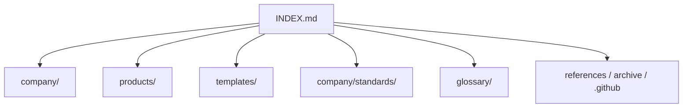

# Master Index

| Field | Value |
| --- | --- |
| Document ID | GPO-GPO-001 |
| Title | Gojen Product Office Master Index |
| Version | 1.0.0 |
| Status | Approved |
| Owner | Documentation Engineering / Product Office |

## Navigation

- [Dashboard (README)](./README.md)
- [Contributing](./CONTRIBUTING.md)
- [Changelog](./CHANGELOG.md)
- [License](./LICENSE.md)

---

## Root Documents

| Document | Path |
| --- | --- |
| Dashboard | [README.md](./README.md) |
| Master index | [INDEX.md](./INDEX.md) |
| Contributing | [CONTRIBUTING.md](./CONTRIBUTING.md) |
| Changelog | [CHANGELOG.md](./CHANGELOG.md) |
| License | [LICENSE.md](./LICENSE.md) |

---

## All Folders

| Folder | README |
| --- | --- |
| `company/` | [README](./company/README.md) |
| `company/vision/` | [README](./company/vision/README.md) |
| `company/founders/` | [README](./company/founders/README.md) |
| `company/governance/` | [README](./company/governance/README.md) |
| `company/standards/` | [README](./company/standards/README.md) |
| `company/operating-system/` | [README](./company/operating-system/README.md) |
| `company/meeting-minutes/` | [README](./company/meeting-minutes/README.md) |
| `products/` | [README](./products/README.md) |
| `products/subscription-os/` | [README](./products/subscription-os/README.md) |
| `products/subscription-os/01-discovery/` | [README](./products/subscription-os/01-discovery/README.md) |
| `products/subscription-os/02-market-research/` | [README](./products/subscription-os/02-market-research/README.md) |
| `products/subscription-os/03-business/` | [README](./products/subscription-os/03-business/README.md) |
| `products/subscription-os/04-product/` | [README](./products/subscription-os/04-product/README.md) |
| `products/subscription-os/05-design/` | [README](./products/subscription-os/05-design/README.md) |
| `products/subscription-os/06-architecture/` | [README](./products/subscription-os/06-architecture/README.md) |
| `products/subscription-os/07-engineering/` | [README](./products/subscription-os/07-engineering/README.md) |
| `products/subscription-os/08-testing/` | [README](./products/subscription-os/08-testing/README.md) |
| `products/subscription-os/09-sales/` | [README](./products/subscription-os/09-sales/README.md) |
| `products/subscription-os/10-marketing/` | [README](./products/subscription-os/10-marketing/README.md) |
| `products/subscription-os/11-release/` | [README](./products/subscription-os/11-release/README.md) |
| `products/subscription-os/12-roadmap/` | [README](./products/subscription-os/12-roadmap/README.md) |
| `products/subscription-os/decision-log/` | [README](./products/subscription-os/decision-log/README.md) |
| `products/subscription-os/risk-register/` | [README](./products/subscription-os/risk-register/README.md) |
| `products/subscription-os/meeting-minutes/` | [README](./products/subscription-os/meeting-minutes/README.md) |
| `products/subscription-os/assets/` | [README](./products/subscription-os/assets/README.md) |
| `products/pawn-management/` | [README](./products/pawn-management/README.md) |
| `templates/` | [README](./templates/README.md) |
| `glossary/` | [README](./glossary/README.md) |
| `references/` | [README](./references/README.md) |
| `archive/` | [README](./archive/README.md) |
| `.github/` | [README](./.github/README.md) |
| `.github/ISSUE_TEMPLATE/` | [README](./.github/ISSUE_TEMPLATE/README.md) |
| `.github/workflows/` | [README](./.github/workflows/README.md) |

---

## Standards

| Document ID | Title | Path |
| --- | --- | --- |
| GPO-STD-001 | Document Numbering | [document-numbering.md](./company/standards/document-numbering.md) |
| GPO-STD-002 | Versioning | [versioning.md](./company/standards/versioning.md) |
| GPO-STD-003 | Writing Style | [writing-style.md](./company/standards/writing-style.md) |
| GPO-STD-004 | Meeting Process | [meeting-process.md](./company/standards/meeting-process.md) |
| GPO-STD-005 | Repository Rules | [repository-rules.md](./company/standards/repository-rules.md) |

---

## Templates

| Template | Path |
| --- | --- |
| Document | [document-template.md](./templates/document-template.md) |
| Meeting | [meeting-template.md](./templates/meeting-template.md) |
| Decision | [decision-template.md](./templates/decision-template.md) |
| Risk | [risk-template.md](./templates/risk-template.md) |
| Roadmap | [roadmap-template.md](./templates/roadmap-template.md) |
| Research | [research-template.md](./templates/research-template.md) |
| PRD | [prd-template.md](./templates/prd-template.md) |
| BRD | [brd-template.md](./templates/brd-template.md) |
| Architecture | [architecture-template.md](./templates/architecture-template.md) |
| API | [api-template.md](./templates/api-template.md) |
| User story | [user-story-template.md](./templates/user-story-template.md) |
| Release | [release-template.md](./templates/release-template.md) |

---

## Glossary

| Document ID | Title | Path |
| --- | --- | --- |
| GLO-GPO-001 | Business Terms | [business-terms.md](./glossary/business-terms.md) |
| GLO-GPO-002 | Technical Terms | [technical-terms.md](./glossary/technical-terms.md) |
| GLO-GPO-003 | Product Management | [product-management.md](./glossary/product-management.md) |

---

## Products

| Product | Path | Status |
| --- | --- | --- |
| Subscription OS | [products/subscription-os](./products/subscription-os/README.md) | Workspace ready (no product docs in Sprint 1) |
| Pawn Management | [products/pawn-management](./products/pawn-management/README.md) | Workspace ready |

---

## Company Documents

| Area | Path | Sprint 1 contents |
| --- | --- | --- |
| Vision | [company/vision](./company/vision/README.md) | Folder only |
| Founders | [company/founders](./company/founders/README.md) | Folder only |
| Governance | [company/governance](./company/governance/README.md) | Folder only |
| Standards | [company/standards](./company/standards/README.md) | Five approved standards |
| Operating system | [company/operating-system](./company/operating-system/README.md) | Folder only |
| Meeting minutes | [company/meeting-minutes](./company/meeting-minutes/README.md) | Folder only |

---

## Related Documents

- [Repository rules](./company/standards/repository-rules.md)
- [Documentation standards overview](./README.md#documentation-standards)
- [Changelog](./CHANGELOG.md)
