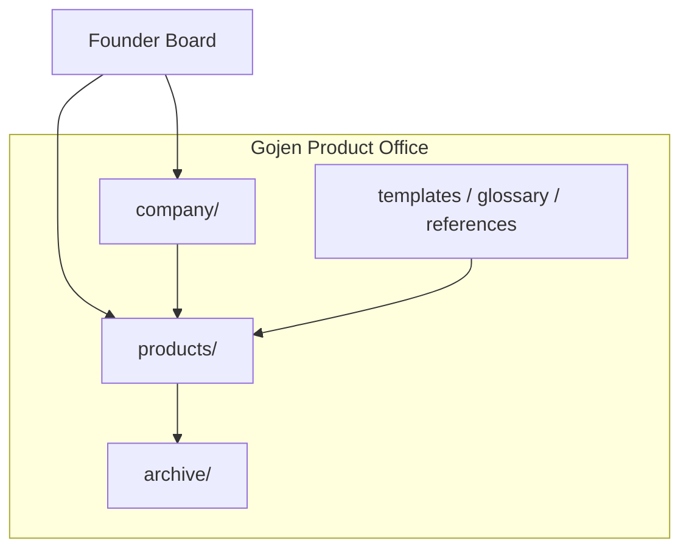
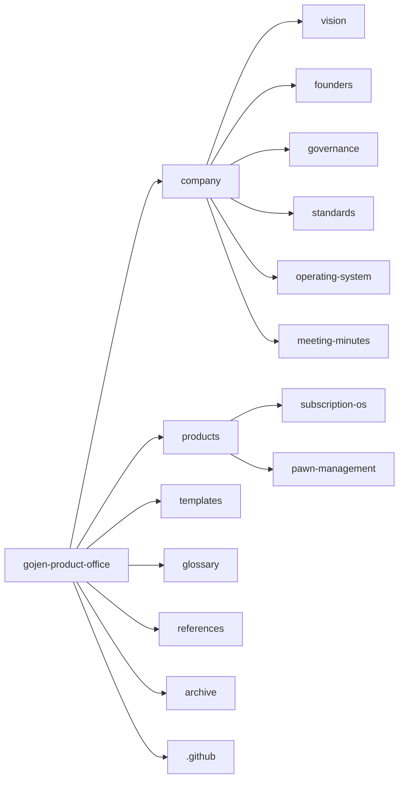
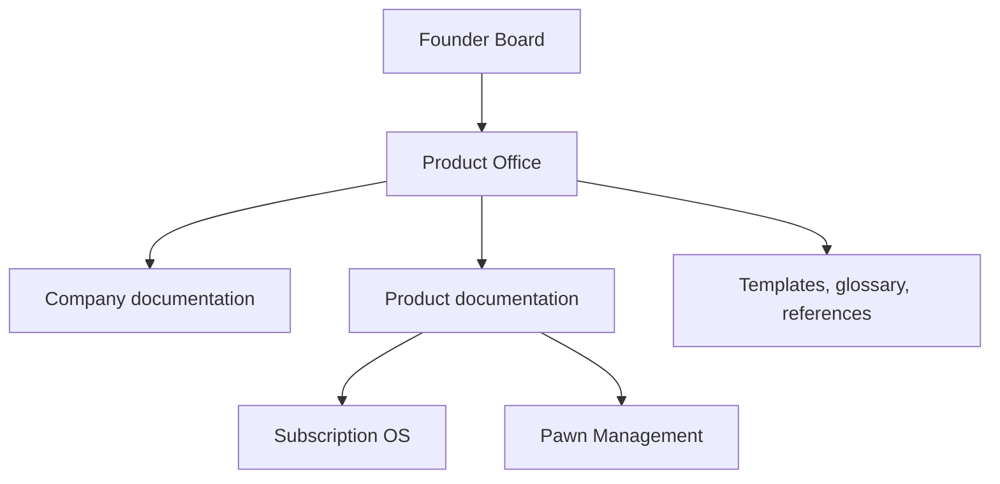

# Gojen Product Office

Canonical documentation repository for **Gojen Technology**. This Product Office holds company doctrine, product lifecycle records, shared templates, and governance artifacts used across the portfolio.

---

## Navigation

| Section | Description |
| --- | --- |
| [Project Overview](#project-overview) | Why this repository exists |
| [Repository Structure](#repository-structure) | Top-level layout |
| [Products](#products) | Portfolio products documented here |
| [Documentation Standards](#documentation-standards) | How we write and organize docs |
| [How to Contribute](#how-to-contribute) | Contribution workflow |
| [Founder Board](#founder-board) | Ownership and escalation |
| [Gojen Product Office](#gojen-product-office) | Role of this office |

**Quick links**

- [Company](./company/README.md)
- [Products](./products/README.md)
- [Templates](./templates/README.md)
- [Glossary](./glossary/README.md)
- [References](./references/README.md)
- [Archive](./archive/README.md)
- [Contributing](./CONTRIBUTING.md)
- [Changelog](./CHANGELOG.md)
- [License](./LICENSE.md)

---

## Project Overview

The Gojen Product Office is the single source of truth for:

- Company vision, founders context, governance, and operating standards
- Product documentation across discovery through release and roadmap
- Shared templates, glossary terms, and reference materials
- Decision logs, risk registers, and meeting records for active products

Codebases live in their respective engineering repositories. This repository is documentation-only unless otherwise stated.



---

## Repository Structure

```text
gojen-product-office/
├── company/                 # Company-wide doctrine and governance
├── products/                # Product portfolios and lifecycle docs
│   ├── subscription-os/     # Subscription OS product workspace
│   └── pawn-management/     # Pawn Management product workspace
├── templates/               # Reusable document templates
├── glossary/                # Shared definitions and terminology
├── references/              # External and internal reference material
├── archive/                 # Superseded or historical documents
├── .github/                 # Issue templates and workflows
├── README.md                # This file
├── CONTRIBUTING.md          # Contribution guide
├── CHANGELOG.md             # Repository change history
└── LICENSE.md               # License terms
```



---

## Products

| Product | Path | Status |
| --- | --- | --- |
| Subscription OS | [products/subscription-os](./products/subscription-os/README.md) | Active workspace initialized |
| Pawn Management | [products/pawn-management](./products/pawn-management/README.md) | Workspace initialized |

Subscription OS uses a numbered lifecycle structure from discovery through roadmap, plus decision-log, risk-register, meeting-minutes, and assets.

---

## Documentation Standards

1. **Folder names are fixed.** Do not rename, invent parallel structures, or change casing conventions.
2. **Every folder has a `README.md`** describing Purpose, Contents, Owner, and Related Documents.
3. **No orphan documents.** New files must be linked from the nearest folder README and, when relevant, from the product or company index.
4. **Prefer Markdown.** Use Mermaid for process, structure, and decision flows.
5. **Supersede, do not erase.** Move outdated material to [archive](./archive/README.md) with clear provenance.
6. **Templates first.** Prefer [templates](./templates/README.md) before inventing new document shapes.
7. **Use the glossary.** Shared terms belong in [glossary](./glossary/README.md).

Details for contributors live in [CONTRIBUTING.md](./CONTRIBUTING.md). Company writing and process norms belong under [company/standards](./company/standards/README.md).

---

## How to Contribute

1. Read [CONTRIBUTING.md](./CONTRIBUTING.md).
2. Place work in the correct folder under `company/` or `products/`.
3. Update the local folder README and any parent navigational links.
4. Record decisions and risks in the product decision-log and risk-register when applicable.
5. Open a pull request with a clear summary of documentation impact.

Issue templates and automation hooks live under [.github](./.github/README.md).

---

## Founder Board

The Founder Board is the highest accountability body for Gojen Technology direction reflected in this repository.

| Responsibility | Where documented |
| --- | --- |
| Vision and long-range intent | [company/vision](./company/vision/README.md) |
| Founders context | [company/founders](./company/founders/README.md) |
| Governance and decision rights | [company/governance](./company/governance/README.md) |
| Operating model | [company/operating-system](./company/operating-system/README.md) |

Escalations that change company doctrine or portfolio strategy should be recorded in company meeting minutes and, when product-impacting, mirrored in the relevant product decision log.

---

## Gojen Product Office

The Product Office maintains:

- Consistency of documentation across all Gojen products
- Lifecycle completeness from discovery through release and roadmap
- Shared templates, glossary, and references
- Traceability of decisions, risks, and meeting outcomes



For change history of this repository, see [CHANGELOG.md](./CHANGELOG.md).
