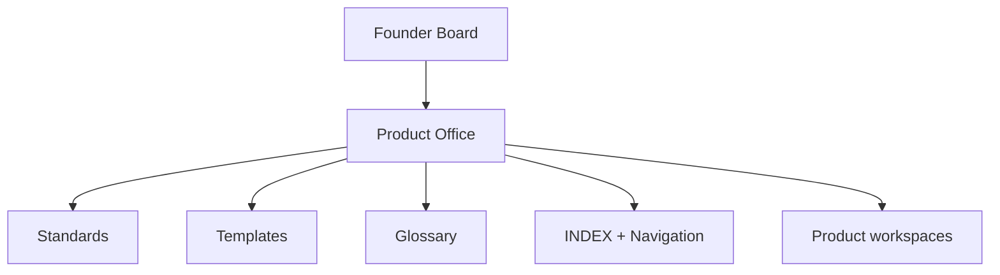
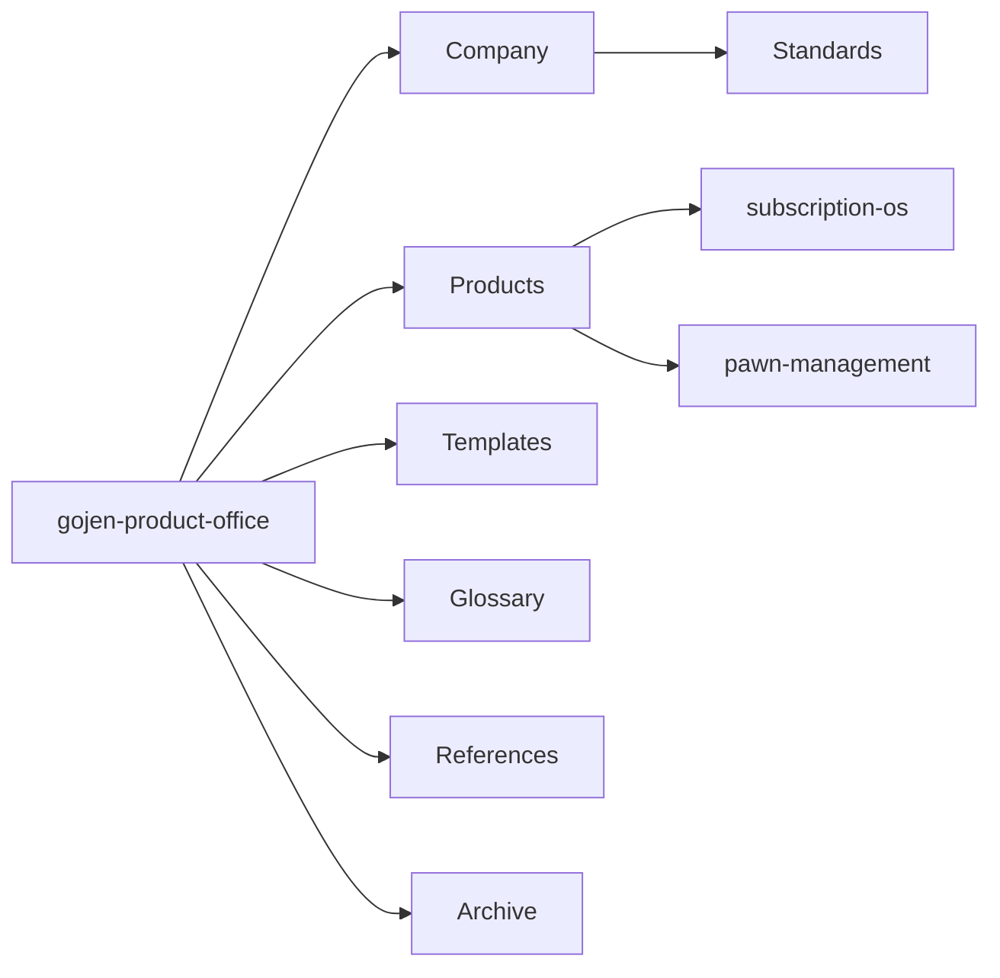

# Gojen Product Office

Documentation infrastructure for **Gojen Technology** — standards, templates, glossary, and portfolio navigation for a professional SaaS product organization.

| Field | Value |
| --- | --- |
| Repository | `gojen-product-office` |
| Current sprint | Sprint 1 — Product Office Foundation |
| Status | Standards and templates established |

---

## Navigation

| Section | Jump |
| --- | --- |
| [Company](#company) | Company doctrine areas |
| [Founder Board](#founder-board) | Accountability |
| [Product Office](#product-office) | Role of this office |
| [Products](#products) | Portfolio workspaces |
| [Repository Structure](#repository-structure) | Folder map |
| [Documentation Standards](#documentation-standards) | Approved standards |
| [Templates](#templates) | Reusable templates |
| [Current Sprint](#current-sprint) | Sprint 1 status |
| [Latest Documents](#latest-documents) | Newly published infra docs |
| [Recent Decisions](#recent-decisions) | Decision log status |
| [Roadmap](#roadmap) | Office roadmap |
| [Master Index](./INDEX.md) | Full navigation index |

**Quick links:** [INDEX](./INDEX.md) · [Standards](./company/standards/README.md) · [Templates](./templates/README.md) · [Glossary](./glossary/README.md) · [Contributing](./CONTRIBUTING.md) · [Changelog](./CHANGELOG.md)

---

## Company

Company-wide doctrine lives under [`company/`](./company/README.md).

| Area | Path |
| --- | --- |
| Vision | [company/vision](./company/vision/README.md) |
| Founders | [company/founders](./company/founders/README.md) |
| Governance | [company/governance](./company/governance/README.md) |
| Standards | [company/standards](./company/standards/README.md) |
| Operating system | [company/operating-system](./company/operating-system/README.md) |
| Meeting minutes | [company/meeting-minutes](./company/meeting-minutes/README.md) |

Sprint 1 published the standards suite. Vision, founders, governance, operating-system, and meeting bodies remain ready for approved content — no placeholder business documents.

---

## Founder Board

The Founder Board is the highest accountability body for direction reflected in this repository.

| Responsibility | Location |
| --- | --- |
| Vision | [company/vision](./company/vision/README.md) |
| Founders context | [company/founders](./company/founders/README.md) |
| Governance | [company/governance](./company/governance/README.md) |
| Meeting cadence | [meeting-process.md](./company/standards/meeting-process.md) |

---

## Product Office

The Product Office maintains documentation integrity across Gojen products.



| Capability | Status |
| --- | --- |
| Numbering, versioning, style, meetings, repo rules | Approved |
| Twelve reusable templates | Available |
| Glossary (business, technical, product) | Available |
| Master index | Available |
| Product business documents | Not started (by design in Sprint 1) |

---

## Products

| Product | Path | Sprint 1 note |
| --- | --- | --- |
| Subscription OS | [products/subscription-os](./products/subscription-os/README.md) | Lifecycle folders ready; **no product docs yet** |
| Pawn Management | [products/pawn-management](./products/pawn-management/README.md) | Workspace ready |

---

## Repository Structure

```text
gojen-product-office/
├── INDEX.md                 # Master navigation
├── company/                 # Doctrine + standards
├── products/                # Product workspaces
├── templates/               # Reusable templates
├── glossary/                # Shared terminology
├── references/              # Reference material
├── archive/                 # Superseded documents
└── .github/                 # Issue templates + workflows
```



Full folder listing: [INDEX.md](./INDEX.md).

---

## Documentation Standards

| ID | Standard | Path |
| --- | --- | --- |
| GPO-STD-001 | Document Numbering | [document-numbering.md](./company/standards/document-numbering.md) |
| GPO-STD-002 | Versioning | [versioning.md](./company/standards/versioning.md) |
| GPO-STD-003 | Writing Style | [writing-style.md](./company/standards/writing-style.md) |
| GPO-STD-004 | Meeting Process | [meeting-process.md](./company/standards/meeting-process.md) |
| GPO-STD-005 | Repository Rules | [repository-rules.md](./company/standards/repository-rules.md) |

---

## Templates

| Template | Path |
| --- | --- |
| Document | [document-template.md](./templates/document-template.md) |
| Meeting | [meeting-template.md](./templates/meeting-template.md) |
| Decision | [decision-template.md](./templates/decision-template.md) |
| Risk | [risk-template.md](./templates/risk-template.md) |
| Roadmap | [roadmap-template.md](./templates/roadmap-template.md) |
| Research | [research-template.md](./templates/research-template.md) |
| PRD | [prd-template.md](./templates/prd-template.md) |
| BRD | [brd-template.md](./templates/brd-template.md) |
| Architecture | [architecture-template.md](./templates/architecture-template.md) |
| API | [api-template.md](./templates/api-template.md) |
| User story | [user-story-template.md](./templates/user-story-template.md) |
| Release | [release-template.md](./templates/release-template.md) |

Every template includes Document Information, Version History, Purpose, Scope, Assumptions, Risks, References, Approval Table, and Change Log.

---

## Current Sprint

### Sprint 1 — Product Office Foundation

| Workstream | Status |
| --- | --- |
| Company standards (5) | Done |
| Templates (12) | Done |
| Glossary (3) | Done |
| Master INDEX | Done |
| README navigation upgrade | Done |
| Root dashboard README | Done |
| Subscription OS product documents | Explicitly out of scope |

---

## Latest Documents

| Date | Document | Path |
| --- | --- | --- |
| 2026-07-15 | Document Numbering | [document-numbering.md](./company/standards/document-numbering.md) |
| 2026-07-15 | Versioning | [versioning.md](./company/standards/versioning.md) |
| 2026-07-15 | Writing Style | [writing-style.md](./company/standards/writing-style.md) |
| 2026-07-15 | Meeting Process | [meeting-process.md](./company/standards/meeting-process.md) |
| 2026-07-15 | Repository Rules | [repository-rules.md](./company/standards/repository-rules.md) |
| 2026-07-15 | Templates suite | [templates/](./templates/README.md) |
| 2026-07-15 | Glossary suite | [glossary/](./glossary/README.md) |
| 2026-07-15 | Master Index | [INDEX.md](./INDEX.md) |

---

## Recent Decisions

No product decision records (`DEC-*`) in Sprint 1. Decision infrastructure is ready via [decision-template.md](./templates/decision-template.md) and product `decision-log/` folders.

When decisions are logged, surface the latest entries here and in [INDEX.md](./INDEX.md).

---

## Roadmap

| Horizon | Focus |
| --- | --- |
| **Now (Sprint 1)** | Documentation standards, templates, glossary, navigation |
| **Next** | Populate company doctrine and begin product documentation using templates |
| **Later** | Expand automation under `.github/workflows`, issue templates, and archive practices |

Product roadmaps belong under each product’s `12-roadmap/` using [roadmap-template.md](./templates/roadmap-template.md).

---

## How to Contribute

1. Read [CONTRIBUTING.md](./CONTRIBUTING.md) and [repository-rules.md](./company/standards/repository-rules.md).
2. Start from the correct [template](./templates/README.md).
3. Assign a Document ID per [document-numbering.md](./company/standards/document-numbering.md).
4. Update the folder README and [INDEX.md](./INDEX.md) when adding discoverable documents.
5. Open a pull request for review by the folder Owner.

---

## Gojen Product Office

This repository is the SaaS company’s documentation control plane: one structure, one numbering system, one set of templates, and clear ownership — so every product can document consistently without inventing process.

For change history, see [CHANGELOG.md](./CHANGELOG.md).
