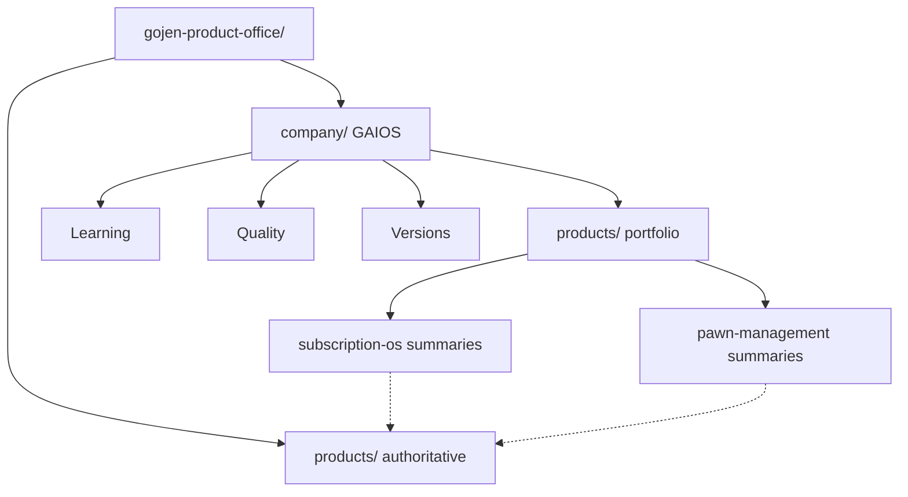
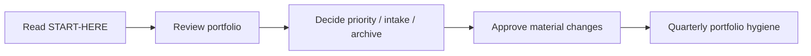
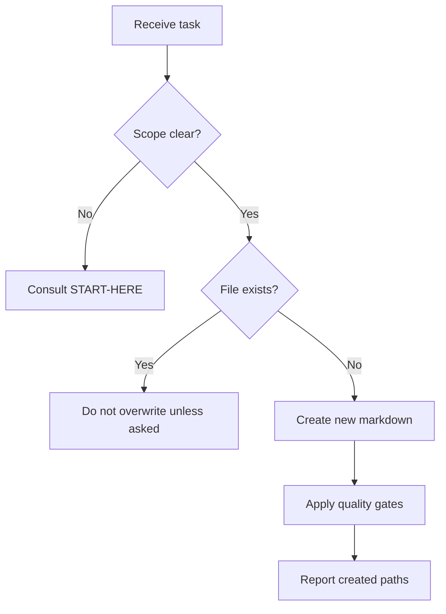
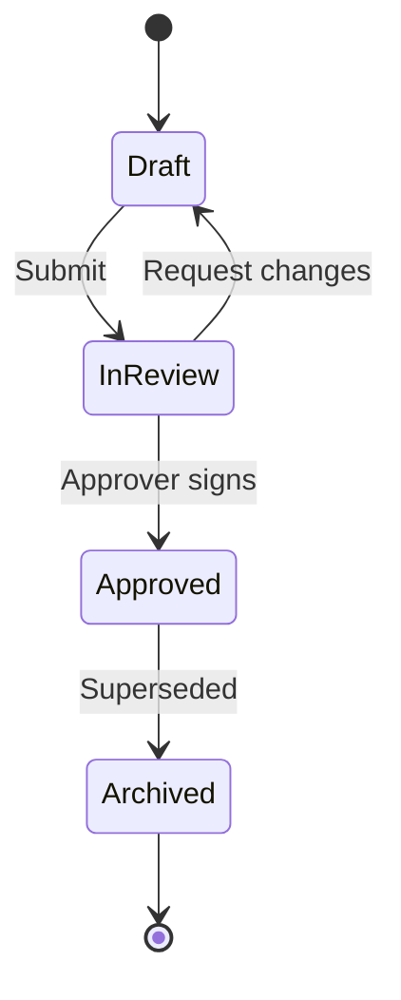
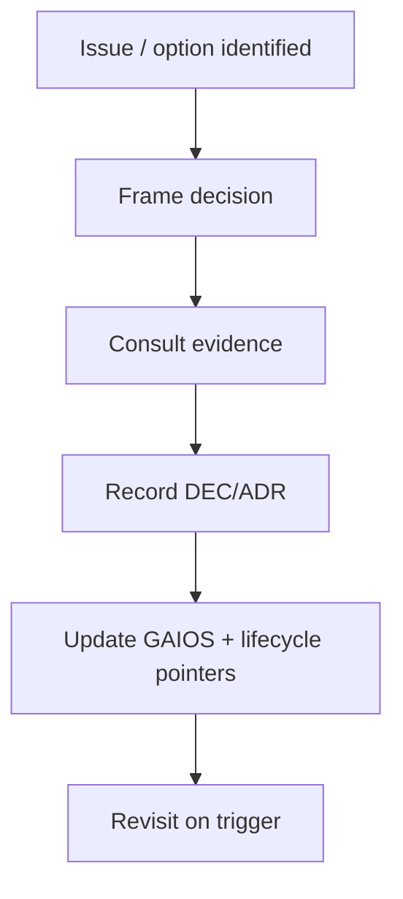
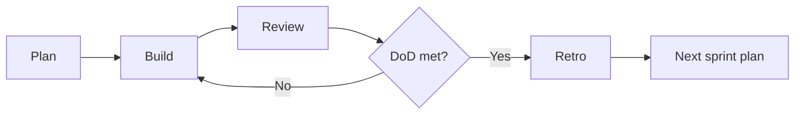
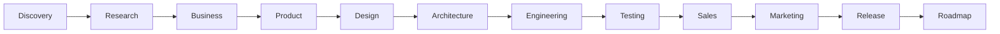
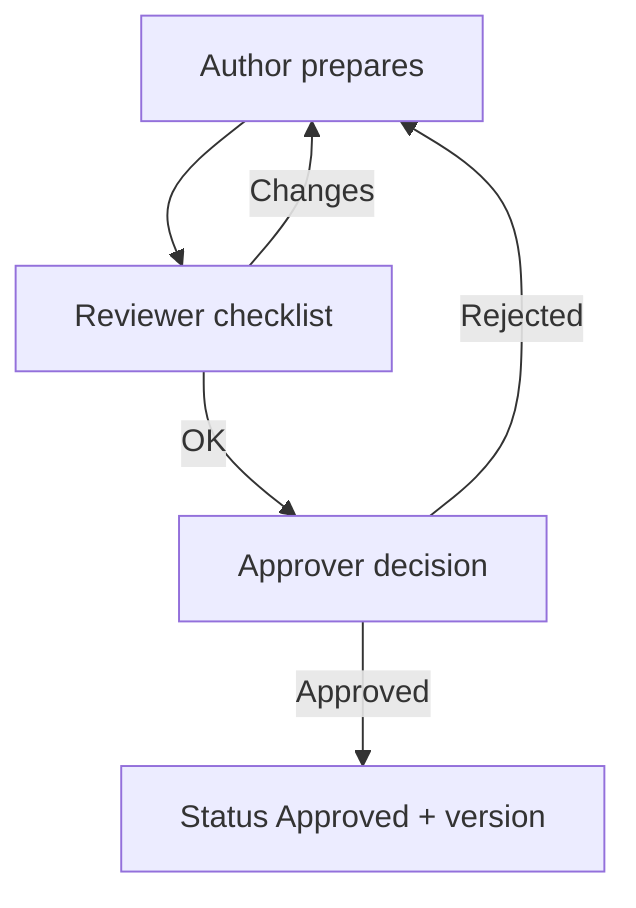
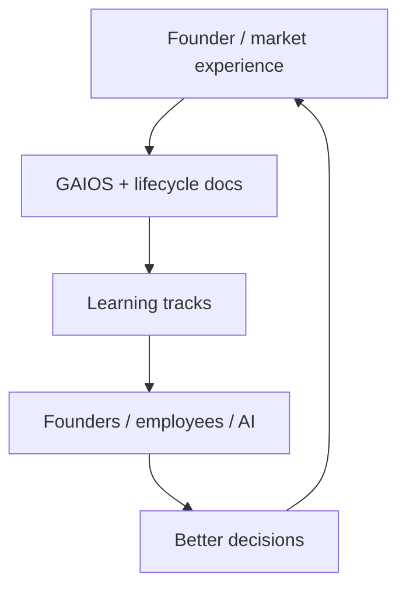

# GAIOS v1.0 Deliverable Summary

| Field | Value |
| --- | --- |
| Document ID | GOS-GPO-999 |
| Title | GAIOS v1.0 Deliverable Summary |
| Product / Scope | GPO |
| Version | 1.0.0 |
| Status | Approved |
| Author | Gojen Product Office |
| Owner | Founder Board |
| Created | 2026-07-18 |
| Last Updated | 2026-07-18 |
| Classification | Internal |

## Version History

| Version | Date | Author | Summary |
| --- | --- | --- | --- |
| 1.0.0 | 2026-07-18 | Gojen Product Office | GAIOS v1.0 deliverable package approved |

## Approval Table

| Role | Name | Decision | Date |
| --- | --- | --- | --- |
| Author | Gojen Product Office | Prepared | 2026-07-18 |
| Reviewer | Gowtham | Approved | 2026-07-18 |
| Reviewer | Arul Jeni | Approved | 2026-07-18 |
| Approver | Gomathi K (CEO) | Approved | 2026-07-18 |

## Breadcrumb

[Home](../README.md) › [Company](./README.md) › GAIOS v1.0 Deliverable

## Navigation Links

- [Back to START-HERE.md](./START-HERE.md)
- [Company](./README.md)
- [Products portfolio](./products/README.md)
- [Learning](./learning/README.md)
- [Quality](./quality/README.md)
- [Versions](./versions/README.md)
- [GAIOS v1.0 Release](./versions/gaios-v1-0-release.md)
- [Master Index](../INDEX.md)

## Purpose

Consolidate the GAIOS v1.0 deliverable for Gojen Technology: repository tree, document inventory, cross-references, Mermaid diagram catalog, gaps, improvements, sprint plan, statistics, and executive summary.

---

## 1. Repository Tree (GAIOS portion under company/)

Intended full GAIOS tree under `company/` (domains created by this workstream and parallel agents):

```text
company/
├── START-HERE.md                          # parallel agent (entry)
├── README.md                              # pre-existing
├── GAIOS-V1-DELIVERABLE.md                # THIS FILE (GOS-GPO-999)
├── vision/                                # pre-existing / parallel
├── founders/                              # pre-existing / parallel
├── governance/                            # pre-existing / parallel
├── standards/                             # pre-existing
├── operating-system/                      # pre-existing / parallel
├── meeting-minutes/                       # pre-existing / parallel
├── products/                              # CREATED (portfolio layer)
│   ├── README.md                          # GOS-GPO-250
│   ├── subscription-os/                   # GOS-GPO-251..262
│   ├── pawn-management/                   # GOS-GPO-270..281
│   ├── future-products/                   # GOS-GPO-290..292
│   └── archived-products/                 # GOS-GPO-295..296
├── learning/                              # CREATED GOS-GPO-300..305
├── quality/                               # CREATED GOS-GPO-310..314
└── versions/                              # CREATED GOS-GPO-320..323
```

Authoritative lifecycle workspaces (not modified by this workstream):

```text
products/
├── README.md
├── subscription-os/     # full lifecycle stages
└── pawn-management/     # product workspace
```

---

## 2. List of Every Document Created (this workstream)

### company/products/

| Path | Document ID |
| --- | --- |
| products/README.md | GOS-GPO-250 |
| products/subscription-os/README.md | GOS-GPO-251 |
| products/subscription-os/vision.md | GOS-GPO-252 |
| products/subscription-os/mission.md | GOS-GPO-253 |
| products/subscription-os/market-research.md | GOS-GPO-254 |
| products/subscription-os/competitor-analysis.md | GOS-GPO-255 |
| products/subscription-os/business-model.md | GOS-GPO-256 |
| products/subscription-os/prd.md | GOS-GPO-257 |
| products/subscription-os/architecture.md | GOS-GPO-258 |
| products/subscription-os/roadmap.md | GOS-GPO-259 |
| products/subscription-os/sprint.md | GOS-GPO-260 |
| products/subscription-os/risks.md | GOS-GPO-261 |
| products/subscription-os/release-notes.md | GOS-GPO-262 |
| products/pawn-management/README.md | GOS-GPO-270 |
| products/pawn-management/vision.md | GOS-GPO-271 |
| products/pawn-management/mission.md | GOS-GPO-272 |
| products/pawn-management/market-research.md | GOS-GPO-273 |
| products/pawn-management/competitor-analysis.md | GOS-GPO-274 |
| products/pawn-management/business-model.md | GOS-GPO-275 |
| products/pawn-management/prd.md | GOS-GPO-276 |
| products/pawn-management/architecture.md | GOS-GPO-277 |
| products/pawn-management/roadmap.md | GOS-GPO-278 |
| products/pawn-management/sprint.md | GOS-GPO-279 |
| products/pawn-management/risks.md | GOS-GPO-280 |
| products/pawn-management/release-notes.md | GOS-GPO-281 |
| products/future-products/README.md | GOS-GPO-290 |
| products/future-products/intake-process.md | GOS-GPO-291 |
| products/future-products/evaluation-criteria.md | GOS-GPO-292 |
| products/archived-products/README.md | GOS-GPO-295 |
| products/archived-products/archive-policy.md | GOS-GPO-296 |

### company/learning/

| Path | Document ID |
| --- | --- |
| learning/README.md | GOS-GPO-300 |
| learning/onboarding-founders.md | GOS-GPO-301 |
| learning/onboarding-ai-assistants.md | GOS-GPO-302 |
| learning/onboarding-employees.md | GOS-GPO-303 |
| learning/curriculum.md | GOS-GPO-304 |
| learning/reading-list.md | GOS-GPO-305 |

### company/quality/

| Path | Document ID |
| --- | --- |
| quality/README.md | GOS-GPO-310 |
| quality/documentation-quality-gates.md | GOS-GPO-311 |
| quality/review-checklist.md | GOS-GPO-312 |
| quality/definition-of-done.md | GOS-GPO-313 |
| quality/audit-schedule.md | GOS-GPO-314 |

### company/versions/

| Path | Document ID |
| --- | --- |
| versions/README.md | GOS-GPO-320 |
| versions/gaios-v1-0-release.md | GOS-GPO-321 |
| versions/versioning-policy.md | GOS-GPO-322 |
| versions/upgrade-path.md | GOS-GPO-323 |

### company/ root

| Path | Document ID |
| --- | --- |
| GAIOS-V1-DELIVERABLE.md | GOS-GPO-999 |

**Total created by this workstream:** 46 markdown files across 8 new folder trees (`products` + 4 children, `learning`, `quality`, `versions`).

**Note:** Other agents create additional GAIOS folders (for example START-HERE, expanded vision/founders/governance/operating-system content). Those are part of the intended full GAIOS tree but are not listed above unless created here.

---

## 3. Cross Reference Matrix (major domains ↔ documents)

| Domain | Primary documents | Links to |
| --- | --- | --- |
| Portfolio | GOS-GPO-250 | Root products, SOS/PAW GAIOS, future/archive |
| Subscription OS OS-layer | GOS-GPO-251..262 | `products/subscription-os/` lifecycle |
| Pawn Management OS-layer | GOS-GPO-270..281 | `products/pawn-management/` lifecycle |
| Future products | GOS-GPO-290..292 | Portfolio, archive, Founder Board |
| Archived products | GOS-GPO-295..296 | Future intake, repository rules |
| Learning | GOS-GPO-300..305 | START-HERE, standards, quality, products |
| Quality | GOS-GPO-310..314 | Standards, versions, sprint DoD |
| Versions | GOS-GPO-320..323 | Deliverable, quality audits |
| Deliverable | GOS-GPO-999 | All GAIOS domains above |

| Product capability theme | GAIOS doc | Lifecycle destination |
| --- | --- | --- |
| Vision / mission | vision.md, mission.md | `01-discovery/` |
| Market / competitors | market-research.md, competitor-analysis.md | `02-market-research/` |
| Business model | business-model.md | `03-business/` |
| Requirements | prd.md | `04-product/` |
| Architecture | architecture.md | `06-architecture/` |
| Roadmap | roadmap.md | `12-roadmap/` |
| Sprint | sprint.md | `07-engineering/` |
| Risks | risks.md | `risk-register/` |
| Release | release-notes.md | `11-release/` |

---

## 4. Mermaid Diagram Summary

### Diagrams embedded in this deliverable

| Diagram | Section below |
| --- | --- |
| Repository Structure | 4.1 |
| Founder Workflow | 4.2 |
| AI Workflow | 4.3 |
| Document Lifecycle | 4.4 |
| Decision Lifecycle | 4.5 |
| Sprint Lifecycle | 4.6 |
| Product Lifecycle | 4.7 |
| Approval Workflow | 4.8 |
| Knowledge Flow | 4.9 |

### Diagrams elsewhere in this workstream

| Diagram | Location |
| --- | --- |
| Portfolio structure | products/README.md |
| Product operating flow | products/*/README.md |
| Architecture context | products/*/architecture.md |
| Sprint flow | products/*/sprint.md |
| Future-products pipeline | products/future-products/README.md |
| Learning knowledge flow | learning/README.md |
| AI workflow | learning/onboarding-ai-assistants.md |
| Quality gate flow | quality/documentation-quality-gates.md |

### 4.1 Repository Structure



### 4.2 Founder Workflow



### 4.3 AI Workflow



### 4.4 Document Lifecycle



### 4.5 Decision Lifecycle



### 4.6 Sprint Lifecycle



### 4.7 Product Lifecycle



### 4.8 Approval Workflow



### 4.9 Knowledge Flow



---

## 5. Missing Recommendations

| Gap | Recommendation | Priority |
| --- | --- | --- |
| START-HERE may be authored in parallel | Ensure single entry doc links to products/learning/quality/versions | High |
| company/README.md does not yet list new folders | Update child-folder table in a later edit sprint (not done here by create-only rule) | High |
| Deep lifecycle artifacts for SOS/PAW | Author discovery → release docs in root `products/` in upcoming sprints | High |
| Pawn Management lifecycle parity | Expand root PAW workspace to match SOS stage folders when approved | High |
| INDEX.md registration | Register GOS-GPO-250..999 IDs in master index | Medium |
| Decision-log / risk-register first entries | Create initial DEC/RISK records when discovery starts | Medium |
| Metrics dashboard | Add lightweight KPI sheet for portfolio health | Low |
| Glossary terms for GAIOS | Add GAIOS, SOS, PAW operating terms to glossary | Low |

---

## 6. Future Improvements

1. Automate link checking in CI for `company/` markdown.
2. Add document ID registry file to prevent collisions across agents.
3. Introduce GAIOS minor releases (v1.1) for operating-system expansions without waiting for major redesign.
4. Connect meeting minutes to decision log with obligatory backlinks.
5. Create founder one-page weekly digest generated from portfolio risks and sprint outputs.
6. Add Codeowners / review rules for Approved document changes.
7. Publish an internal "how GAIOS differs from lifecycle" short guide for new AI sessions.

---

## 7. Suggested Sprint Plan (next 3–4 sprints after GAIOS v1.0)

### Sprint A — Wire-up & Indexing

| Work item | Owner |
| --- | --- |
| Ensure START-HERE links all GAIOS domains | Product Office |
| Update company README child folders (explicit edit task) | Documentation Engineering |
| Register new document IDs in INDEX.md | Documentation Engineering |
| First link-health audit | Documentation Engineering |

### Sprint B — Subscription OS discovery depth

| Work item | Owner |
| --- | --- |
| Author discovery + market research lifecycle packs | Product Owner — SOS |
| Align GAIOS market/competitor summaries to evidence | Product Office |
| Open first DEC and RISK entries | Product Owner — SOS |

### Sprint C — Pawn Management foundation

| Work item | Owner |
| --- | --- |
| Approve and create PAW lifecycle stage folders | Founder Board / Product Office |
| Author PAW discovery charter | Product Owner — PAW |
| Refresh PAW GAIOS summaries with evidence pointers | Product Office |

### Sprint D — Quality & GAIOS v1.1 prep

| Work item | Owner |
| --- | --- |
| Execute quarterly-style standards compliance audit early | Documentation Engineering |
| Close High gaps from Missing Recommendations | Product Office |
| Draft GAIOS v1.1 scope via upgrade-path.md | Founder Board steward |

---

## 8. Repository Statistics

| Metric | Count |
| --- | --- |
| New folders created (this workstream) | 8 (`products`, `subscription-os`, `pawn-management`, `future-products`, `archived-products`, `learning`, `quality`, `versions`) |
| New markdown files created (this workstream) | 46 |
| Document IDs issued (this workstream) | GOS-GPO-250..262, 270..281, 290..292, 295..296, 300..305, 310..314, 320..323, 999 |
| Pre-existing company files modified | 0 |
| Root `products/` files modified | 0 |
| Estimated full GAIOS size under `company/` after parallel agents | ~80–120 markdown files (doctrine + OS + portfolio + learning + quality + versions) |
| Estimated combined Product Office docs (company + products + templates + glossary) at mature v1.x | 200+ markdown files |

---

## 9. Executive Summary

GAIOS v1.0 gives Gojen Technology a usable company operating-system documentation layer. This workstream created the **portfolio layer** under `company/products/` for Subscription OS and Pawn Management, plus future/archive pipelines, learning tracks, quality controls, and version governance — **46 new markdown files**, create-only, with **zero modifications** to existing company files or root `products/` lifecycle workspaces.

Founders (Gomathi K, Gowtham, Arul Jeni) now have a clear split of concerns: **GAIOS summaries for operating clarity** and **root product workspaces for authoritative depth**. The next sprints should wire indexes, deepen Subscription OS discovery artifacts, bring Pawn Management lifecycle parity, and harden quality audits on the path to GAIOS v1.1.

## References

| Document ID | Title | Link |
| --- | --- | --- |
| GOS-GPO-250 | Product Portfolio Index | [./products/README.md](./products/README.md) |
| GOS-GPO-300 | Learning Index | [./learning/README.md](./learning/README.md) |
| GOS-GPO-310 | Quality Index | [./quality/README.md](./quality/README.md) |
| GOS-GPO-320 | Versions Index | [./versions/README.md](./versions/README.md) |
| GOS-GPO-321 | GAIOS v1.0 Release | [./versions/gaios-v1-0-release.md](./versions/gaios-v1-0-release.md) |

## Change Log

| Date | Version | Change | Author |
| --- | --- | --- | --- |
| 2026-07-18 | 1.0.0 | Initial approved GAIOS v1.0 deliverable summary | Gojen Product Office |

---

## 8b. Verified repository statistics (post-assembly)

Measured after all GAIOS v1.0 workstreams completed on 2026-07-18. Existing Product Office files were not modified.

| Metric | Value |
| --- | --- |
| GAIOS markdown documents | 230 |
| New domain folders under company/ | 18 (+ governance additions) |
| Founder workspaces | 3 (Gomathi, Gowtham, Arul) |
| Role playbooks | 19 |
| Operational playbooks | 6 |
| Registered AI agents | 8 |
| Prompt library files | 37 |
| Product portfolio OS docs | 30 |
| Existing files modified | 0 |

### Domain counts

| Domain | Count |
| --- | --- |
| Entry points | 3 |
| AI governance | 19 |
| Memory | 7 |
| Founder workspaces | 31 |
| Dashboards | 6 |
| Roadmaps | 5 |
| Meetings | 5 |
| Research | 7 |
| Decision register | 5 |
| Risk register | 6 |
| GAIOS templates | 6 |
| Prompt library | 37 |
| Playbooks | 27 |
| Governance additions | 4 |
| Wiki | 7 |
| Learning | 6 |
| Quality | 5 |
| Versions | 4 |
| Products (GAIOS portfolio) | 30 |
| AI agents | 9 |
| Deliverable | 1 |
| **Total** | **230** |

Canonical inventory: [INDEX.md](./INDEX.md).
