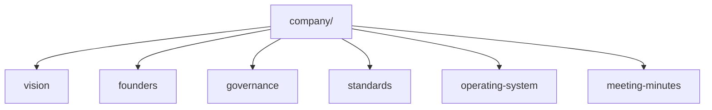

# Company

## Breadcrumb

[Home](../README.md) › Company

## Navigation Links

- [Master Index](../INDEX.md)
- [Standards](./standards/README.md)
- [Products](../products/README.md)
- [Templates](../templates/README.md)
- [Dashboard](../README.md)

## Parent Folder

[Repository root](../README.md)

## Child Folders

| Folder | Description |
| --- | --- |
| [vision/](./vision/README.md) | Company vision and long-range intent |
| [founders/](./founders/README.md) | Founders context and accountability |
| [governance/](./governance/README.md) | Decision rights and governance artifacts |
| [standards/](./standards/README.md) | Documentation and quality standards |
| [operating-system/](./operating-system/README.md) | Operating model and rhythms |
| [meeting-minutes/](./meeting-minutes/README.md) | Company-level meeting records |

## Purpose

Hold company-wide doctrine for Gojen Technology: vision, founders context, governance, standards, operating model, and company-level meeting records.

## Owner

Founder Board, stewarded by the Gojen Product Office.

## Related Documents

- [Repository dashboard](../README.md)
- [Master index](../INDEX.md)
- [Meeting process](./standards/meeting-process.md)
- [Repository rules](./standards/repository-rules.md)
- [Contributing](../CONTRIBUTING.md)
