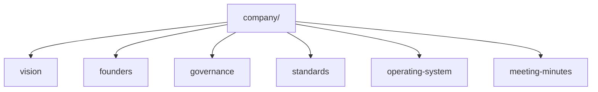

# Company

## Purpose

Holds company-wide doctrine for Gojen Technology: vision, founders context, governance, standards, operating model, and company-level meeting records.

## Contents

| Folder | Description |
| --- | --- |
| [vision/](./vision/README.md) | Company vision and long-range intent |
| [founders/](./founders/README.md) | Founders context and accountability |
| [governance/](./governance/README.md) | Decision rights and governance artifacts |
| [standards/](./standards/README.md) | Company documentation and quality standards |
| [operating-system/](./operating-system/README.md) | How Gojen operates day to day |
| [meeting-minutes/](./meeting-minutes/README.md) | Company-level meeting records |

## Owner

Founder Board, stewarded by the Gojen Product Office.

## Related Documents

- [Repository home](../README.md)
- [Products](../products/README.md)
- [Contributing](../CONTRIBUTING.md)
- [Templates](../templates/README.md)
