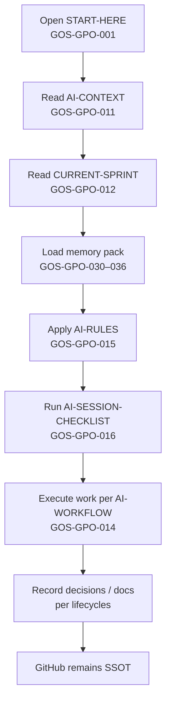
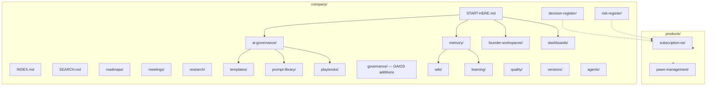

# GAIOS v1.0 — Start Here

| Field | Value |
| --- | --- |
| Document ID | GOS-GPO-001 |
| Document Name | GAIOS Master Entry Point |
| Version | 1.0.0 |
| Status | Approved |
| Owner | Gomathi K (Founder & CEO) |
| Reviewer | Gowtham (Co-Founder), Arul Jeni (Co-Founder) |
| Approver | Founder Board |
| Created Date | 2026-07-18 |
| Last Updated | 2026-07-18 |
| Purpose | Master entry point for GAIOS v1.0 — vision, navigation, and AI onboarding |
| Scope | All Gojen Technology Product Office contributors and AI collaborators |
| Related Documents | [INDEX.md](./INDEX.md), [SEARCH.md](./SEARCH.md), [ai-governance/README.md](./ai-governance/README.md), [memory/README.md](./memory/README.md) |

## Navigation

| Link | Target |
| --- | --- |
| Parent Document | [company/README.md](./README.md) (existing company home — read-only reference) |
| Child Documents | [INDEX.md](./INDEX.md), [SEARCH.md](./SEARCH.md), [ai-governance/](./ai-governance/README.md), [memory/](./memory/README.md) |
| Related Documents | [AI-CONTEXT](./ai-governance/AI-CONTEXT.md), [CURRENT-SPRINT](./ai-governance/CURRENT-SPRINT.md), [AI-RULES](./ai-governance/AI-RULES.md) |
| Previous | — (this is the GAIOS root) |
| Next | [INDEX.md](./INDEX.md) |
| Back to START-HERE | You are here |

---

## 1. What is GAIOS?

**GAIOS** (Gojen AI Operating System) is the structured operating layer for Gojen Technology inside the `gojen-product-office` repository. It turns company memory, governance, product context, and AI collaboration rules into a single, navigable system of record.

GAIOS does not replace the existing Product Office standards ([GPO-STD-001](./standards/document-numbering.md) through [GPO-STD-005](./standards/repository-rules.md)). It sits alongside them as the AI-native operating system: how humans and AI assistants load context, make decisions, run sprints, and keep GitHub as the single source of truth (SSOT).

### Design principles

1. **GitHub is SSOT** — Every durable decision, document, and standard lives in this repository.
2. **AI assistants are collaborators** — They follow GAIOS rules, checklists, and memory; they do not invent parallel truth.
3. **Founders govern** — Gomathi K (Founder & CEO), Gowtham (Co-Founder), and Arul Jeni (Co-Founder) own strategic direction and final approval.
4. **Products stay product-owned** — Subscription OS (primary) and Pawn Management remain under `products/`; GAIOS points to them, it does not absorb them.
5. **Additive evolution** — New GAIOS paths are created under `company/`; existing company and product files remain untouched unless a separate change request says otherwise.

---

## 2. How to navigate GAIOS

| Need | Go to |
| --- | --- |
| Full document list | [INDEX.md](./INDEX.md) |
| Keyword / topic search map | [SEARCH.md](./SEARCH.md) |
| AI session rules and workflow | [ai-governance/](./ai-governance/README.md) |
| Company / product / founder memory | [memory/](./memory/README.md) |
| Current sprint focus | [CURRENT-SPRINT.md](./ai-governance/CURRENT-SPRINT.md) |
| Founder board summary | [FOUNDER-BOARD-PACK.md](./ai-governance/FOUNDER-BOARD-PACK.md) |
| Existing Product Office standards | [standards/](./standards/README.md) |

### Recommended reading order (humans)

1. This page (START-HERE)
2. [memory/company-context.md](./memory/company-context.md)
3. [ai-governance/AI-CONTEXT.md](./ai-governance/AI-CONTEXT.md)
4. [ai-governance/CURRENT-SPRINT.md](./ai-governance/CURRENT-SPRINT.md)
5. [INDEX.md](./INDEX.md) for deep links as needed

### Recommended reading order (AI assistants)

Follow [AI-SESSION-CHECKLIST.md](./ai-governance/AI-SESSION-CHECKLIST.md). In summary:

1. START-HERE → AI-CONTEXT → CURRENT-SPRINT
2. Load relevant memory files
3. Apply AI-RULES and PROMPT-STANDARDS
4. Reference existing GPO-STD standards before creating or changing artifacts
5. Commit outcomes only when a human explicitly requests a commit

---

## 3. AI onboarding steps

| Step | Action | Document |
| --- | --- | --- |
| 1 | Confirm you are in `gojen-product-office` | Repository root |
| 2 | Read GAIOS vision and folder map | This document |
| 3 | Load operating context | [AI-CONTEXT.md](./ai-governance/AI-CONTEXT.md) |
| 4 | Align to sprint goals | [CURRENT-SPRINT.md](./ai-governance/CURRENT-SPRINT.md) |
| 5 | Load durable memory | [memory/README.md](./memory/README.md) |
| 6 | Follow collaboration rules | [AI-RULES.md](./ai-governance/AI-RULES.md) |
| 7 | Use prompt and meeting standards | [PROMPT-STANDARDS.md](./ai-governance/PROMPT-STANDARDS.md), [MEETING-STANDARDS.md](./ai-governance/MEETING-STANDARDS.md) |
| 8 | Respect roles and RACI | [ROLE-MATRIX.md](./ai-governance/ROLE-MATRIX.md), [RACI-MATRIX.md](./ai-governance/RACI-MATRIX.md) |

---

## 4. Planned GAIOS repository structure

The diagram below shows the **planned** GAIOS folder map under `company/` and related product/agent surfaces. Some folders are established in this foundation sprint; others may be created by sibling workstreams. Treat the map as the target architecture for GAIOS v1.0.

| Folder | Role in GAIOS |
| --- | --- |
| `ai-governance/` | Rules, workflows, standards, matrices, changelog |
| `memory/` | Durable company, product, business, technology, founder, and meeting context |
| `founder-workspaces/` | Per-founder working notes and packs |
| `dashboards/` | Status and health views |
| `roadmaps/` | Company and cross-product roadmap views |
| `meetings/` | Meeting agendas, outcomes, and links to minutes |
| `research/` | Cross-product research briefs |
| `decision-register/` | Company-level decision index |
| `risk-register/` | Company-level risk index |
| `templates/` | GAIOS document and prompt templates |
| `prompt-library/` | Reusable AI prompts |
| `playbooks/` | Repeatable operating playbooks |
| `governance/` | Additions to existing governance (do not overwrite existing README) |
| `wiki/` | Living knowledge articles |
| `learning/` | Retrospectives and learning logs |
| `quality/` | Quality gates and review criteria |
| `versions/` | GAIOS version history and release notes |
| `products/` | Product workspaces (existing SSOT for product artifacts) |
| `agents/` | Agent role definitions and runbooks |

---

## 5. Products in scope

| Product | Status | Path |
| --- | --- | --- |
| Subscription OS | Primary product; lifecycle folders ready | [products/subscription-os/](../products/subscription-os/README.md) |
| Pawn Management | Workspace ready | [products/pawn-management/](../products/pawn-management/README.md) |

---

## 6. Existing standards (do not duplicate)

Always reference these Product Office standards; do not copy or overwrite them:

| ID | Title | Path |
| --- | --- | --- |
| GPO-STD-001 | Document Numbering | [standards/document-numbering.md](./standards/document-numbering.md) |
| GPO-STD-002 | Versioning | [standards/versioning.md](./standards/versioning.md) |
| GPO-STD-003 | Writing Style | [standards/writing-style.md](./standards/writing-style.md) |
| GPO-STD-004 | Meeting Process | [standards/meeting-process.md](./standards/meeting-process.md) |
| GPO-STD-005 | Repository Rules | [standards/repository-rules.md](./standards/repository-rules.md) |

GAIOS standards in `ai-governance/` (GOS-GPO-025 through GOS-GPO-028) **extend** these for AI collaboration; they do not replace them.

---

## 7. Version and ownership

| Item | Value |
| --- | --- |
| GAIOS version | 1.0.0 |
| Current sprint | [SPR-001 SubscriptionOS Discovery](./ai-governance/CURRENT-SPRINT.md) · [backlog](../products/subscription-os/backlog/SPR-001.md) |
| Change history | [ai-governance/CHANGELOG.md](./ai-governance/CHANGELOG.md) |
| Steward | Gojen Product Office under Founder Board |

---

## 8. Quick links

- [Document index](./INDEX.md)
- [Search guide](./SEARCH.md)
- [AI governance hub](./ai-governance/README.md)
- [Memory hub](./memory/README.md)
- [Founder board pack](./ai-governance/FOUNDER-BOARD-PACK.md)
- [Company README (existing)](./README.md)
- [Repository master index (existing)](../INDEX.md)

---

## GAIOS domain map (complete)

| Domain | Path | Purpose |
| --- | --- | --- |
| AI governance | [ai-governance/](./ai-governance/README.md) | Rules, workflows, standards, sprint pack |
| Memory | [memory/](./memory/README.md) | Compact context for AI and humans |
| Founder workspaces | [founder-workspaces/](./founder-workspaces/README.md) | Gomathi, Gowtham, Arul personal OS areas |
| Dashboards | [dashboards/](./dashboards/README.md) | Executive operating dashboards |
| Roadmaps | [roadmaps/](./roadmaps/README.md) | Company and product roadmaps |
| Meetings | [meetings/](./meetings/README.md) | Cadence, agendas, meeting index |
| Research | [research/](./research/README.md) | Market, competitor, pricing, technology research |
| Decision register | [decision-register/](./decision-register/README.md) | Company decisions with full rationale |
| Risk register | [risk-register/](./risk-register/README.md) | Company risks and mitigations |
| Templates | [templates/](./templates/README.md) | GAIOS-specific working templates |
| Prompt library | [prompt-library/](./prompt-library/README.md) | Reusable prompts by function |
| Playbooks | [playbooks/](./playbooks/README.md) | Operating and role playbooks |
| Governance | [governance/gaios-governance-charter.md](./governance/gaios-governance-charter.md) | GAIOS charter and approval workflow |
| Wiki | [wiki/](./wiki/README.md) | Glossary, processes, FAQs, acronyms |
| Learning | [learning/](./learning/README.md) | Onboarding and curriculum |
| Quality | [quality/](./quality/README.md) | Quality gates and definition of done |
| Versions | [versions/](./versions/README.md) | GAIOS version history and upgrade path |
| Products | [products/](./products/README.md) | GAIOS portfolio layer (links to root products/) |
| Agents | [agents/](./agents/README.md) | AI agent registry |
| Sprints | [sprints/](./sprints/README.md) | Permanent sprint folders; CURRENT-SPRINT is pointer only |
| Deliverable | [GAIOS-V1-DELIVERABLE.md](./GAIOS-V1-DELIVERABLE.md) | v1.0 acceptance package |

Full inventory: [INDEX.md](./INDEX.md) (230 documents).
