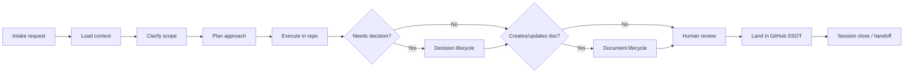

# AI Workflow

| Field | Value |
| --- | --- |
| Document ID | GOS-GPO-014 |
| Document Name | AI Workflow |
| Version | 1.0.0 |
| Status | Approved |
| Owner | Gojen Product Office |
| Reviewer | Gomathi K (Founder & CEO) |
| Approver | Founder Board |
| Created Date | 2026-07-18 |
| Last Updated | 2026-07-18 |
| Purpose | Define the end-to-end collaboration loop between humans and AI assistants |
| Scope | All AI-assisted work in gojen-product-office |
| Related Documents | [AI-RULES.md](./AI-RULES.md), [AI-SESSION-CHECKLIST.md](./AI-SESSION-CHECKLIST.md), [DOCUMENT-LIFECYCLE.md](./DOCUMENT-LIFECYCLE.md), [DECISION-LIFECYCLE.md](./DECISION-LIFECYCLE.md) |

## Navigation

| Link | Target |
| --- | --- |
| Parent Document | [README.md](./README.md) |
| Child Documents | None |
| Related Documents | [PROMPT-STANDARDS.md](./PROMPT-STANDARDS.md), [CURRENT-SPRINT.md](./CURRENT-SPRINT.md), [AI-CONTEXT.md](./AI-CONTEXT.md) |
| Previous | [FOUNDER-BOARD-PACK.md](./FOUNDER-BOARD-PACK.md) |
| Next | [AI-RULES.md](./AI-RULES.md) |
| Back to START-HERE | [START-HERE.md](../START-HERE.md) |

---

## Workflow overview

---

## Stage details

### 1. Intake request

Human states the goal, constraints, and whether the work is GAIOS, company, or product-scoped. Prefer prompts that follow [PROMPT-STANDARDS.md](./PROMPT-STANDARDS.md).

### 2. Load context

AI loads [AI-CONTEXT.md](./AI-CONTEXT.md), [CURRENT-SPRINT.md](./CURRENT-SPRINT.md), and relevant [memory/](../memory/README.md) files. Product tasks also load the matching `products/*` README and stage folders.

### 3. Clarify scope

Confirm:

- Paths that may be created vs paths that must not be modified
- Whether a decision or only an artifact is required
- Owner, reviewer, and approver expectations per [ROLE-MATRIX.md](./ROLE-MATRIX.md)

### 4. Plan approach

Produce a short plan: files to touch, standards to apply, risks, and verification. For large work, align to [SPRINT-STANDARDS.md](./SPRINT-STANDARDS.md).

### 5. Execute in repo

Implement only authorized changes. Prefer new files under approved GAIOS paths when establishing OS content. Respect [repository-standards.md](./repository-standards.md) and [GPO-STD-005](../standards/repository-rules.md).

### 6. Decision gate

If the work changes strategy, ownership, scope, or irreversible process, follow [DECISION-LIFECYCLE.md](./DECISION-LIFECYCLE.md) before treating the change as settled.

### 7. Document gate

New or revised durable docs follow [DOCUMENT-LIFECYCLE.md](./DOCUMENT-LIFECYCLE.md) and [documentation-standards.md](./documentation-standards.md).

### 8. Human review

Humans approve substance. AI may propose; founders and designated owners decide.

### 9. Land in GitHub

Commits and merges happen only under human direction. GitHub remains SSOT.

### 10. Session close

Complete the end-of-session items in [AI-SESSION-CHECKLIST.md](./AI-SESSION-CHECKLIST.md): summarize outcomes, list files created, note open decisions, point to next reading.

---

## Collaboration modes

| Mode | When to use | AI behavior |
| --- | --- | --- |
| Advise | Strategy, trade-offs | Recommend; do not write irreversible decisions as fact until recorded |
| Draft | Documents, plans | Create structured drafts with metadata |
| Implement | Authorized file creation/edits | Execute precisely; minimize scope |
| Audit | Consistency / compliance | Check against AI-RULES and standards; report gaps |

---

## Escalation

Escalate to Founder Board (via [FOUNDER-BOARD-PACK.md](./FOUNDER-BOARD-PACK.md) update request) when:

- Product priority or company strategy would change
- Existing protected files need modification
- RACI ownership is unclear for a material decision
- A proposed change conflicts with Approved GAIOS or GPO-STD documents
