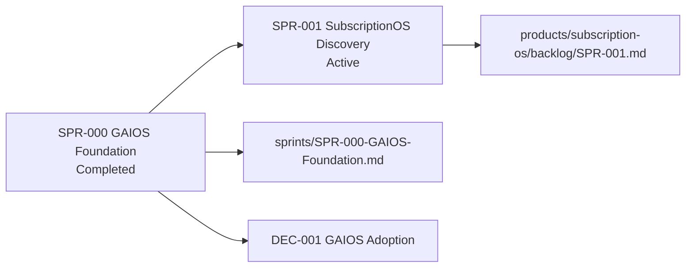

# Current Sprint — SPR-001 SubscriptionOS Discovery

| Field | Value |
| --- | --- |
| Document ID | GOS-GPO-012 |
| Document Name | Current Sprint — SubscriptionOS Discovery |
| Version | 2.0.0 |
| Status | Active |
| Owner | Founder Board |
| Reviewer | Gomathi K (Founder & CEO) |
| Approver | Founder Board |
| Created Date | 2026-07-18 |
| Last Updated | 2026-07-19 |
| Purpose | Declare the active operational sprint after GAIOS Foundation completion |
| Scope | Subscription OS discovery and MVP definition for a two-week sprint |
| Related Documents | [SPR-001 backlog](../../products/subscription-os/backlog/SPR-001.md), [Subscription OS Roadmap](../roadmaps/subscription-os-roadmap.md), [DEC-001](../decision-register/DEC-001-GAIOS-Adoption.md), [SPR-000 archive](../sprints/SPR-000-GAIOS-Foundation.md), [SPR-000 retrospective](../learning/retrospectives/SPR-000.md), [FBM-001 Actions](../meetings/action-register/FBM-001-Actions.md) |

## Navigation

| Link | Target |
| --- | --- |
| Parent Document | [ai-governance/README.md](./README.md) |
| Child Documents | None |
| Related Documents | [Company Roadmap](../roadmaps/company-roadmap.md), [FOUNDER-BOARD-PACK.md](./FOUNDER-BOARD-PACK.md), [sprints/README.md](../sprints/README.md) |
| Previous | [AI-CONTEXT.md](./AI-CONTEXT.md) |
| Next | [FOUNDER-BOARD-PACK.md](./FOUNDER-BOARD-PACK.md) |
| Back to START-HERE | [START-HERE.md](../START-HERE.md) |

---

## Sprint identity

| Field | Value |
| --- | --- |
| Sprint ID | SPR-001 |
| Sprint Name | SubscriptionOS Discovery Sprint |
| Status | Active |
| Duration | Two weeks |
| Start Date | 2026-07-19 |
| Target End Date | 2026-08-02 |
| Owner | Founder Board |

---

## Sprint goal

Validate the Subscription OS opportunity and define the MVP.

---

## Objectives

1. Customer discovery and market validation (Story 001)
2. Competitor analysis and pricing research (Story 002)
3. Product vision (Story 003)
4. User personas (Story 004)
5. Customer journey mapping (Story 005)
6. Operational workflow design (Story 006)
7. MVP scope for Founder Board approval

Discovery sequence: **market → product → experience → operations**.

---

## Success criteria

| Criterion | Target |
| --- | --- |
| Customer interviews | 20 completed and synthesized |
| Competitor analysis | Top competitors documented |
| Pricing | Pricing approach approved by Founder Board |
| MVP | MVP scope approved by Founder Board |
| Board review | Founder Board review of discovery pack completed |

---

## Working links

| Need | Document |
| --- | --- |
| Product backlog (stories) | [products/subscription-os/backlog/SPR-001.md](../../products/subscription-os/backlog/SPR-001.md) (index → story folders) |
| Product roadmap | [subscription-os-roadmap.md](../roadmaps/subscription-os-roadmap.md) |
| Company roadmap | [company-roadmap.md](../roadmaps/company-roadmap.md) |
| GAIOS adoption decision (DEC-001) | [DEC-001-GAIOS-Adoption.md](../decision-register/DEC-001-GAIOS-Adoption.md) |
| Canonical adoption decision | [dec-gpo-002-gaios-v1-adoption.md](../decision-register/dec-gpo-002-gaios-v1-adoption.md) |
| Foundation sprint archive | [SPR-000-GAIOS-Foundation.md](../sprints/SPR-000-GAIOS-Foundation.md) |
| Foundation retrospective | [learning/retrospectives/SPR-000.md](../learning/retrospectives/SPR-000.md) |
| Founder Board actions | [FBM-001-Actions.md](../meetings/action-register/FBM-001-Actions.md) |

---

## Prior sprint (completed)

| Field | Value |
| --- | --- |
| Sprint ID | SPR-000 |
| Sprint Name | GAIOS Foundation |
| Status | Completed |
| Archive | [SPR-000-GAIOS-Foundation.md](../sprints/SPR-000-GAIOS-Foundation.md) |
| Board decision | [DEC-001](../decision-register/DEC-001-GAIOS-Adoption.md) |

---

## Out of scope (this sprint)

- Feature coding for Subscription OS
- Production architecture build-out
- Pawn Management discovery expansion beyond capacity caps already set
- Modifying existing GPO standards
