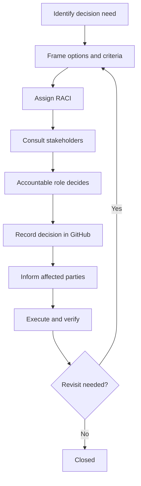

# Decision Lifecycle

| Field | Value |
| --- | --- |
| Document ID | GOS-GPO-021 |
| Document Name | Decision Lifecycle |
| Version | 1.0.0 |
| Status | Approved |
| Owner | Gojen Product Office |
| Reviewer | Gomathi K (Founder & CEO) |
| Approver | Founder Board |
| Created Date | 2026-07-18 |
| Last Updated | 2026-07-18 |
| Purpose | Define how material decisions are proposed, decided, recorded, and communicated |
| Scope | Company and GAIOS decisions; product decisions follow the same pattern in product decision logs |
| Related Documents | [RACI-MATRIX.md](./RACI-MATRIX.md), [ROLE-MATRIX.md](./ROLE-MATRIX.md), [MEETING-STANDARDS.md](./MEETING-STANDARDS.md) |

## Navigation

| Link | Target |
| --- | --- |
| Parent Document | [README.md](./README.md) |
| Child Documents | None |
| Related Documents | [DOCUMENT-LIFECYCLE.md](./DOCUMENT-LIFECYCLE.md), [FOUNDER-BOARD-PACK.md](./FOUNDER-BOARD-PACK.md), [AI-RULES.md](./AI-RULES.md) |
| Previous | [DOCUMENT-LIFECYCLE.md](./DOCUMENT-LIFECYCLE.md) |
| Next | [ROLE-MATRIX.md](./ROLE-MATRIX.md) |
| Back to START-HERE | [START-HERE.md](../START-HERE.md) |

---

## Lifecycle diagram

---

## What counts as a material decision

Record a formal decision when the choice:

- Changes product priority or company strategy
- Alters ownership, RACI, or approval rights
- Creates or retires a GAIOS standard
- Authorizes modification of previously protected paths
- Commits significant engineering or commercial direction

Non-material execution choices may proceed under existing Approved standards without a new decision record.

---

## Decision record minimum fields

| Field | Description |
| --- | --- |
| Decision ID | Per [GPO-STD-001](../standards/document-numbering.md) (`DEC-...`) when logged in product/company registers |
| Title | Short decision name |
| Context | Why the decision is needed |
| Options | Alternatives considered |
| Decision | Chosen option |
| Rationale | Why |
| Accountable | Who decided |
| Date | Decision date |
| Consequences | What changes in-repo or in operating practice |
| Links | Related docs |

Product decisions for Subscription OS use [products/subscription-os/decision-log/](../../products/subscription-os/decision-log/README.md). Company-level index is planned under `company/decision-register/`.

---

## Authority rules

- AI may draft options and recommended rationale.
- AI may not mark a decision Approved.
- Founder Board is Accountable for company strategy and GAIOS foundation acceptance.
- Product owners are Accountable for product-scoped decisions within Board priorities.

See [RACI-MATRIX.md](./RACI-MATRIX.md).

---

## Communication

After recording:

1. Update affected GAIOS docs if doctrine changed
2. Mention in [CHANGELOG.md](./CHANGELOG.md) when GAIOS-visible
3. Reflect in [FOUNDER-BOARD-PACK.md](./FOUNDER-BOARD-PACK.md) when Board-relevant
4. Inform roles listed as Informed in RACI
