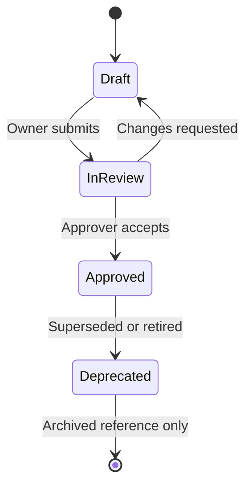

# Document Lifecycle

| Field | Value |
| --- | --- |
| Document ID | GOS-GPO-020 |
| Document Name | Document Lifecycle |
| Version | 1.0.0 |
| Status | Approved |
| Owner | Gojen Product Office |
| Reviewer | Gomathi K (Founder & CEO) |
| Approver | Founder Board |
| Created Date | 2026-07-18 |
| Last Updated | 2026-07-18 |
| Purpose | Define states and transitions for GAIOS and Product Office documents |
| Scope | Markdown documents under company/ GAIOS paths; guidance for product docs |
| Related Documents | [documentation-standards.md](./documentation-standards.md), [GPO-STD-002](../standards/versioning.md), [DECISION-LIFECYCLE.md](./DECISION-LIFECYCLE.md) |

## Navigation

| Link | Target |
| --- | --- |
| Parent Document | [README.md](./README.md) |
| Child Documents | None |
| Related Documents | [ROLE-MATRIX.md](./ROLE-MATRIX.md), [INDEX.md](../INDEX.md), [GPO-STD-001](../standards/document-numbering.md) |
| Previous | [SPRINT-STANDARDS.md](./SPRINT-STANDARDS.md) |
| Next | [DECISION-LIFECYCLE.md](./DECISION-LIFECYCLE.md) |
| Back to START-HERE | [START-HERE.md](../START-HERE.md) |

---

## Lifecycle diagram

---

## States

| State | Meaning | Allowed edits |
| --- | --- | --- |
| Draft | Work in progress | Owner and collaborators |
| InReview | Awaiting reviewer/approver | Editorial fixes only unless returned to Draft |
| Approved | Authoritative for its scope | Controlled updates with version bump per [GPO-STD-002](../standards/versioning.md) |
| Deprecated | No longer active doctrine | Corrections for historical clarity only |

GAIOS v1.0 foundation documents ship as **Approved** at version **1.0.0**.

---

## Required metadata (every GAIOS doc)

Document ID, Document Name, Version, Status, Owner, Reviewer, Approver, Created Date, Last Updated, Purpose, Scope, Related Documents — plus navigation links including Back to START-HERE.

See [documentation-standards.md](./documentation-standards.md).

---

## Create → publish path

1. Allocate Document ID (`GOS-GPO-NNN` for GAIOS).
2. Create new file under the correct folder (prefer additive paths).
3. Fill metadata and navigation.
4. Cross-link from [INDEX.md](../INDEX.md) and [SEARCH.md](../SEARCH.md) when adding new IDs in future sprints.
5. Move Draft → InReview → Approved with named humans.
6. Note material releases in [CHANGELOG.md](./CHANGELOG.md).

---

## Supersession

When a document is replaced:

- Mark old Status as Deprecated
- Link old → new and new → old in Related Documents
- Keep the file for history unless a separate archival policy says otherwise
- Update INDEX and SEARCH keyword targets

Version numbering follows [GPO-STD-002](../standards/versioning.md).
