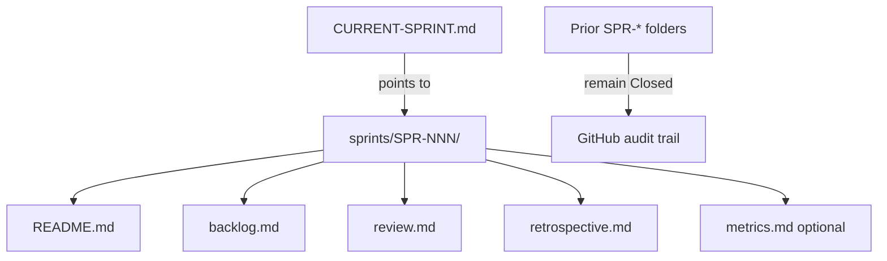

# Sprint Standards (GAIOS)

| Field | Value |
| --- | --- |
| Document ID | GOS-GPO-019 |
| Document Name | Sprint Standards |
| Version | 1.1.0 |
| Status | Approved |
| Owner | Gojen Product Office |
| Reviewer | Gomathi K (Founder & CEO) |
| Approver | Founder Board |
| Created Date | 2026-07-18 |
| Last Updated | 2026-07-19 |
| Purpose | Define how GAIOS and Product Office sprints are named, scoped, tracked, and closed |
| Scope | Company GAIOS sprints and guidance for product sprints that reference GAIOS |
| Related Documents | [CURRENT-SPRINT.md](./CURRENT-SPRINT.md), [sprints/README.md](../sprints/README.md), [AI-WORKFLOW.md](./AI-WORKFLOW.md) |

## Navigation

| Link | Target |
| --- | --- |
| Parent Document | [README.md](./README.md) |
| Child Documents | None |
| Related Documents | [MEETING-STANDARDS.md](./MEETING-STANDARDS.md), [FOUNDER-BOARD-PACK.md](./FOUNDER-BOARD-PACK.md), [CHANGELOG.md](./CHANGELOG.md) |
| Previous | [MEETING-STANDARDS.md](./MEETING-STANDARDS.md) |
| Next | [DOCUMENT-LIFECYCLE.md](./DOCUMENT-LIFECYCLE.md) |
| Back to START-HERE | [START-HERE.md](../START-HERE.md) |

---

## Separation of concerns (mandatory)

| Artifact | Role | May hold history? |
| --- | --- | --- |
| [CURRENT-SPRINT.md](./CURRENT-SPRINT.md) | **Pointer only** — active sprint ID, one-line goal, links | No |
| [sprints/SPR-NNN/](../sprints/README.md) | **Permanent sprint folder** — README, backlog, review, metrics, retrospective | Yes (never overwrite prior sprints) |

Historical information is never overwritten. Closing a sprint means marking its folder Closed and moving the pointer — not editing history into CURRENT-SPRINT.

---

## Sprint naming

| Kind | Pattern | Example |
| --- | --- | --- |
| Folder ID | `SPR-NNN` | `SPR-000`, `SPR-001` |
| Optional alias | `GAIOS-N` | `GAIOS-1` = SPR-000, `GAIOS-2` = SPR-001 |
| Product sprint | Product code + sequence | Managed under product engineering docs |

Active company sprint pointer: [CURRENT-SPRINT.md](./CURRENT-SPRINT.md) → currently [SPR-001](../sprints/SPR-001/README.md).

---

## Sprint definition of ready

A sprint may start when:

1. Folder `company/sprints/SPR-NNN/` exists with `README.md` and `backlog.md`
2. Goal is written in one sentence in the sprint README
3. In-scope and out-of-scope lists exist
4. Success criteria are testable
5. Owner and reviewer are named
6. [CURRENT-SPRINT.md](./CURRENT-SPRINT.md) pointer updated to the new folder
7. Prior sprint (if any) marked Closed in its README and in [sprints/README.md](../sprints/README.md)

---

## Sprint definition of done

A sprint may close when:

1. Success criteria are met or explicitly deferred with Board acknowledgment
2. `review.md` and `retrospective.md` completed (Version 1.0.0, Status Closed)
3. `metrics.md` completed when quantitative tracking applies
4. [CHANGELOG.md](./CHANGELOG.md) updated for GAIOS-visible changes
5. [CURRENT-SPRINT.md](./CURRENT-SPRINT.md) pointer moved to the next sprint (or cleared only if none active)
6. Open decisions are logged with owners
7. Founder Board pack reflects material outcomes if strategy-facing
8. Prior sprint folder contents are left intact

---

## Cadence (default)

| Event | Timing | Output location |
| --- | --- | --- |
| Plan | Sprint start | `SPR-NNN/README.md` + `backlog.md` |
| Mid-check | Mid-sprint | Backlog status updates in `backlog.md` |
| Review | Sprint end | `SPR-NNN/review.md` |
| Retro | Sprint end | `SPR-NNN/retrospective.md` (+ learning notes in `company/learning/` when relevant) |

Ceremony quality follows [MEETING-STANDARDS.md](./MEETING-STANDARDS.md).

---

## Scope control

- Prefer thin vertical slices that land as Approved documents or working product artifacts.
- Do not expand into protected existing files without an explicit change request.
- If product delivery and GAIOS work compete, Founder Board priority wins; default product priority is Subscription OS.
- Never store sprint history in CURRENT-SPRINT; never delete closed sprint folders.
