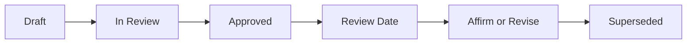

# Decision Register

| Field | Value |
| --- | --- |
| Document ID | GOS-GPO-120 |
| Document Name | Decision Register |
| Version | 1.0.0 |
| Status | Approved |
| Owner | Product Office |
| Reviewer | Founder Board |
| Approver | Founder Board |
| Created Date | 2026-07-18 |
| Last Updated | 2026-07-18 |
| Purpose | Govern how durable company decisions are proposed, recorded, approved, and reviewed under GAIOS. |
| Scope | Company-level decisions (GPO). Product-scoped decisions may also use product decision logs once activated. |

## Navigation

| Link | Target |
| --- | --- |
| Parent | [company/](../README.md) · [START-HERE](../START-HERE.md) |
| Child | [REGISTER.md](./REGISTER.md) · [DEC-GPO-001](./dec-gpo-001-github-as-ssot.md) · [DEC-GPO-002](./dec-gpo-002-gaios-v1-adoption.md) · [DEC-GPO-003](./dec-gpo-003-product-portfolio-structure.md) |
| Related | [Decision Draft Template](../templates/decision-draft-template.md) · [Approval Workflow](../governance/approval-workflow.md) · [Risk Register](../risk-register/README.md) |
| Previous | [Industry Reports](../research/industry-reports.md) |
| Next | [REGISTER.md](./REGISTER.md) |
| Back to START-HERE | [START-HERE.md](../START-HERE.md) |

## Purpose

The Decision Register is the authoritative record of choices that shape Gojen Technology’s operating system, portfolio, and knowledge practices. AI assistants may draft options; only Approved decisions in this register (or product decision logs) are company truth.

## Required Fields

Every decision document must include:

| Field | Description |
| --- | --- |
| Decision ID | Stable identifier (e.g., DEC-GPO-001) |
| Owner | Accountable person or role |
| Problem Statement | Why a decision is required |
| Options Considered | Alternatives with trade-offs |
| Decision | Chosen option |
| Reason | Rationale |
| Impact | Who/what changes |
| Status | Draft / In Review / Approved / Superseded |
| Approval | Who approved and when |
| Review Date | When the decision must be revalidated |

## Lifecycle

## Index

| Decision ID | Title | Status | Doc ID |
| --- | --- | --- | --- |
| DEC-GPO-001 | GitHub as Single Source of Truth | Approved | [GOS-GPO-122](./dec-gpo-001-github-as-ssot.md) |
| DEC-GPO-002 | GAIOS v1.0 Adoption | Approved | [GOS-GPO-123](./dec-gpo-002-gaios-v1-adoption.md) |
| DEC-GPO-003 | Product Portfolio Structure | Approved | [GOS-GPO-124](./dec-gpo-003-product-portfolio-structure.md) |

Master table: [REGISTER.md](./REGISTER.md)

## Related Documents

- [REGISTER.md](./REGISTER.md)
- [Approval Workflow](../governance/approval-workflow.md)
- [Authority Matrix](../governance/authority-matrix.md)
- [Decision Draft Template](../templates/decision-draft-template.md)
