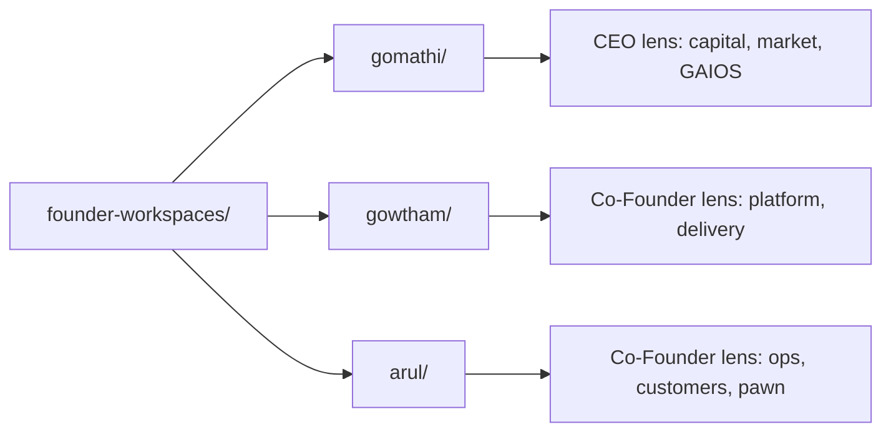

# Founder Workspaces

| Field | Value |
| --- | --- |
| Document ID | GOS-GPO-040 |
| Document Name | Founder Workspaces Index |
| Version | 1.0.0 |
| Status | Approved |
| Owner | Gomathi K – Founder & CEO |
| Reviewer | Founder Board |
| Approver | Founder Board |
| Created Date | 2026-07-18 |
| Last Updated | 2026-07-18 |
| Purpose | Index personal operating workspaces for each founder so strategy, decisions, and weekly execution stay visible and cross-linked inside GAIOS. |
| Scope | All founder personal workspaces under `company/founder-workspaces/` for Gojen Technology GAIOS v1.0. |
| Related Documents | [CEO Dashboard](../dashboards/ceo-dashboard.md), [Founder Board Cadence](../meetings/founder-board-cadence.md), [Company Roadmap](../roadmaps/company-roadmap.md) |

## Navigation

| Link | Target |
| --- | --- |
| Parent Document | [Company](../README.md) |
| Child Documents | [Gomathi](./gomathi/README.md), [Gowtham](./gowtham/README.md), [Arul Jeni](./arul/README.md) |
| Related Documents | [Dashboards](../dashboards/README.md), [Roadmaps](../roadmaps/README.md), [Meetings](../meetings/README.md) |
| Previous | [Company Operating System](../operating-system/README.md) |
| Next | [Gomathi Workspace](./gomathi/README.md) |
| Back to START-HERE | [START-HERE](../START-HERE.md) |

## Purpose

Founder workspaces give each founder a private-but-indexed operating surface inside the Product Office repository. They capture AI onboarding context, meeting notes, research, ideas, weekly logs, learning, action items, personal roadmaps, and decision drafts without replacing company governance or product documentation.

## Workspace Map

| Founder | Role | Workspace | Document Range |
| --- | --- | --- | --- |
| Gomathi K | Founder & CEO | [gomathi/](./gomathi/README.md) | GOS-GPO-041 – GOS-GPO-050 |
| Gowtham | Co-Founder | [gowtham/](./gowtham/README.md) | GOS-GPO-051 – GOS-GPO-060 |
| Arul Jeni | Co-Founder | [arul/](./arul/README.md) | GOS-GPO-061 – GOS-GPO-070 |

## Operating Rules

1. Personal notes stay in the founder folder; company decisions move to governance, decision logs, or Founder Board minutes.
2. Weekly logs cover the prior calendar week and feed the [CEO Dashboard](../dashboards/ceo-dashboard.md) and Founder Board.
3. Action items must be concrete, dated, and owned; close them or escalate within two board cycles.
4. Cross-link Subscription OS, Pawn Management, and GAIOS foundation work instead of duplicating product specs.

## Current Company Context (July 2026)

- GAIOS foundation infrastructure is ready; Product Office documentation is starting in earnest.
- Subscription OS and Pawn Management are the two active SaaS product lines in discovery-to-definition.
- Founders use these workspaces to keep parallel tracks aligned without blocking product authors.
