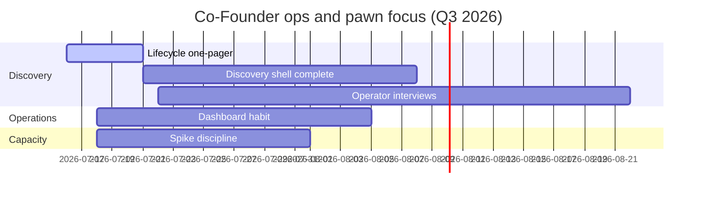

# Arul Jeni – Personal Roadmap

| Field | Value |
| --- | --- |
| Document ID | GOS-GPO-069 |
| Document Name | Arul Jeni Personal Roadmap |
| Version | 1.0.0 |
| Status | Approved |
| Owner | Arul Jeni – Co-Founder |
| Reviewer | Gomathi K – Founder & CEO |
| Approver | Founder Board |
| Created Date | 2026-07-18 |
| Last Updated | 2026-07-18 |
| Purpose | Define Co-Founder operations and Pawn Management focus themes for Q3 2026. |
| Scope | Personal leadership roadmap for Arul; product milestones live in roadmaps/. |
| Related Documents | [Pawn Management Roadmap](../../roadmaps/pawn-management-roadmap.md), [Operations Dashboard](../../dashboards/operations-dashboard.md), [Action Items](./action-items.md) |

## Navigation

| Link | Target |
| --- | --- |
| Parent Document | [Arul Workspace](./README.md) |
| Child Documents | None |
| Related Documents | [Company Roadmap](../../roadmaps/company-roadmap.md) |
| Previous | [Action Items](./action-items.md) |
| Next | [Decision Drafts](./decision-drafts.md) |
| Back to START-HERE | [START-HERE](../../START-HERE.md) |

## Focus Themes (Q3 2026)

| Theme | Outcome | Checkpoint |
| --- | --- | --- |
| Pawn discovery shell | Lifecycle, ICP draft, open questions pack | 2026-08-08 |
| Ops cadence | Operations dashboard fresh before each board | Ongoing |
| Capacity honesty | No unplanned eng spikes | 2026-08-01 |
| Customer signal | At least three structured operator interviews logged | 2026-08-22 |

## Relationship to Product Roadmaps

This personal roadmap supports [pawn-management-roadmap.md](../../roadmaps/pawn-management-roadmap.md) and stays subordinate to company sequencing in [company-roadmap.md](../../roadmaps/company-roadmap.md).
