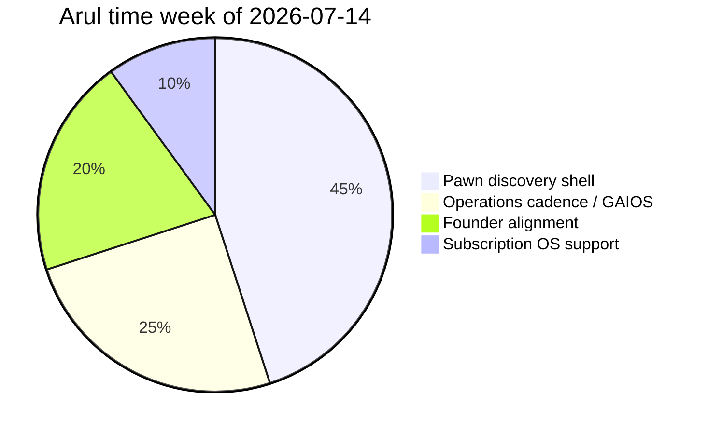

# Arul Jeni – Weekly Log

| Field | Value |
| --- | --- |
| Document ID | GOS-GPO-066 |
| Document Name | Arul Jeni Weekly Log |
| Version | 1.0.0 |
| Status | Approved |
| Owner | Arul Jeni – Co-Founder |
| Reviewer | Gomathi K – Founder & CEO |
| Approver | Founder Board |
| Created Date | 2026-07-18 |
| Last Updated | 2026-07-18 |
| Purpose | Record Co-Founder weekly operations and Pawn Management reality for Founder Board. |
| Scope | Week-by-week operations journal starting week of 2026-07-14. |
| Related Documents | [Action Items](./action-items.md), [Operations Dashboard](../../dashboards/operations-dashboard.md), [Meeting Notes](./meeting-notes.md) |

## Navigation

| Link | Target |
| --- | --- |
| Parent Document | [Arul Workspace](./README.md) |
| Child Documents | None |
| Related Documents | [Pawn Management Roadmap](../../roadmaps/pawn-management-roadmap.md) |
| Previous | [Ideas](./ideas.md) |
| Next | [Learning](./learning.md) |
| Back to START-HERE | [START-HERE](../../START-HERE.md) |

## Week of 2026-07-14

### Narrative

GAIOS foundation being ready meant operations work could finally live in a durable place. This week focused on naming the pawn loan lifecycle for discovery, accepting a lighter discovery shell than Subscription OS, and making sure operations risks show up on the dashboard instead of only in chat.

### Wins

| Win | Evidence |
| --- | --- |
| Founder agreement on pawn parallel track | Sync 2026-07-15 |
| First lifecycle stage map drafted | Meeting notes 2026-07-16 |
| Operations dashboard ownership confirmed | Arul weekly refresh |

### Friction

| Issue | Impact | Response |
| --- | --- | --- |
| Fear of being “second product” | Morale / clarity risk | CEO sequencing draft makes parallel explicit |
| Compliance questions without counsel yet | Discovery depth limited | Log open regulatory questions; do not invent |

### Time Allocation (approximate)

### Carry Forward

See [Action Items](./action-items.md) for dated commitments into the week of 2026-07-21.
