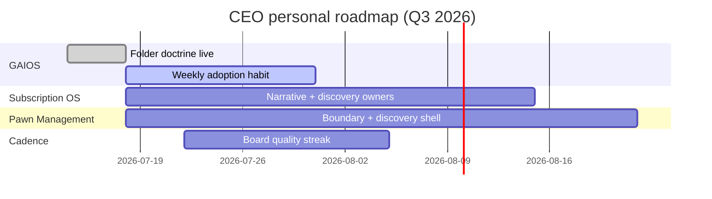

# Gomathi – Personal Roadmap

| Field | Value |
| --- | --- |
| Document ID | GOS-GPO-049 |
| Document Name | Gomathi Personal Roadmap |
| Version | 1.0.0 |
| Status | Approved |
| Owner | Gomathi K – Founder & CEO |
| Reviewer | Founder Board |
| Approver | Founder Board |
| Created Date | 2026-07-18 |
| Last Updated | 2026-07-18 |
| Purpose | Define CEO focus themes and checkpoints for Q3 2026 without replacing the company roadmap. |
| Scope | Personal leadership roadmap for Gomathi K; company milestones live in roadmaps/. |
| Related Documents | [Company Roadmap](../../roadmaps/company-roadmap.md), [Action Items](./action-items.md), [Decision Drafts](./decision-drafts.md) |

## Navigation

| Link | Target |
| --- | --- |
| Parent Document | [Gomathi Workspace](./README.md) |
| Child Documents | None |
| Related Documents | [CEO Dashboard](../../dashboards/ceo-dashboard.md), [Product Office Roadmap](../../roadmaps/product-office-roadmap.md) |
| Previous | [Action Items](./action-items.md) |
| Next | [Decision Drafts](./decision-drafts.md) |
| Back to START-HERE | [START-HERE](../../START-HERE.md) |

## Focus Themes (Q3 2026)

| Theme | Outcome | Checkpoint |
| --- | --- | --- |
| GAIOS adoption | Founders and Product Office update living docs weekly | 2026-07-31 |
| Subscription OS narrative | Discovery pack ready for external brief | 2026-08-15 |
| Pawn Management boundary | Discovery shell complete without stealing SOS capacity | 2026-08-22 |
| Founder cadence quality | Two consecutive boards with full dashboard refresh | 2026-08-05 |

## Relationship to Company Roadmap

This document is a CEO lens on [company-roadmap.md](../../roadmaps/company-roadmap.md). If personal focus and company milestones diverge for more than two weeks, raise it as a pending decision on the [CEO Dashboard](../../dashboards/ceo-dashboard.md).
