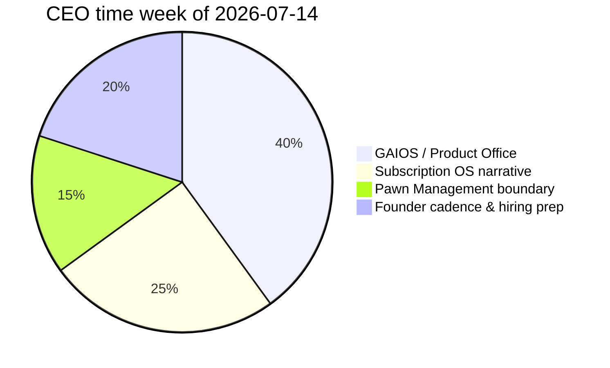

# Gomathi – Weekly Log

| Field | Value |
| --- | --- |
| Document ID | GOS-GPO-046 |
| Document Name | Gomathi Weekly Log |
| Version | 1.0.0 |
| Status | Approved |
| Owner | Gomathi K – Founder & CEO |
| Reviewer | Founder Board |
| Approver | Founder Board |
| Created Date | 2026-07-18 |
| Last Updated | 2026-07-18 |
| Purpose | Record CEO weekly operating reality for transparency into Founder Board and dashboards. |
| Scope | Week-by-week CEO journal starting week of 2026-07-14. |
| Related Documents | [Action Items](./action-items.md), [CEO Dashboard](../../dashboards/ceo-dashboard.md), [Meeting Notes](./meeting-notes.md) |

## Navigation

| Link | Target |
| --- | --- |
| Parent Document | [Gomathi Workspace](./README.md) |
| Child Documents | None |
| Related Documents | [Company Roadmap](../../roadmaps/company-roadmap.md) |
| Previous | [Ideas](./ideas.md) |
| Next | [Learning](./learning.md) |
| Back to START-HERE | [START-HERE](../../START-HERE.md) |

## Week of 2026-07-14

### Narrative

GAIOS foundation infrastructure is in place. This week shifted from “can we host the operating system?” to “will founders and Product Office actually write into it?” Primary CEO work was aligning the three founders on folder doctrine, protecting Subscription OS as the lead product story, and confirming Pawn Management stays a deliberate parallel track rather than a distraction.

### Wins

| Win | Evidence |
| --- | --- |
| Founder alignment on GAIOS v1.0 create-only expansion | 2026-07-15 founder sync notes |
| Clear portfolio sequencing restated | Subscription OS primary; Pawn Management discovery shell |
| Dashboards and roadmaps scoped for creation | Linked from [CEO Dashboard](../../dashboards/ceo-dashboard.md) plan |

### Friction

| Issue | Impact | Response |
| --- | --- | --- |
| Product documentation still thin | Hard to brief outsiders on either product | Accelerate Product Office roadmap authoring |
| Risk of dual-product thrash | Dilutes CEO narrative | Keep Founder Board agenda product-sequenced |

### Time Allocation (approximate)

### Carry Forward

See [Action Items](./action-items.md) for dated CEO commitments into the week of 2026-07-21.
