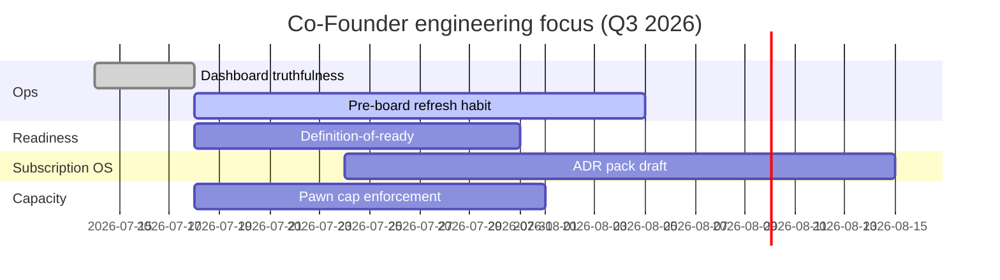

# Gowtham – Personal Roadmap

| Field | Value |
| --- | --- |
| Document ID | GOS-GPO-059 |
| Document Name | Gowtham Personal Roadmap |
| Version | 1.0.0 |
| Status | Approved |
| Owner | Gowtham – Co-Founder |
| Reviewer | Gomathi K – Founder & CEO |
| Approver | Founder Board |
| Created Date | 2026-07-18 |
| Last Updated | 2026-07-18 |
| Purpose | Define Co-Founder delivery focus themes for Q3 2026 without replacing product roadmaps. |
| Scope | Personal leadership roadmap for Gowtham; product milestones live in roadmaps/. |
| Related Documents | [Subscription OS Roadmap](../../roadmaps/subscription-os-roadmap.md), [Engineering Dashboard](../../dashboards/engineering-dashboard.md), [Action Items](./action-items.md) |

## Navigation

| Link | Target |
| --- | --- |
| Parent Document | [Gowtham Workspace](./README.md) |
| Child Documents | None |
| Related Documents | [Company Roadmap](../../roadmaps/company-roadmap.md) |
| Previous | [Action Items](./action-items.md) |
| Next | [Decision Drafts](./decision-drafts.md) |
| Back to START-HERE | [START-HERE](../../START-HERE.md) |

## Focus Themes (Q3 2026)

| Theme | Outcome | Checkpoint |
| --- | --- | --- |
| Truthful engineering ops | Dashboard refreshed before every Founder Board | Ongoing |
| Build readiness | Definition-of-ready live with Product Office | 2026-07-31 |
| Subscription OS architecture prep | Core ADR set drafted | 2026-08-15 |
| Capacity discipline | Pawn eng load stays within published cap | 2026-08-01 |

## Relationship to Product Roadmaps

Personal focus supports [subscription-os-roadmap.md](../../roadmaps/subscription-os-roadmap.md) and [pawn-management-roadmap.md](../../roadmaps/pawn-management-roadmap.md). Feature dates are not promised here until discovery exit criteria clear.
