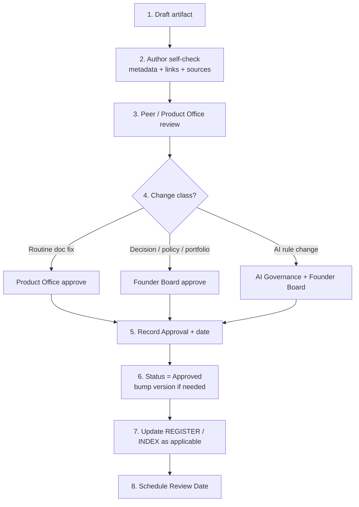

# Approval Workflow

| Field | Value |
| --- | --- |
| Document ID | GOS-GPO-151 |
| Document Name | Approval Workflow |
| Version | 1.0.0 |
| Status | Approved |
| Owner | Product Office |
| Reviewer | Founder Board |
| Approver | Founder Board |
| Created Date | 2026-07-18 |
| Last Updated | 2026-07-18 |
| Purpose | Define how GAIOS artifacts move from draft to Approved status with clear gates. |
| Scope | Company decisions, governance docs, research status changes, and material GAIOS policy. |

## Navigation

| Link | Target |
| --- | --- |
| Parent | [Governance](./README.md) · [START-HERE](../START-HERE.md) |
| Child | None |
| Related | [Authority Matrix](./authority-matrix.md) · [GAIOS Governance Charter](./gaios-governance-charter.md) · [Decision Register](../decision-register/README.md) · [Decision Draft Template](../templates/decision-draft-template.md) |
| Previous | [GAIOS Governance Charter](./gaios-governance-charter.md) |
| Next | [Authority Matrix](./authority-matrix.md) |
| Back to START-HERE | [START-HERE.md](../START-HERE.md) |

## Workflow Overview

## Change Classes

| Class | Examples | Approver |
| --- | --- | --- |
| Routine | Typos, link fixes, non-semantic clarity | Product Office steward |
| Material documentation | New GAIOS process page, research status upgrades | Product Office + notifying Founder Board |
| Decision | New DEC-* | Founder Board (or delegated per Authority Matrix) |
| Portfolio / charter | Product freeze, charter amendment | Founder Board only |
| AI governance | Autonomy rules, agent permissions | AI Governance steward + Founder Board |

## Step Detail

### 1. Draft

Use the appropriate template ([decision-draft-template.md](../templates/decision-draft-template.md) for decisions). Status = Draft.

### 2. Author self-check

- Metadata complete (ID, Version, Owner, dates, Purpose, Scope)
- Navigation links valid
- Sources cited; no PII
- Options and impacts stated for decisions

### 3. Review

Reviewer challenges assumptions, dual-product conflicts, and AI-invented claims.

### 4–5. Approval

Approver named in [Authority Matrix](./authority-matrix.md). Record name/role and date in the document Approval field.

### 6–8. Publish and review

Set Status = Approved. Update master registers. Set Review Date. Calendar the revalidation.

## SLA Guidance

| Class | Target cycle time |
| --- | --- |
| Routine | 48 hours |
| Material documentation | 1 week |
| Decision | Next Founder Board session or ad-hoc within 5 business days if blocking |

## Rejection / Rework

If rejected, Status returns to Draft with written reasons. Do not delete history; supersede when a replacement decision is Approved.

## Related Documents

- [Authority Matrix](./authority-matrix.md)
- [Compliance Checklist](./compliance-checklist.md)
- [Decision Register](../decision-register/README.md)
- [GAIOS Governance Charter](./gaios-governance-charter.md)
