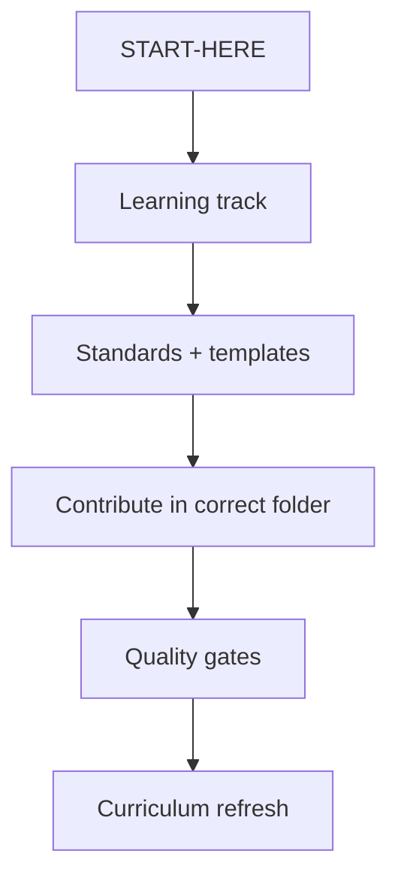

# Learning Index

| Field | Value |
| --- | --- |
| Document ID | GOS-GPO-300 |
| Title | Learning Index |
| Product / Scope | GPO |
| Version | 1.0.0 |
| Status | Approved |
| Author | Gojen Product Office |
| Owner | Product Office / Learning Steward |
| Created | 2026-07-18 |
| Last Updated | 2026-07-19 |
| Classification | Internal |

## Version History

| Version | Date | Author | Summary |
| --- | --- | --- | --- |
| 1.0.0 | 2026-07-18 | Gojen Product Office | GAIOS v1.0 approved release |

## Approval Table

| Role | Name | Decision | Date |
| --- | --- | --- | --- |
| Author | Gojen Product Office | Prepared | 2026-07-18 |
| Reviewer | Gowtham | Approved | 2026-07-18 |
| Reviewer | Arul Jeni | Approved | 2026-07-18 |
| Approver | Gomathi K (CEO) | Approved | 2026-07-18 |

## Breadcrumb

[Home](../../README.md) › [Company](../README.md) › Learning

## Navigation Links

- [Back to START-HERE.md](../START-HERE.md)
- [Learning index](./README.md)
- [Quality](../quality/README.md)
- [Products](../products/README.md)
- [Master Index](../../INDEX.md)

## Purpose

Provide the learning system for founders, employees, and AI assistants operating inside GAIOS and the Gojen Product Office.

## Learning Tracks

| Track | Document | Audience |
| --- | --- | --- |
| Founders | [onboarding-founders.md](./onboarding-founders.md) | Gomathi K, Gowtham, Arul Jeni |
| AI assistants | [onboarding-ai-assistants.md](./onboarding-ai-assistants.md) | Cursor / AI operators |
| Employees | [onboarding-employees.md](./onboarding-employees.md) | Future hires / contributors |
| Curriculum | [curriculum.md](./curriculum.md) | All operators |
| Reading list | [reading-list.md](./reading-list.md) | All operators |
| Retrospectives | [retrospectives/README.md](./retrospectives/README.md) | Sprint learning records |

## Learning Outcomes

After completing the appropriate track, a person or AI assistant can:

1. Navigate company and product folders without breaking authority boundaries.
2. Create documents using standards and templates.
3. Know when to update GAIOS summaries versus lifecycle artifacts.
4. Escalate decisions to the correct owner.

## Knowledge Flow

## References

| Document ID | Title | Link |
| --- | --- | --- |
| GOS-GPO-300 | Learning Index | [./README.md](./README.md) |
| GOS-GPO-999 | GAIOS v1 Deliverable | [../GAIOS-V1-DELIVERABLE.md](../GAIOS-V1-DELIVERABLE.md) |

## Change Log

| Date | Version | Change | Author |
| --- | --- | --- | --- |
| 2026-07-18 | 1.0.0 | Initial approved GAIOS v1.0 document | Gojen Product Office |

