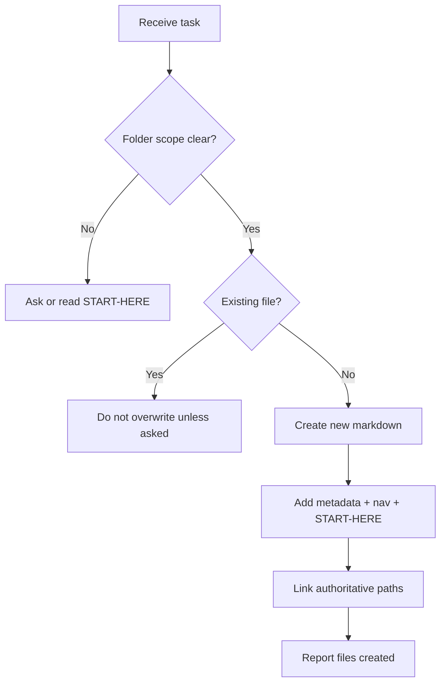

# AI Assistant Onboarding

| Field | Value |
| --- | --- |
| Document ID | GOS-GPO-302 |
| Title | AI Assistant Onboarding |
| Product / Scope | GPO |
| Version | 1.0.0 |
| Status | Approved |
| Author | Gojen Product Office |
| Owner | Product Office / Learning Steward |
| Created | 2026-07-18 |
| Last Updated | 2026-07-18 |
| Classification | Internal |

## Version History

| Version | Date | Author | Summary |
| --- | --- | --- | --- |
| 1.0.0 | 2026-07-18 | Gojen Product Office | GAIOS v1.0 approved release |

## Approval Table

| Role | Name | Decision | Date |
| --- | --- | --- | --- |
| Author | Gojen Product Office | Prepared | 2026-07-18 |
| Reviewer | Gowtham | Approved | 2026-07-18 |
| Reviewer | Arul Jeni | Approved | 2026-07-18 |
| Approver | Gomathi K (CEO) | Approved | 2026-07-18 |

## Breadcrumb

[Home](../../README.md) › [Company](../README.md) › [Learning](./README.md) › AI Assistant Onboarding

## Navigation Links

- [Back to START-HERE.md](../START-HERE.md)
- [Learning index](./README.md)
- [Quality](../quality/README.md)
- [Products](../products/README.md)
- [Master Index](../../INDEX.md)

## Purpose

Instruct AI assistants (including Cursor agents) how to operate safely and correctly inside this repository.

## Hard Rules

1. **Do not modify or overwrite existing files** unless the human explicitly requests an edit.
2. **Do not modify root `products/` lifecycle workspaces** when the task is GAIOS portfolio documentation — link instead.
3. Prefer creating new markdown under the requested folder only.
4. Follow document numbering, writing style, and versioning standards.
5. Every new GAIOS document needs metadata, navigation, and a link back to START-HERE.
6. Never invent approvals; use the Founder Board names only when documenting the approved process.
7. Never commit secrets.

## Correct Authority Model

| Need | Write in | Link to |
| --- | --- | --- |
| Operating summary | `company/products/<product>/` | `products/<product>/` |
| Deep PRD / research / ADR | `products/<product>/...` | GAIOS summary for operator view |
| Standards | `company/standards/` | Templates and INDEX |

## AI Workflow

## Quality Bar for AI-authored Docs

- No placeholders such as "TBD" without an owner and date
- Relative links verified against actual paths
- Mermaid used where structure or workflow clarity benefits
- Professional tone aligned to Fortune-500 internal standards

## References

| Document ID | Title | Link |
| --- | --- | --- |
| GOS-GPO-300 | Learning Index | [./README.md](./README.md) |
| GOS-GPO-999 | GAIOS v1 Deliverable | [../GAIOS-V1-DELIVERABLE.md](../GAIOS-V1-DELIVERABLE.md) |

## Change Log

| Date | Version | Change | Author |
| --- | --- | --- | --- |
| 2026-07-18 | 1.0.0 | Initial approved GAIOS v1.0 document | Gojen Product Office |

