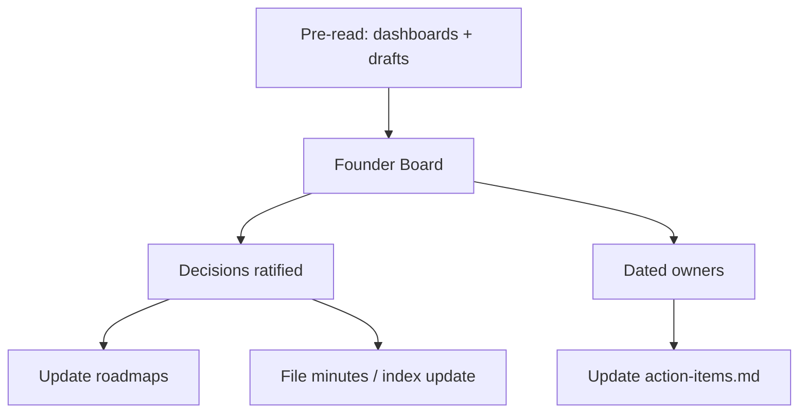

# Founder Board Cadence

| Field | Value |
| --- | --- |
| Document ID | GOS-GPO-102 |
| Document Name | Founder Board Cadence |
| Version | 1.0.0 |
| Status | Approved |
| Owner | Gomathi K – Founder & CEO |
| Reviewer | Founder Board |
| Approver | Founder Board |
| Created Date | 2026-07-18 |
| Last Updated | 2026-07-18 |
| Purpose | Define how Founder Board runs so decisions, dashboards, and actions stay synchronized inside GAIOS. |
| Scope | Founder Board rhythm for Gomathi, Gowtham, and Arul Jeni; working syncs are out of scope except as inputs. |
| Related Documents | [Meeting Index](./meeting-index.md), [Sample Founder Board Agenda](./sample-founder-board-agenda.md), [Dashboards](../dashboards/README.md) |

## Navigation

| Link | Target |
| --- | --- |
| Parent Document | [Meetings Index](./README.md) |
| Child Documents | None |
| Related Documents | [Company Roadmap](../roadmaps/company-roadmap.md), [Templates Guide](./templates-guide.md) |
| Previous | [Meeting Index](./meeting-index.md) |
| Next | [Templates Guide](./templates-guide.md) |
| Back to START-HERE | [START-HERE](../START-HERE.md) |

## Cadence

| Element | Standard |
| --- | --- |
| Frequency | Weekly during GAIOS / Product Office ramp |
| Length | 60 minutes |
| Chair | Gomathi K |
| Required attendees | Gomathi K, Gowtham, Arul Jeni |
| Pre-read deadline | 24 hours before start |

## Required Inputs (pre-read)

1. [CEO Dashboard](../dashboards/ceo-dashboard.md)  
2. [CPO Dashboard](../dashboards/cpo-dashboard.md)  
3. [Engineering Dashboard](../dashboards/engineering-dashboard.md)  
4. [Sales Dashboard](../dashboards/sales-dashboard.md)  
5. [Operations Dashboard](../dashboards/operations-dashboard.md)  
6. Relevant decision drafts from founder workspaces  

## Standard Agenda Shape

| Block | Minutes | Purpose |
| --- | --- | --- |
| Portfolio pulse | 10 | Sequencing and narrative |
| Dashboard exceptions | 15 | Only red/yellow items |
| Decisions | 20 | Options already drafted |
| Risks / blockers | 10 | Cross-role |
| Actions confirm | 5 | Owners and dates |

## Outputs

| Output | Where it lands |
| --- | --- |
| Ratified decisions | Minutes + linked decision docs |
| Actions | Each founder’s `action-items.md` |
| Date moves | Relevant roadmap + CEO dashboard |
| Open questions | Role dashboards pending/blocked tables |

## Quality Bar

A board without refreshed dashboards is a working sync, not a Founder Board. If pre-reads are missing, the chair shortens decisions and schedules a make-up board within seven days.
