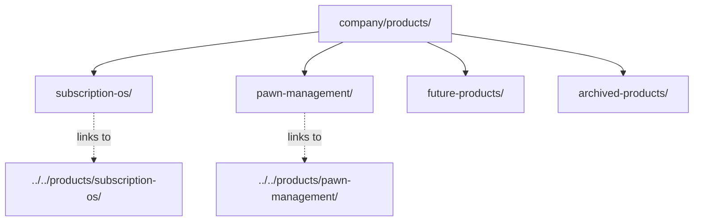

# Product Portfolio (GAIOS)

| Field | Value |
| --- | --- |
| Document ID | GOS-GPO-250 |
| Title | Product Portfolio Index |
| Product / Scope | GPO |
| Version | 1.0.0 |
| Status | Approved |
| Author | Gojen Product Office |
| Owner | Founder Board / Product Office |
| Created | 2026-07-18 |
| Last Updated | 2026-07-18 |
| Classification | Internal |

## Version History

| Version | Date | Author | Summary |
| --- | --- | --- | --- |
| 1.0.0 | 2026-07-18 | Gojen Product Office | GAIOS v1.0 approved release |

## Approval Table

| Role | Name | Decision | Date |
| --- | --- | --- | --- |
| Author | Gojen Product Office | Prepared | 2026-07-18 |
| Reviewer | Gowtham | Approved | 2026-07-18 |
| Reviewer | Arul Jeni | Approved | 2026-07-18 |
| Approver | Gomathi K (CEO) | Approved | 2026-07-18 |

## Breadcrumb

[Home](../../README.md) › [Company](../README.md) › Products (GAIOS)

## Navigation Links

- [Back to START-HERE.md](../START-HERE.md)
- [Company](../README.md)
- [GAIOS v1 Deliverable](../GAIOS-V1-DELIVERABLE.md)
- [Learning](../learning/README.md)
- [Quality](../quality/README.md)
- [Versions](../versions/README.md)
- [Root products workspaces](../../products/README.md)
- [Master Index](../../INDEX.md)

## Parent Folder

[company/](../README.md)

## Child Folders

| Folder | Document ID | Description |
| --- | --- | --- |
| [subscription-os/](./subscription-os/README.md) | GOS-GPO-251 | Operating-system summary for Subscription OS |
| [pawn-management/](./pawn-management/README.md) | GOS-GPO-270 | Operating-system summary for Pawn Management |
| [future-products/](./future-products/README.md) | GOS-GPO-290 | Intake pipeline for candidate products |
| [archived-products/](./archived-products/README.md) | GOS-GPO-295 | Retired and suspended product records |

## Purpose

This folder is the **GAIOS portfolio layer** for Gojen Technology. It provides founder-facing operating summaries, portfolio status, and navigation. It does **not** replace the authoritative product lifecycle workspaces under the repository root `products/` folder.

| Layer | Location | Role |
| --- | --- | --- |
| GAIOS portfolio | `company/products/` | Operating-system summaries, portfolio index, intake/archive |
| Authoritative lifecycle | `products/subscription-os/`, `products/pawn-management/` | Full discovery → release artifacts |

## Portfolio Overview

| Product | Scope Code | Status | GAIOS Index | Authoritative Workspace |
| --- | --- | --- | --- | --- |
| Subscription OS | SOS | Active | [subscription-os/](./subscription-os/README.md) | [../../products/subscription-os/](../../products/subscription-os/README.md) |
| Pawn Management | PAW | Active (workspace seeding) | [pawn-management/](./pawn-management/README.md) | [../../products/pawn-management/](../../products/pawn-management/README.md) |

## Founders

| Name | Role |
| --- | --- |
| Gomathi K | CEO / Approver |
| Gowtham | Founder / Reviewer |
| Arul Jeni | Founder / Reviewer |

## Portfolio Structure

## Operating Principles

1. **Single source of truth for depth:** Lifecycle detail always lives in root `products/<product>/`.
2. **GAIOS for operating clarity:** Vision, mission, roadmap summary, sprint posture, and risk posture live here as concise OS docs.
3. **No duplication of full PRD/architecture packs:** GAIOS PRD and architecture docs summarize and link; they do not fork content.
4. **Portfolio hygiene:** New ideas enter via `future-products/`; retired work moves via `archived-products/`.

## Related Documents

- [GAIOS v1 Deliverable](../GAIOS-V1-DELIVERABLE.md)
- [Root products README](../../products/README.md)
- [Document numbering](../standards/document-numbering.md)
- [Versioning policy](../versions/versioning-policy.md)

## References

| Document ID | Title | Link |
| --- | --- | --- |
| GOS-GPO-999 | GAIOS v1 Deliverable | [../GAIOS-V1-DELIVERABLE.md](../GAIOS-V1-DELIVERABLE.md) |
| GPO-STD-001 | Document Numbering | [../standards/document-numbering.md](../standards/document-numbering.md) |

## Change Log

| Date | Version | Change | Author |
| --- | --- | --- | --- |
| 2026-07-18 | 1.0.0 | Initial approved GAIOS v1.0 document | Gojen Product Office |

