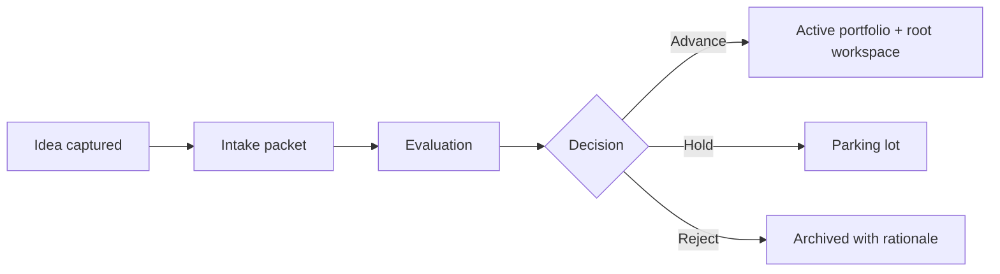

# Future Products

| Field | Value |
| --- | --- |
| Document ID | GOS-GPO-290 |
| Title | Future Products Index |
| Product / Scope | GPO |
| Version | 1.0.0 |
| Status | Approved |
| Author | Gojen Product Office |
| Owner | Founder Board / Product Office |
| Created | 2026-07-18 |
| Last Updated | 2026-07-18 |
| Classification | Internal |

## Version History

| Version | Date | Author | Summary |
| --- | --- | --- | --- |
| 1.0.0 | 2026-07-18 | Gojen Product Office | GAIOS v1.0 approved release |

## Approval Table

| Role | Name | Decision | Date |
| --- | --- | --- | --- |
| Author | Gojen Product Office | Prepared | 2026-07-18 |
| Reviewer | Gowtham | Approved | 2026-07-18 |
| Reviewer | Arul Jeni | Approved | 2026-07-18 |
| Approver | Gomathi K (CEO) | Approved | 2026-07-18 |

## Breadcrumb

[Home](../../../README.md) › [Company](../../README.md) › [Products](../README.md) › Future Products

## Navigation Links

- [Back to START-HERE.md](../../START-HERE.md)
- [Portfolio index](../README.md)
- [Intake process](./intake-process.md)
- [Evaluation criteria](./evaluation-criteria.md)
- [Archived products](../archived-products/README.md)
- [Master Index](../../../INDEX.md)

## Parent Folder

[products/](../README.md)

## Child Documents

| Document | ID | Purpose |
| --- | --- | --- |
| [intake-process.md](./intake-process.md) | GOS-GPO-291 | How candidate products enter the portfolio |
| [evaluation-criteria.md](./evaluation-criteria.md) | GOS-GPO-292 | How candidates are scored and decided |

## Purpose

Hold the intake pipeline for product ideas that are not yet active portfolio products. Future Products protects Subscription OS and Pawn Management focus while preserving a disciplined path for new opportunities.

## Pipeline Stages

## Current Candidates

| Candidate | Status | Owner | Next Action |
| --- | --- | --- | --- |
| — | None filed at GAIOS v1.0 | Product Office | Use intake process for first submission |

## Operating Rules

1. No candidate becomes an active product without Founder Board approval.
2. Active products keep priority unless a candidate clearly outranks on strategy and capacity.
3. Accepted products receive a scope code and a root `products/<name>/` lifecycle workspace before deep documentation begins.

## References

| Document ID | Title | Link |
| --- | --- | --- |
| GOS-GPO-250 | Product Portfolio Index | [../README.md](../README.md) |
| GOS-GPO-291 | Intake Process | [./intake-process.md](./intake-process.md) |
| GOS-GPO-292 | Evaluation Criteria | [./evaluation-criteria.md](./evaluation-criteria.md) |

## Change Log

| Date | Version | Change | Author |
| --- | --- | --- | --- |
| 2026-07-18 | 1.0.0 | Initial approved GAIOS v1.0 document | Gojen Product Office |

