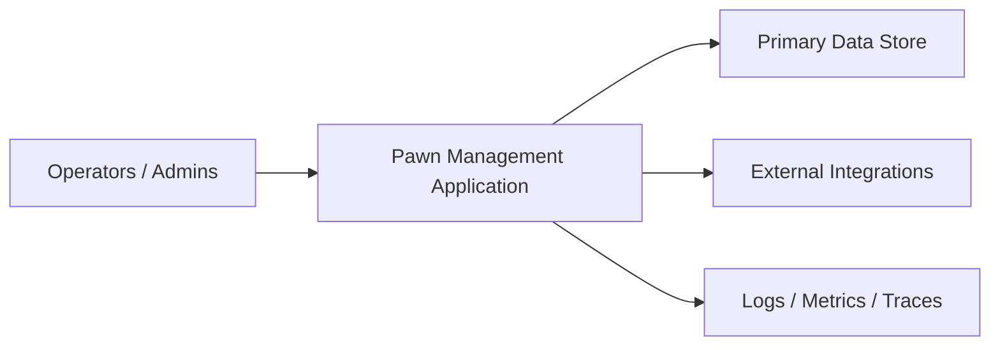

# Pawn Management — Architecture Summary

| Field | Value |
| --- | --- |
| Document ID | GOS-GPO-277 |
| Title | Pawn Management — Architecture Summary |
| Product / Scope | PAW |
| Version | 1.0.0 |
| Status | Approved |
| Author | Gojen Product Office |
| Owner | Product Owner — Pawn Management |
| Created | 2026-07-18 |
| Last Updated | 2026-07-18 |
| Classification | Internal |

## Version History

| Version | Date | Author | Summary |
| --- | --- | --- | --- |
| 1.0.0 | 2026-07-18 | Gojen Product Office | GAIOS v1.0 approved release |

## Approval Table

| Role | Name | Decision | Date |
| --- | --- | --- | --- |
| Author | Gojen Product Office | Prepared | 2026-07-18 |
| Reviewer | Gowtham | Approved | 2026-07-18 |
| Reviewer | Arul Jeni | Approved | 2026-07-18 |
| Approver | Gomathi K (CEO) | Approved | 2026-07-18 |

## Breadcrumb

[Home](../../../README.md) › [Company](../../README.md) › [Products](../README.md) › [Pawn Management](./README.md) › Architecture Summary

## Navigation Links

- [Back to START-HERE.md](../../START-HERE.md)
- [Portfolio index](../README.md)
- [Product index](./README.md)
- [Authoritative workspace](../../../products/pawn-management/README.md)
- [Quality](../../quality/README.md)
- [Master Index](../../../INDEX.md)

## Purpose

Summarize architectural direction for Pawn Management for operators and reviewers.

> **Authority note:** Authoritative detailed artifacts will live in [`../../products/pawn-management/`](../../../products/pawn-management/README.md) lifecycle folders (discovery through release). GAIOS documents in `company/products/pawn-management/` are the **operating-system summary layer** for founders, AI assistants, and Product Office operators. Do not treat GAIOS summaries as a fork of lifecycle content.

## Architecture Intent

Build a maintainable system with clear domain boundaries, auditable state changes, and deployment practices suitable for an early-stage product that can grow without uncontrolled complexity.

## Viewpoints

| Viewpoint | GAIOS Summary Focus | Lifecycle Depth |
| --- | --- | --- |
| Context | Actors and external systems | Architecture overview |
| Containers | Major deployable units | Architecture docs |
| Components | Module boundaries | ADRs + detailed design |
| Data | Critical entities and events | Data model artifacts |
| Security | Authn/z and data protection posture | Security notes / ADRs |

## Working Principles

1. Prefer explicit domain events for critical state transitions.
2. Keep MVP architecture simple enough to operate and observe.
3. Record Architecture Decision Records (ADRs) for irreversible choices.
4. Separate secrets and environment configuration from documentation.

## High-Level Context

## Open Architecture Questions

| ID | Question | Resolution Path |
| --- | --- | --- |
| AQ-01 | Core persistence and hosting choices | ADR in lifecycle architecture |
| AQ-02 | Integration priorities for MVP | Product + architecture review |
| AQ-03 | Multi-tenant vs single-tenant posture | Founder-visible decision |

Do not implement against unresolved AQs without a recorded decision.

## References

| Document ID | Title | Link |
| --- | --- | --- |
| GOS-GPO-270 | Pawn Management GAIOS Index | [./README.md](./README.md) |
| GOS-GPO-250 | Product Portfolio Index | [../README.md](../README.md) |
| — | Authoritative workspace | [../../../products/pawn-management/README.md](../../../products/pawn-management/README.md) |

## Change Log

| Date | Version | Change | Author |
| --- | --- | --- | --- |
| 2026-07-18 | 1.0.0 | Initial approved GAIOS v1.0 document | Gojen Product Office |

