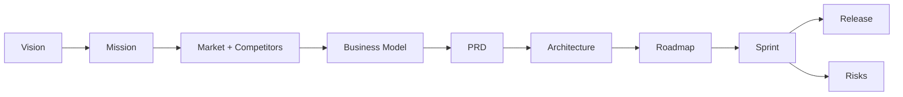

# Subscription OS — GAIOS Operating Index

| Field | Value |
| --- | --- |
| Document ID | GOS-GPO-251 |
| Title | Subscription OS — GAIOS Operating Index |
| Product / Scope | SOS |
| Version | 1.0.0 |
| Status | Approved |
| Author | Gojen Product Office |
| Owner | Product Owner — Subscription OS |
| Created | 2026-07-18 |
| Last Updated | 2026-07-18 |
| Classification | Internal |

## Version History

| Version | Date | Author | Summary |
| --- | --- | --- | --- |
| 1.0.0 | 2026-07-18 | Gojen Product Office | GAIOS v1.0 approved release |

## Approval Table

| Role | Name | Decision | Date |
| --- | --- | --- | --- |
| Author | Gojen Product Office | Prepared | 2026-07-18 |
| Reviewer | Gowtham | Approved | 2026-07-18 |
| Reviewer | Arul Jeni | Approved | 2026-07-18 |
| Approver | Gomathi K (CEO) | Approved | 2026-07-18 |

## Breadcrumb

[Home](../../../README.md) › [Company](../../README.md) › [Products](../README.md) › Subscription OS

## Navigation Links

- [Back to START-HERE.md](../../START-HERE.md)
- [Portfolio index](../README.md)
- [Product index](./README.md)
- [Authoritative workspace](../../../products/subscription-os/README.md)
- [Quality](../../quality/README.md)
- [Master Index](../../../INDEX.md)

## Purpose

Provide the GAIOS operating entry point for **Subscription OS**: status, document map, and links to the authoritative lifecycle workspace.

> **Authority note:** Authoritative detailed artifacts will live in [`../../products/subscription-os/`](../../../products/subscription-os/README.md) lifecycle folders (discovery through release). GAIOS documents in `company/products/subscription-os/` are the **operating-system summary layer** for founders, AI assistants, and Product Office operators. Do not treat GAIOS summaries as a fork of lifecycle content.

## Product Snapshot

| Attribute | Value |
| --- | --- |
| Product name | Subscription OS |
| Scope code | SOS |
| Company | Gojen Technology |
| Portfolio status | Active |
| Authoritative workspace | [../../../products/subscription-os/README.md](../../../products/subscription-os/README.md) |

## Document Map

| Document | ID | Purpose |
| --- | --- | --- |
| [vision.md](./vision.md) | GOS-GPO-252 | Long-range product vision |
| [mission.md](./mission.md) | GOS-GPO-253 | Near-term mission and outcomes |
| [market-research.md](./market-research.md) | GOS-GPO-254 | Market summary for operators |
| [competitor-analysis.md](./competitor-analysis.md) | GOS-GPO-255 | Competitive posture summary |
| [business-model.md](./business-model.md) | GOS-GPO-256 | Commercial model summary |
| [prd.md](./prd.md) | GOS-GPO-257 | Product requirements summary |
| [architecture.md](./architecture.md) | GOS-GPO-258 | Architecture summary |
| [roadmap.md](./roadmap.md) | GOS-GPO-259 | Roadmap horizons |
| [sprint.md](./sprint.md) | GOS-GPO-260 | Sprint operating rhythm |
| [risks.md](./risks.md) | GOS-GPO-261 | Risk posture summary |
| [release-notes.md](./release-notes.md) | GOS-GPO-262 | Release communication summary |

## Operating Flow

## Owner

Product Owner — Subscription OS, stewarded by the Gojen Product Office; approved by the Founder Board.

## References

| Document ID | Title | Link |
| --- | --- | --- |
| GOS-GPO-251 | Subscription OS GAIOS Index | [./README.md](./README.md) |
| GOS-GPO-250 | Product Portfolio Index | [../README.md](../README.md) |
| — | Authoritative workspace | [../../../products/subscription-os/README.md](../../../products/subscription-os/README.md) |

## Change Log

| Date | Version | Change | Author |
| --- | --- | --- | --- |
| 2026-07-18 | 1.0.0 | Initial approved GAIOS v1.0 document | Gojen Product Office |

