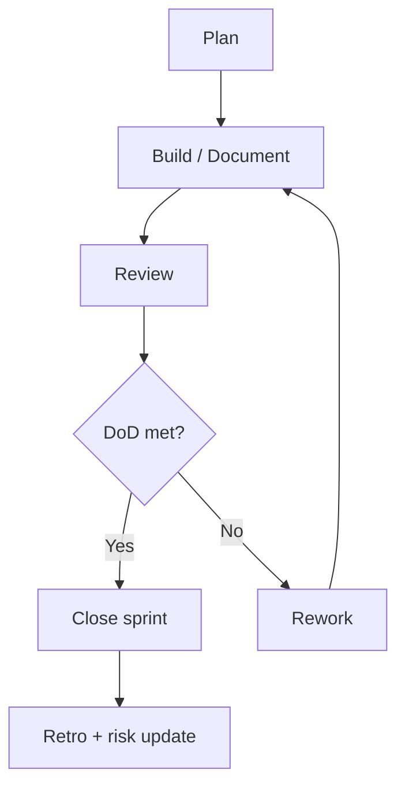

# Subscription OS — Sprint Operating Model

| Field | Value |
| --- | --- |
| Document ID | GOS-GPO-260 |
| Title | Subscription OS — Sprint Operating Model |
| Product / Scope | SOS |
| Version | 1.0.0 |
| Status | Approved |
| Author | Gojen Product Office |
| Owner | Product Owner — Subscription OS |
| Created | 2026-07-18 |
| Last Updated | 2026-07-18 |
| Classification | Internal |

## Version History

| Version | Date | Author | Summary |
| --- | --- | --- | --- |
| 1.0.0 | 2026-07-18 | Gojen Product Office | GAIOS v1.0 approved release |

## Approval Table

| Role | Name | Decision | Date |
| --- | --- | --- | --- |
| Author | Gojen Product Office | Prepared | 2026-07-18 |
| Reviewer | Gowtham | Approved | 2026-07-18 |
| Reviewer | Arul Jeni | Approved | 2026-07-18 |
| Approver | Gomathi K (CEO) | Approved | 2026-07-18 |

## Breadcrumb

[Home](../../../README.md) › [Company](../../README.md) › [Products](../README.md) › [Subscription OS](./README.md) › Sprint Operating Model

## Navigation Links

- [Back to START-HERE.md](../../START-HERE.md)
- [Portfolio index](../README.md)
- [Product index](./README.md)
- [Authoritative workspace](../../../products/subscription-os/README.md)
- [Quality](../../quality/README.md)
- [Master Index](../../../INDEX.md)

## Purpose

Define how sprints operate for Subscription OS under GAIOS.

> **Authority note:** Authoritative detailed artifacts will live in [`../../products/subscription-os/`](../../../products/subscription-os/README.md) lifecycle folders (discovery through release). GAIOS documents in `company/products/subscription-os/` are the **operating-system summary layer** for founders, AI assistants, and Product Office operators. Do not treat GAIOS summaries as a fork of lifecycle content.

## Sprint Cadence

| Event | Timing | Owner |
| --- | --- | --- |
| Sprint planning | Start of sprint | Product Owner |
| Mid-sprint check | Midpoint | Product Owner + builders |
| Sprint review | End of sprint | Product Owner + founders as needed |
| Retro | End of sprint | Team |
| Risk review | Each sprint | Risk owner |

## Sprint Inputs

- Mission and roadmap summary
- Prioritized backlog / work package
- Open risks and decisions
- Quality gates applicable to planned artifacts

## Sprint Outputs

| Output | Destination |
| --- | --- |
| Completed work | Product / engineering systems of record |
| Decisions | Product decision-log lifecycle folder |
| Risks updates | Risk register lifecycle folder |
| Doc updates | Lifecycle folders + GAIOS summary refresh if needed |

## Definition Alignment

Sprints use [Definition of Done](../../quality/definition-of-done.md) and [Documentation Quality Gates](../../quality/documentation-quality-gates.md).

## Sprint Flow

## References

| Document ID | Title | Link |
| --- | --- | --- |
| GOS-GPO-251 | Subscription OS GAIOS Index | [./README.md](./README.md) |
| GOS-GPO-250 | Product Portfolio Index | [../README.md](../README.md) |
| — | Authoritative workspace | [../../../products/subscription-os/README.md](../../../products/subscription-os/README.md) |

## Change Log

| Date | Version | Change | Author |
| --- | --- | --- | --- |
| 2026-07-18 | 1.0.0 | Initial approved GAIOS v1.0 document | Gojen Product Office |

