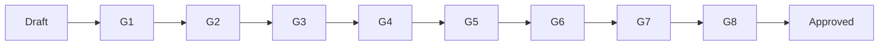

# Documentation Quality Gates

| Field | Value |
| --- | --- |
| Document ID | GOS-GPO-311 |
| Title | Documentation Quality Gates |
| Product / Scope | GPO |
| Version | 1.0.0 |
| Status | Approved |
| Author | Gojen Product Office |
| Owner | Documentation Engineering / Product Office |
| Created | 2026-07-18 |
| Last Updated | 2026-07-18 |
| Classification | Internal |

## Version History

| Version | Date | Author | Summary |
| --- | --- | --- | --- |
| 1.0.0 | 2026-07-18 | Gojen Product Office | GAIOS v1.0 approved release |

## Approval Table

| Role | Name | Decision | Date |
| --- | --- | --- | --- |
| Author | Gojen Product Office | Prepared | 2026-07-18 |
| Reviewer | Gowtham | Approved | 2026-07-18 |
| Reviewer | Arul Jeni | Approved | 2026-07-18 |
| Approver | Gomathi K (CEO) | Approved | 2026-07-18 |

## Breadcrumb

[Home](../../README.md) › [Company](../README.md) › [Quality](./README.md) › Documentation Quality Gates

## Navigation Links

- [Back to START-HERE.md](../START-HERE.md)
- [Quality index](./README.md)
- [Learning](../learning/README.md)
- [Versions](../versions/README.md)
- [Standards](../standards/README.md)
- [Master Index](../../INDEX.md)

## Purpose

Specify gates that documentation must pass before status may move to Approved or before a sprint claims documentation complete.

## Gates

| Gate | Requirement |
| --- | --- |
| G1 Identity | Document ID, title, owner, dates present |
| G2 Navigation | Breadcrumb, nav links, Back to START-HERE |
| G3 Authority | Lifecycle vs GAIOS authority stated where relevant |
| G4 Structure | Headings follow writing-style standard |
| G5 Links | Relative links resolve |
| G6 Review | Reviewer named; open questions owned |
| G7 Approval | Approver recorded for Approved status |
| G8 Version | Semver matches versioning policy |

## Gate Flow

## Failure Handling

If any gate fails, status remains Draft or returns to Draft. Do not mark Approved with known broken links or missing owners.

## References

| Document ID | Title | Link |
| --- | --- | --- |
| GOS-GPO-310 | Quality Index | [./README.md](./README.md) |
| GPO-STD-003 | Writing Style | [../standards/writing-style.md](../standards/writing-style.md) |

## Change Log

| Date | Version | Change | Author |
| --- | --- | --- | --- |
| 2026-07-18 | 1.0.0 | Initial approved GAIOS v1.0 document | Gojen Product Office |

