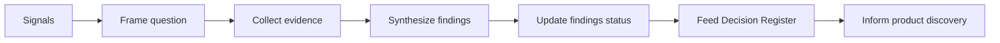

# Research Center

| Field | Value |
| --- | --- |
| Document ID | GOS-GPO-110 |
| Document Name | Research Center |
| Version | 1.0.0 |
| Status | Approved |
| Owner | Product Office / Research Steward |
| Reviewer | Founder Board |
| Approver | Founder Board |
| Created Date | 2026-07-18 |
| Last Updated | 2026-07-18 |
| Purpose | Company-level research hub for Subscription OS and Pawn Management, capturing market, competitive, customer, pricing, technology, and industry evidence used by founders and AI collaborators. |
| Scope | Cross-product research artifacts under GAIOS; product-specific deep research may also live under `products/*/02-market-research/` once those workspaces are activated. |

## Navigation

| Link | Target |
| --- | --- |
| Parent | [company/](../README.md) · [START-HERE](../START-HERE.md) |
| Child | [Market Research](./market-research.md) · [Competitor Analysis](./competitor-analysis.md) · [Customer Interviews](./customer-interviews.md) · [Pricing Research](./pricing-research.md) · [Technology Research](./technology-research.md) · [Industry Reports](./industry-reports.md) |
| Related | [Decision Register](../decision-register/README.md) · [Risk Register](../risk-register/README.md) · [Wiki](../wiki/README.md) · [Products](../../products/README.md) |
| Previous | [START-HERE](../START-HERE.md) |
| Next | [Market Research](./market-research.md) |
| Back to START-HERE | [START-HERE.md](../START-HERE.md) |

## Purpose

The Research Center is the GAIOS single source of truth for company-level discovery evidence. Chat sessions and AI drafts are collaborators; conclusions that affect portfolio direction must be promoted here (or into a decision record) before they are treated as durable knowledge.

## Portfolio Focus

| Product | Research emphasis |
| --- | --- |
| **Subscription OS** | SaaS billing, subscription lifecycle, metering, invoicing, dunning, tax/compliance adjacency, multi-tenant commercial models |
| **Pawn Management** | Pawn shop operations, collateral lending workflows, ticket lifecycle, inventory/valuation, regulatory reporting, store multi-location ops |

## Research Framework

| Stage | Method | Output |
| --- | --- | --- |
| Frame | Problem statement, ICP hypothesis, success metric | Research brief |
| Collect | Secondary sources, competitor teardown, structured interviews | Evidence log |
| Synthesize | Cross-product themes, contradictions, confidence rating | Findings section in each topic doc |
| Decide | Escalate durable choices | [Decision Register](../decision-register/README.md) |
| Monitor | Quarterly refresh of market and regulatory signals | Status updates |

## Document Index

| Document ID | Title | Path | Findings status |
| --- | --- | --- | --- |
| GOS-GPO-111 | Market Research | [market-research.md](./market-research.md) | Active — baseline framed |
| GOS-GPO-112 | Competitor Analysis | [competitor-analysis.md](./competitor-analysis.md) | Active — landscape mapped |
| GOS-GPO-113 | Customer Interviews | [customer-interviews.md](./customer-interviews.md) | Protocol ready — interviews pending |
| GOS-GPO-114 | Pricing Research | [pricing-research.md](./pricing-research.md) | Active — model hypotheses |
| GOS-GPO-115 | Technology Research | [technology-research.md](./technology-research.md) | Active — platform options reviewed |
| GOS-GPO-116 | Industry Reports | [industry-reports.md](./industry-reports.md) | Active — curated source map |

## Operating Rules

1. Prefer primary or named secondary sources; cite them in each topic document.
2. Never store real customer PII in this folder. Use anonymized segments (e.g., “Mid-market SaaS CFO”, “Multi-store pawn operator”).
3. Mark confidence as **High / Medium / Low** on every major finding.
4. When research changes a product bet, open or update a decision in the Decision Register.
5. AI assistants may draft synthesis here; humans approve status changes to **Approved** findings.

## Owner

Product Office Research Steward, accountable to the Founder Board.

## Related Documents

- [Market Research](./market-research.md)
- [Decision Register](../decision-register/README.md)
- [Risk Register](../risk-register/README.md)
- [GAIOS Governance Charter](../governance/gaios-governance-charter.md)
- [Subscription OS](../../products/subscription-os/README.md)
- [Pawn Management](../../products/pawn-management/README.md)
