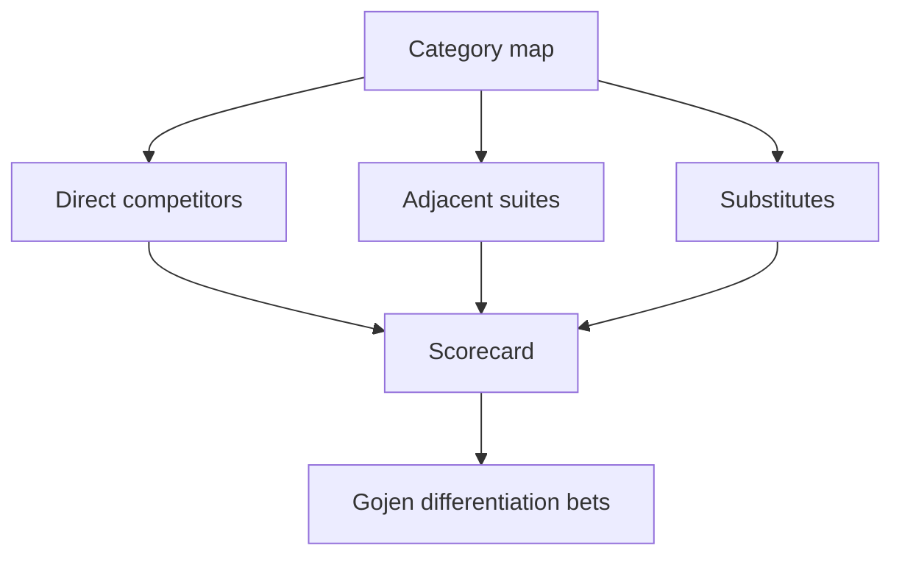

# Competitor Analysis

| Field | Value |
| --- | --- |
| Document ID | GOS-GPO-112 |
| Document Name | Competitor Analysis |
| Version | 1.0.0 |
| Status | Approved |
| Owner | Product Office / Research Steward |
| Reviewer | Founder Board |
| Approver | Founder Board |
| Created Date | 2026-07-18 |
| Last Updated | 2026-07-18 |
| Purpose | Map competitive landscapes for Subscription OS and Pawn Management using a repeatable teardown framework. |
| Scope | Category peers, substitutes, and adjacent suites; not a sales battle card library. |

## Navigation

| Link | Target |
| --- | --- |
| Parent | [Research Center](./README.md) |
| Child | None |
| Related | [Market Research](./market-research.md) · [Technology Research](./technology-research.md) · [Pricing Research](./pricing-research.md) |
| Previous | [Market Research](./market-research.md) |
| Next | [Customer Interviews](./customer-interviews.md) |
| Back to START-HERE | [START-HERE.md](../START-HERE.md) |

## Teardown Framework

| Dimension | What to capture |
| --- | --- |
| Positioning | Who they say they serve; category claim |
| ICP | Apparent company size, industry, buyer |
| Product depth | Billing/ops coverage; gaps |
| Pricing signal | Public tiers, usage, enterprise opacity |
| GTM motion | PLG, sales-led, partner, reseller |
| Moat signals | Integrations, compliance, data network effects |
| Switching friction | Migration tools, lock-in patterns |
| Threat to Gojen | Direct / adjacent / substitute |

## Subscription OS Landscape

### Competitor classes

| Class | Examples (illustrative category peers) | Role vs Gojen |
| --- | --- | --- |
| Billing platforms | Stripe Billing, Chargebee, Recurly, Maxio, Zuora | Direct or aspirational peers depending on ICP |
| Payment gateways with subscriptions | Adyen, Braintree (subscription modules) | Substitute for early-stage buyers |
| Finance / ERP adjacent | NetSuite + CPQ/billing add-ons | Upper-bound suite competition |
| Open-source / DIY | Custom on Postgres + cron + Stripe APIs | Build-vs-buy substitute |

### Scorecard (working)

| Capability | Typical peer strength | Gojen opportunity hypothesis |
| --- | --- | --- |
| Plan catalog & proration | Strong | Match clarity; excel at explainability |
| Usage metering | Mixed | Differentiated flexibility for hybrid models |
| Dunning / recovery | Mixed–strong | Treat as core revenue feature |
| Entitlements | Mixed | Product-led coupling to feature flags |
| Developer experience | Strong (platform leaders) | Must be API-first from day one |
| Mid-market finance exports | Mixed | Strong CFO narrative |

### Current findings status — Subscription OS

| Finding | Confidence | Status |
| --- | --- | --- |
| Early buyers often start on gateway-native subscriptions and churn when plan complexity rises | High | Active |
| Enterprise billing suites win on controls and reporting but lose on speed-to-value for smaller SaaS | Medium | Active |
| Differentiation should not be “another Stripe Billing clone”; focus on hybrid pricing clarity and operational workflows | Medium | Active |

## Pawn Management Landscape

### Competitor classes

| Class | Characteristics | Role vs Gojen |
| --- | --- | --- |
| Legacy pawn POS | Desktop, store-local, weak multi-location | Displacement targets |
| Modern cloud pawn platforms | Browser/mobile, multi-store, compliance packs | Direct peers |
| Generic retail POS + spreadsheets | Cheap entry, poor lending lifecycle | Substitute |
| Specialty jewelry / scrap systems | Strong valuation, weak lending ops | Adjacent niche |

### Scorecard (working)

| Capability | Typical peer strength | Gojen opportunity hypothesis |
| --- | --- | --- |
| Ticket lifecycle (loan → redeem/forfeit) | Core | Must be excellent and auditable |
| Collateral valuation aids | Variable | Opportunity in guided valuation + photo evidence |
| Multi-store inventory & cash controls | Variable | Chain operators need this early |
| Regulatory reporting packs | Variable by region | Compliance matrix as GTM enabler |
| Offline / intermittent connectivity | Legacy strength | Cloud peers often weaker — design for store reality |
| Customer CRM light | Mixed | Support repeat borrowers without over-banking UX |

### Current findings status — Pawn Management

| Finding | Confidence | Status |
| --- | --- | --- |
| Buyers compare on store-floor speed, not feature checklists alone | High | Active |
| Multi-store reporting is a common reason to leave legacy tools | Medium | Active |
| Public pricing is often opaque; demos and data migration cost dominate deals | Medium | Active |

## Competitive Watch Process

1. Quarterly refresh of class map (not every vendor page).
2. Deep teardown only for top 3 peers per product before major roadmap bets.
3. Capture win/loss themes after first customer conversations (anonymized).
4. Escalate positioning choices to the Decision Register.

## Related Documents

- [Market Research](./market-research.md)
- [Pricing Research](./pricing-research.md)
- [Technology Research](./technology-research.md)
- [Customer Interviews](./customer-interviews.md)
