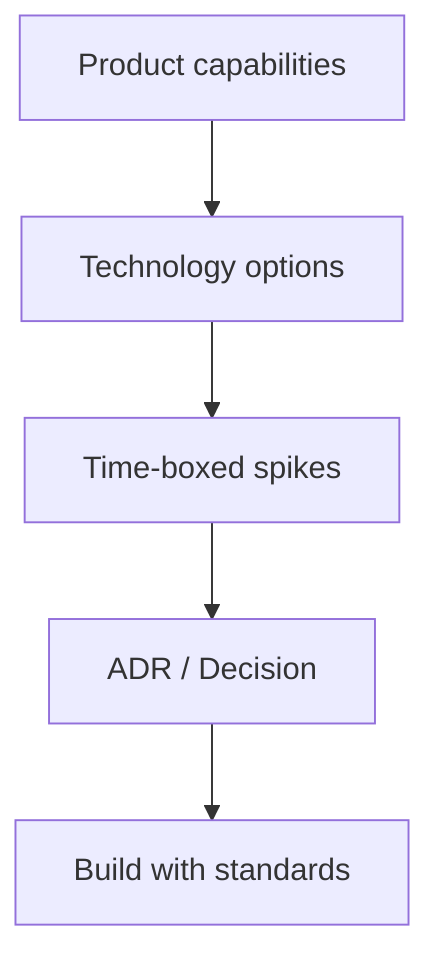

# Technology Research

| Field | Value |
| --- | --- |
| Document ID | GOS-GPO-115 |
| Document Name | Technology Research |
| Version | 1.0.0 |
| Status | Approved |
| Owner | Solution Architecture / Product Office |
| Reviewer | Tech Lead · Founder Board |
| Approver | Founder Board |
| Created Date | 2026-07-18 |
| Last Updated | 2026-07-18 |
| Purpose | Capture technology options, constraints, and evaluation criteria for Subscription OS and Pawn Management platforms. |
| Scope | Research and evaluation notes; architecture ADRs remain the binding technical decisions. |

## Navigation

| Link | Target |
| --- | --- |
| Parent | [Research Center](./README.md) |
| Child | None |
| Related | [Competitor Analysis](./competitor-analysis.md) · [Architecture Terms](../wiki/architecture-terms.md) · [Industry Reports](./industry-reports.md) |
| Previous | [Pricing Research](./pricing-research.md) |
| Next | [Industry Reports](./industry-reports.md) |
| Back to START-HERE | [START-HERE.md](../START-HERE.md) |

## Evaluation Framework

| Criterion | Weight guidance | Notes |
| --- | --- | --- |
| Correctness & auditability | Critical | Money and collateral systems cannot “mostly work” |
| Time-to-first-value | High | Early-stage dual product needs speed |
| Operability | High | Observability, backups, multi-tenant isolation |
| Compliance adjacency | High | PCI DSS for payments; regional lending rules for pawn |
| Extensibility | Medium | Integrations, webhooks, plugin points |
| Cost trajectory | Medium | Avoid lock-in that blocks SOM growth |
| Team familiarity | Medium | Bias to stack founders can operate |

## Subscription OS — Technology Themes

| Theme | Options under review | Research note |
| --- | --- | --- |
| Billing engine | Build core ledger + orchestration; integrate PSPs | Prefer event-sourced invoice timeline for audit |
| Payments | Stripe and peer PSPs | Gateway as dependency, not product identity |
| Metering | Stream ingestion + aggregation jobs | Idempotency and late events are hard requirements |
| Entitlements | Feature-flag service or internal service | Must sync with subscription state |
| Multi-tenancy | Schema-per-tenant vs row-level | Isolation and migration cost trade-off |
| Reporting | Warehouse export + operational DB | Finance needs immutable invoice history |

### Findings status — Subscription OS

| Finding | Confidence | Status |
| --- | --- | --- |
| Treating the payment gateway as the system of record for subscriptions creates long-term lock-in | High | Active |
| A clear domain model (Customer, Plan, Subscription, Invoice, PaymentAttempt, Entitlement) is required before UI polish | High | Active |
| Usage metering should be designed for late and duplicate events from day one | High | Active |
| Final stack choices deferred to architecture ADRs after spikes | — | Open |

## Pawn Management — Technology Themes

| Theme | Options under review | Research note |
| --- | --- | --- |
| Offline / store resilience | Progressive web app + sync queue; optional local cache | Counter cannot freeze on WAN blips |
| Media evidence | Object storage for collateral photos | Chain-of-custody metadata required |
| Identity & roles | Store / region / HQ role matrix | Least privilege for cash and void actions |
| Hardware | Label printers, barcode/QR, cash drawers | Integration adapters over hardcoding vendors |
| Reporting | Operational reports + compliance exports | Jurisdiction packs as configuration |
| Mobile | Tablet-first counter UX | Desktop HQ analytics secondary |

### Findings status — Pawn Management

| Finding | Confidence | Status |
| --- | --- | --- |
| Store-floor latency and print reliability dominate perceived quality | High | Active |
| Photo + appraisal notes are evidentiary assets, not attachments | High | Active |
| Sync conflict resolution for tickets must be designed, not improvised | Medium | Active |
| Shared services with Subscription OS should be limited to identity, docs, and observability until proven | Medium | Active |

## Shared Platform Candidates (Cautious)

| Shared capability | Share now? | Rationale |
| --- | --- | --- |
| Auth / identity | Candidate | Common need |
| Document templates / PDF | Candidate | Both generate customer docs |
| Observability | Yes | Company standard |
| Billing domain | No | Product-specific |
| Pawn ticket domain | No | Product-specific |

## Related Documents

- [Market Research](./market-research.md)
- [Competitor Analysis](./competitor-analysis.md)
- [Architecture Terms](../wiki/architecture-terms.md)
- [Root glossary — technical terms](../../glossary/technical-terms.md)
- [DEC-GPO-003](../decision-register/dec-gpo-003-product-portfolio-structure.md)
