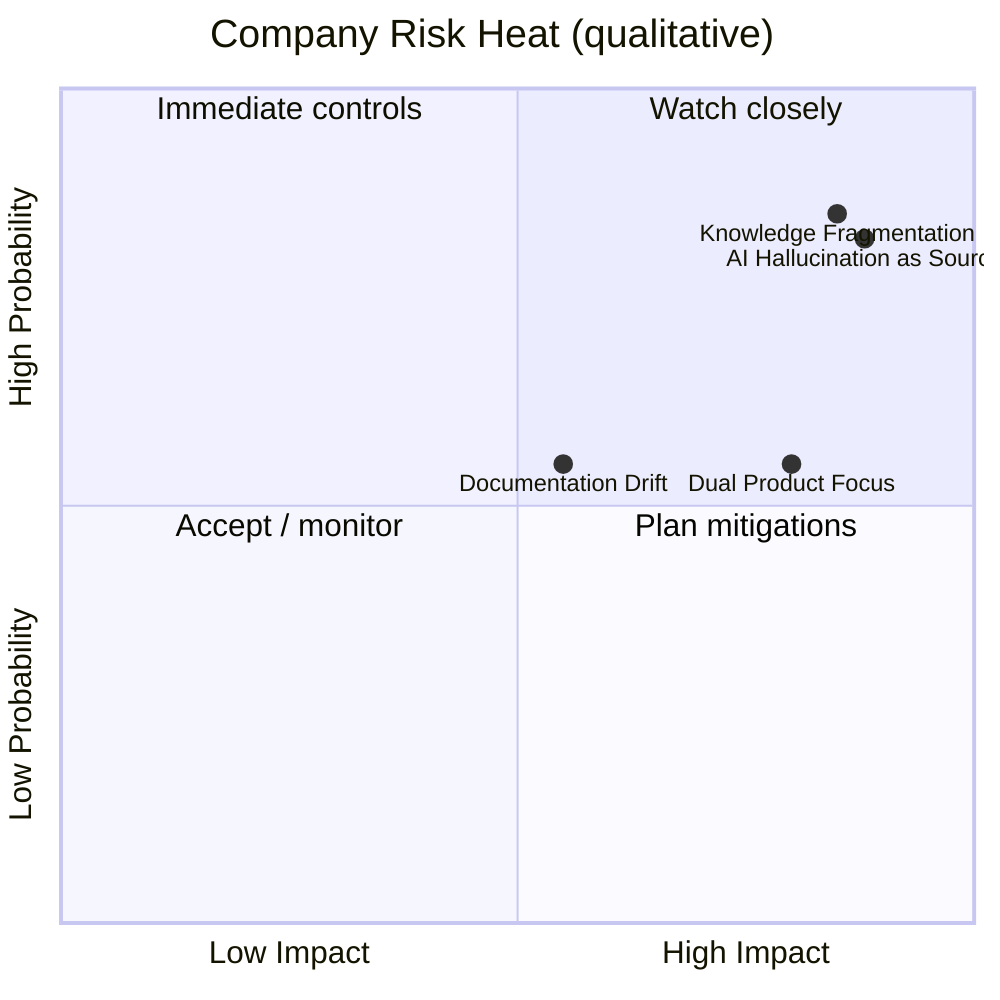

# Risk Register — Master Table

| Field | Value |
| --- | --- |
| Document ID | GOS-GPO-131 |
| Document Name | Risk Register Master Table |
| Version | 1.0.0 |
| Status | Approved |
| Owner | Product Office |
| Reviewer | Founder Board |
| Approver | Founder Board |
| Created Date | 2026-07-18 |
| Last Updated | 2026-07-18 |
| Purpose | Single table of company-level GAIOS risks for executive scan. |
| Scope | RISK-GPO-* entries. |

## Navigation

| Link | Target |
| --- | --- |
| Parent | [Risk Register](./README.md) |
| Child | None |
| Related | [RISK-GPO-001](./risk-gpo-001-knowledge-fragmentation.md) · [RISK-GPO-002](./risk-gpo-002-ai-hallucination-as-source.md) · [RISK-GPO-003](./risk-gpo-003-dual-product-focus.md) · [RISK-GPO-004](./risk-gpo-004-documentation-drift.md) |
| Previous | [Risk Register README](./README.md) |
| Next | [RISK-GPO-001](./risk-gpo-001-knowledge-fragmentation.md) |
| Back to START-HERE | [START-HERE.md](../START-HERE.md) |

## Master Register

| Risk ID | Title | Category | Probability | Impact | Owner | Current Status | Document |
| --- | --- | --- | --- | --- | --- | --- | --- |
| RISK-GPO-001 | Knowledge Fragmentation | Knowledge | High | High | Product Office | Mitigating | [risk-gpo-001-knowledge-fragmentation.md](./risk-gpo-001-knowledge-fragmentation.md) |
| RISK-GPO-002 | AI Hallucination Treated as Source of Truth | AI | High | High | Product Office / AI Governance | Mitigating | [risk-gpo-002-ai-hallucination-as-source.md](./risk-gpo-002-ai-hallucination-as-source.md) |
| RISK-GPO-003 | Dual Product Focus Dilution | Strategy | Medium | High | CEO / Founder Board | Monitoring | [risk-gpo-003-dual-product-focus.md](./risk-gpo-003-dual-product-focus.md) |
| RISK-GPO-004 | Documentation Drift | Process | Medium | Medium | Documentation Engineering | Mitigating | [risk-gpo-004-documentation-drift.md](./risk-gpo-004-documentation-drift.md) |

## Heat Map (qualitative)

## Maintenance

- Review all Open/Mitigating/Monitoring risks in Founder Board cadence at least monthly.
- Close risks only with recorded residual acceptance or elimination evidence.

## Related Documents

- [Risk Register README](./README.md)
- [Decision Register](../decision-register/REGISTER.md)
