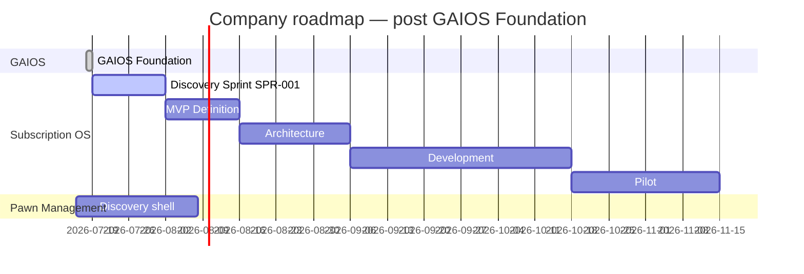
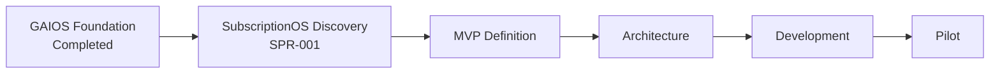

# Company Roadmap

| Field | Value |
| --- | --- |
| Document ID | GOS-GPO-091 |
| Document Name | Company Roadmap |
| Version | 1.1.0 |
| Status | Approved |
| Owner | Gomathi K – Founder & CEO |
| Reviewer | Founder Board |
| Approver | Founder Board |
| Created Date | 2026-07-18 |
| Last Updated | 2026-07-19 |
| Purpose | Sequence company-level milestones across GAIOS, Product Office, Subscription OS, and Pawn Management. |
| Scope | Portfolio timeline for Gojen Technology; detailed product work lives in product roadmaps and sprint backlogs. |
| Related Documents | [Roadmaps Index](./README.md), [CURRENT-SPRINT.md](../ai-governance/CURRENT-SPRINT.md), [SPR-001 backlog](../../products/subscription-os/backlog/SPR-001.md), [DEC-001](../decision-register/DEC-001-GAIOS-Adoption.md) |

## Navigation

| Link | Target |
| --- | --- |
| Parent Document | [Roadmaps Index](./README.md) |
| Child Documents | None |
| Related Documents | [Subscription OS Roadmap](./subscription-os-roadmap.md), [Pawn Management Roadmap](./pawn-management-roadmap.md), [SPR-000 archive](../sprints/SPR-000-GAIOS-Foundation.md) |
| Previous | [Roadmaps Index](./README.md) |
| Next | [Product Office Roadmap](./product-office-roadmap.md) |
| Back to START-HERE | [START-HERE](../START-HERE.md) |

## Portfolio Position (July 2026)

| Track | Status | Company stance |
| --- | --- | --- |
| GAIOS Foundation | **Completed** | Approved OS of Gojen Technology ([DEC-001](../decision-register/DEC-001-GAIOS-Adoption.md)) |
| Subscription OS | **Discovery Sprint Active (SPR-001)** | Primary product narrative |
| Product Office | Supporting discovery | Standards unchanged |
| Pawn Management | Discovery shell | Parallel, capacity-capped |

## Milestone Table

| Milestone | Status | Target | Owner | Success signal |
| --- | --- | --- | --- | --- |
| GAIOS Foundation | **Completed** | 2026-07-19 | Founder Board | [SPR-000 archive](../sprints/SPR-000-GAIOS-Foundation.md); [DEC-001](../decision-register/DEC-001-GAIOS-Adoption.md) |
| SubscriptionOS Discovery Sprint | Active | 2026-08-02 | Founder Board | [CURRENT-SPRINT.md](../ai-governance/CURRENT-SPRINT.md); 20 interviews; competitors; pricing; MVP; Board review |
| MVP Definition | Planned | 2026-08-16 | Founder Board / Product Office | MVP pack approved |
| Architecture | Planned | 2026-09-06 | Engineering / Architecture | Architecture baseline approved |
| Development | Planned | 2026-10-18 | Engineering | Build against approved MVP |
| Pilot | Planned | 2026-11-15 | Founder Board / CS | Pilot criteria met |

## Dependencies

## Change Control

Material date moves require Founder Board visibility and updates to [CURRENT-SPRINT.md](../ai-governance/CURRENT-SPRINT.md) and [FBM action registers](../meetings/action-register/README.md).
