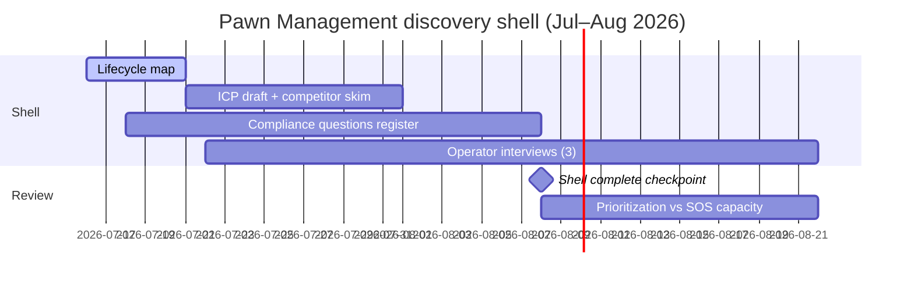

# Pawn Management Roadmap

| Field | Value |
| --- | --- |
| Document ID | GOS-GPO-094 |
| Document Name | Pawn Management Roadmap |
| Version | 1.0.0 |
| Status | Approved |
| Owner | Arul Jeni – Co-Founder |
| Reviewer | Gomathi K – Founder & CEO |
| Approver | Founder Board |
| Created Date | 2026-07-18 |
| Last Updated | 2026-07-18 |
| Purpose | Sequence Pawn Management as a parallel discovery track with explicit depth and capacity boundaries. |
| Scope | Company-level Pawn Management discovery shell and post-shell review; not a full build plan yet. |
| Related Documents | [Roadmaps Index](./README.md), [Operations Dashboard](../dashboards/operations-dashboard.md), [Company Roadmap](./company-roadmap.md) |

## Navigation

| Link | Target |
| --- | --- |
| Parent Document | [Roadmaps Index](./README.md) |
| Child Documents | None |
| Related Documents | [Product Office Roadmap](./product-office-roadmap.md), [Arul Roadmap](../founder-workspaces/arul/roadmap.md) |
| Previous | [Subscription OS Roadmap](./subscription-os-roadmap.md) |
| Next | [Meetings Index](../meetings/README.md) |
| Back to START-HERE | [START-HERE](../START-HERE.md) |

## Product Intent

Pawn Management helps pawn operators run loan lifecycle clarity—intake, appraisal, issuance, redeem/renew/forfeit, and inventory—with auditability appropriate to a trust-sensitive domain.

## Discovery Shell Timeline

## Milestone Table

| Milestone | Target date | Owner | Success signal |
| --- | --- | --- | --- |
| Lifecycle one-pager | 2026-07-21 | Arul | Stages and open questions listed |
| Discovery shell complete | 2026-08-08 | Arul | Shell exit criteria met |
| Three operator interviews | 2026-08-22 | Arul | Notes in workspace / Product Office |
| Prioritization review with CEO | 2026-08-22 | Arul / Gomathi | Capacity decision for next phase |

## Shell Exit Criteria

1. Lifecycle map published  
2. ICP draft for operators  
3. Lighter competitor skim  
4. Compliance questions register (no invented legal claims)  
5. Explicit non-goals for Q3  
6. Engineering spike requests zero unless discovery-unblockable and approved  

## Capacity Boundary

Engineering support remains capped (target ≤10% in July) per [Engineering Dashboard](../dashboards/engineering-dashboard.md) and [DEC-ENG-002](../founder-workspaces/gowtham/decision-drafts.md). Pawn Management does not equal Subscription OS depth this quarter.
