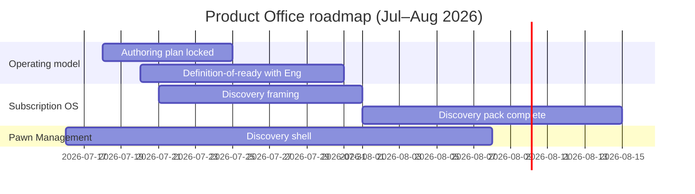

# Product Office Roadmap

| Field | Value |
| --- | --- |
| Document ID | GOS-GPO-092 |
| Document Name | Product Office Roadmap |
| Version | 1.0.0 |
| Status | Approved |
| Owner | Product Office (CEO oversight) |
| Reviewer | Gomathi K – Founder & CEO |
| Approver | Founder Board |
| Created Date | 2026-07-18 |
| Last Updated | 2026-07-18 |
| Purpose | Sequence Product Office documentation and definition work that unblocks Subscription OS and Pawn Management. |
| Scope | Product Office throughput, standards usage, and discovery/definition gates—not engineering sprint boards. |
| Related Documents | [Roadmaps Index](./README.md), [CPO Dashboard](../dashboards/cpo-dashboard.md), [Company Roadmap](./company-roadmap.md) |

## Navigation

| Link | Target |
| --- | --- |
| Parent Document | [Roadmaps Index](./README.md) |
| Child Documents | None |
| Related Documents | [Subscription OS Roadmap](./subscription-os-roadmap.md), [Pawn Management Roadmap](./pawn-management-roadmap.md) |
| Previous | [Company Roadmap](./company-roadmap.md) |
| Next | [Subscription OS Roadmap](./subscription-os-roadmap.md) |
| Back to START-HERE | [START-HERE](../START-HERE.md) |

## Current Constraint

GAIOS infrastructure is ready. The Product Office is the bottleneck: product documentation is starting, and engineering correctly refuses premature feature builds.

## Workstreams

| Workstream | Outcome | Target |
| --- | --- | --- |
| Authoring plan | Named owners for SOS discovery and PAW shell | 2026-07-25 |
| Definition-of-ready | Shared checklist with Engineering | 2026-07-31 |
| SOS discovery pack | Brief-ready discovery set | 2026-08-15 |
| PAW discovery shell | Lighter but complete shell | 2026-08-08 |
| ID / standards hygiene | Consistent GOS-GPO and product IDs | Continuous |

## Exit Criteria by Track

### Subscription OS discovery pack

- Problem statement and ICP draft published  
- Competitor skim with differentiation thesis  
- Must-have vs later capability list  
- Open questions and risks registered  
- Discovery exit criteria written for engineering gate  

### Pawn Management discovery shell

- Lifecycle map (intake → appraisal → loan → redeem/renew/forfeit → inventory)  
- ICP draft for operators  
- Competitor skim (lighter)  
- Compliance questions register (no invented answers)  
- Explicit non-goals for this quarter  

## Capacity Notes

Product Office prioritizes Subscription OS depth. Pawn Management receives enough authoring time to finish the shell, not to match SOS research volume in Q3.
