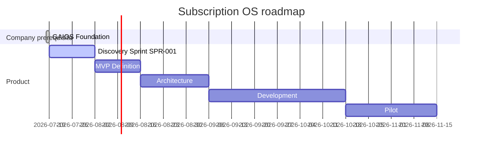

# Subscription OS Roadmap

| Field | Value |
| --- | --- |
| Document ID | GOS-GPO-093 |
| Document Name | Subscription OS Roadmap |
| Version | 1.1.0 |
| Status | Approved |
| Owner | Gomathi K – Founder & CEO (product narrative); Product Office (artifacts) |
| Reviewer | Founder Board |
| Approver | Founder Board |
| Created Date | 2026-07-18 |
| Last Updated | 2026-07-19 |
| Purpose | Sequence Subscription OS from discovery through MVP, architecture, development, and pilot. |
| Scope | Company-level Subscription OS roadmap; sprint stories live in product backlog. |
| Related Documents | [CURRENT-SPRINT.md](../ai-governance/CURRENT-SPRINT.md), [SPR-001 backlog](../../products/subscription-os/backlog/SPR-001.md), [Company Roadmap](./company-roadmap.md), [DEC-001](../decision-register/DEC-001-GAIOS-Adoption.md) |

## Navigation

| Link | Target |
| --- | --- |
| Parent Document | [Roadmaps Index](./README.md) |
| Child Documents | None |
| Related Documents | [Product Office Roadmap](./product-office-roadmap.md), [FBM-001-Actions.md](../meetings/action-register/FBM-001-Actions.md) |
| Previous | [Product Office Roadmap](./product-office-roadmap.md) |
| Next | [Pawn Management Roadmap](./pawn-management-roadmap.md) |
| Back to START-HERE | [START-HERE](../START-HERE.md) |

## Product Intent

Subscription OS is an operating system for subscription businesses: entitlements, billing control, dunning visibility, and workflow clarity—not merely another invoicing UI.

## Milestone sequence

| Milestone | Status | Target window | Notes |
| --- | --- | --- | --- |
| GAIOS Foundation (company prerequisite) | **Completed** | 2026-07-18 → 2026-07-19 | [SPR-000 archive](../sprints/SPR-000-GAIOS-Foundation.md) |
| SubscriptionOS Discovery Sprint | **Active** | 2026-07-19 → 2026-08-02 | [CURRENT-SPRINT.md](../ai-governance/CURRENT-SPRINT.md) · [SPR-001.md](../../products/subscription-os/backlog/SPR-001.md) |
| MVP Definition | Planned | After Discovery | Board-approved MVP scope |
| Architecture | Planned | After MVP | Architecture baseline |
| Development | Planned | After Architecture | Build against MVP |
| Pilot | Planned | After Development | Controlled pilot |

## Discovery Sprint success criteria (SPR-001)

| Criterion | Target |
| --- | --- |
| Customer interviews | 20 |
| Competitor analysis | Top competitors documented |
| Pricing | Approved by Founder Board |
| MVP | Approved by Founder Board |
| Board review | Discovery pack review completed |

## Explicit Non-Goals (Discovery Sprint)

- Declaring GA or production customers
- Feature coding before MVP approval
- Coupling Pawn Management data models into SOS MVP
