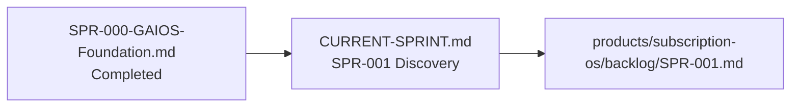

# Sprints Hub

| Field | Value |
| --- | --- |
| Document ID | GOS-GPO-330 |
| Document Name | Sprints Hub |
| Version | 1.1.0 |
| Status | Approved |
| Owner | Gojen Product Office |
| Reviewer | Gomathi K (Founder & CEO) |
| Approver | Founder Board |
| Created Date | 2026-07-19 |
| Last Updated | 2026-07-19 |
| Purpose | Permanent home for company sprint history and archive records |
| Scope | Company-level sprints under `company/sprints/` |
| Related Documents | [CURRENT-SPRINT.md](../ai-governance/CURRENT-SPRINT.md), [SPR-000-GAIOS-Foundation.md](./SPR-000-GAIOS-Foundation.md), [SPR-001 backlog](../../products/subscription-os/backlog/SPR-001.md) |

## Navigation

| Link | Target |
| --- | --- |
| Parent Document | [START-HERE.md](../START-HERE.md) |
| Child Documents | [SPR-000-GAIOS-Foundation.md](./SPR-000-GAIOS-Foundation.md), [SPR-000/](./SPR-000/README.md), [SPR-001/](./SPR-001/README.md) |
| Related Documents | [retrospectives](../learning/retrospectives/README.md), [FBM-001-Actions.md](../meetings/action-register/FBM-001-Actions.md), [DEC-001](../decision-register/DEC-001-GAIOS-Adoption.md) |
| Previous | [SPRINT-STANDARDS.md](../ai-governance/SPRINT-STANDARDS.md) |
| Next | [CURRENT-SPRINT.md](../ai-governance/CURRENT-SPRINT.md) |
| Back to START-HERE | [START-HERE.md](../START-HERE.md) |

---

## Sprint register

| Sprint ID | Name | Status | Primary record | Notes |
| --- | --- | --- | --- | --- |
| SPR-000 | GAIOS Foundation | **Completed** | [SPR-000-GAIOS-Foundation.md](./SPR-000-GAIOS-Foundation.md) | Board-approved close; also [SPR-000/](./SPR-000/README.md) |
| SPR-001 | SubscriptionOS Discovery | **Active** | [CURRENT-SPRINT.md](../ai-governance/CURRENT-SPRINT.md) | Product backlog: [SPR-001.md](../../products/subscription-os/backlog/SPR-001.md) |

Historical working folders retained (not deleted): [SPR-000/](./SPR-000/README.md), [SPR-001/](./SPR-001/README.md) (pre-transition GAIOS operationalization notes).

---

## How to close / open sprints

1. Write permanent archive under `company/sprints/` (do not overwrite prior archives).
2. Complete retrospective under `company/learning/retrospectives/`.
3. Update [CURRENT-SPRINT.md](../ai-governance/CURRENT-SPRINT.md) to the new active sprint.
4. Record Board actions in [action-register/](../meetings/action-register/README.md).
5. Log the transition in [CHANGELOG.md](../ai-governance/CHANGELOG.md).
