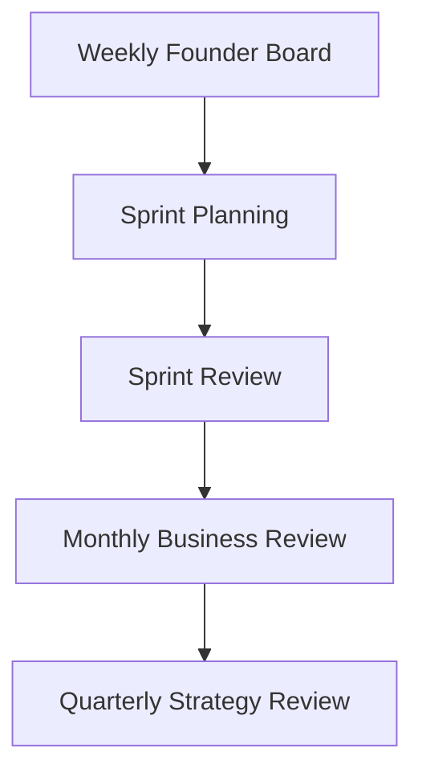

# Meeting Process Standard

| Field | Value |
| --- | --- |
| Document ID | GPO-STD-004 |
| Title | Meeting Process |
| Version | 1.0.0 |
| Status | Approved |
| Owner | Product Office (Founder Board accountable for company forums) |

## Breadcrumb

[Home](../../README.md) › [Company](../README.md) › [Standards](./README.md) › Meeting Process

## Purpose

Define recurring Product Office and leadership forums, their outputs, and how meetings are numbered and stored.

## Meeting Cadence



### Weekly Founder Board Meeting

| Field | Definition |
| --- | --- |
| Cadence | Weekly |
| Purpose | Company direction, escalations, unblock portfolio decisions |
| Typical attendees | Founder Board; Product Office as required |
| Storage | `company/meeting-minutes/` |

### Sprint Planning

| Field | Definition |
| --- | --- |
| Cadence | Per sprint |
| Purpose | Select sprint goals and documentation / delivery commitments |
| Typical attendees | Product Owner, Product Office, delivery leads |
| Storage | Product or company minutes as scoped |

### Sprint Review

| Field | Definition |
| --- | --- |
| Cadence | End of sprint |
| Purpose | Inspect completed work, accept or return documentation and deliverables |
| Typical attendees | Product Owner, stakeholders, Product Office |
| Storage | Product or company minutes as scoped |

### Monthly Business Review

| Field | Definition |
| --- | --- |
| Cadence | Monthly |
| Purpose | Review commercial and portfolio health at management level |
| Typical attendees | Founder Board, Product Office, product leads |
| Storage | `company/meeting-minutes/` |

### Quarterly Strategy Review

| Field | Definition |
| --- | --- |
| Cadence | Quarterly |
| Purpose | Reconfirm vision, portfolio priorities, and major bets |
| Typical attendees | Founder Board, Product Office |
| Storage | `company/meeting-minutes/` with links to vision/governance updates |

## Document Outputs

| Meeting | Minimum outputs |
| --- | --- |
| Weekly Founder Board | Minutes (`MTG`), action items, decisions (`DEC`) when decisions are made |
| Sprint Planning | Minutes, sprint goal statement, commitment list |
| Sprint Review | Minutes, acceptance notes, follow-up risks (`RISK`) if needed |
| Monthly Business Review | Minutes, KPI snapshot links, decisions |
| Quarterly Strategy Review | Minutes, strategy deltas linked to vision / roadmap docs |

Use [meeting-template.md](../../templates/meeting-template.md) for all formal minutes.

## Meeting Numbering

Follow [document-numbering.md](./document-numbering.md).

| Scope | Prefix pattern | Example |
| --- | --- | --- |
| Company / Founder Board | `MTG-GPO-{nnn}` | `MTG-GPO-001` |
| Subscription OS | `MTG-SOS-{nnn}` | `MTG-SOS-014` |
| Pawn Management | `MTG-PAW-{nnn}` | `MTG-PAW-003` |

**Filename pattern:**

```text
mtg-{scope}-{nnn}-{yyyy-mm-dd}-{short-title}.md
```

Example: `mtg-gpo-001-2026-07-15-founder-board.md`

## Agenda and Minutes Discipline

1. Publish agenda before the meeting when practicable.
2. Capture decisions with Document IDs in the decision log.
3. Assign owners and due dates for every action item.
4. Link related risks, PRDs, and roadmap items.
5. Store minutes in the correct folder; do not duplicate across products.

## Related Documents

- [Document numbering](./document-numbering.md)
- [Repository rules](./repository-rules.md)
- [Meeting template](../../templates/meeting-template.md)
- [Decision template](../../templates/decision-template.md)
- [Company meeting minutes](../meeting-minutes/README.md)
