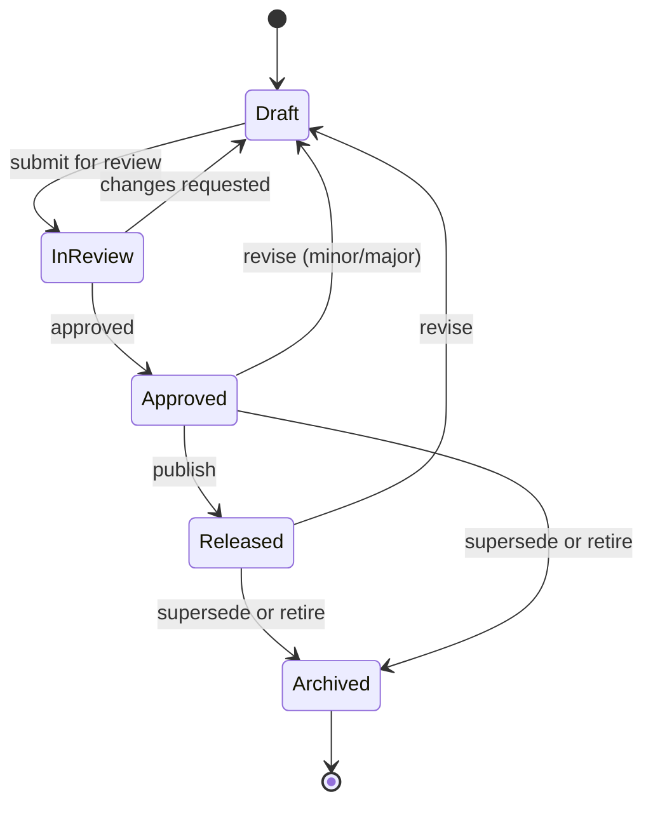

# Versioning Standard

| Field | Value |
| --- | --- |
| Document ID | GPO-STD-002 |
| Title | Document Versioning |
| Version | 1.0.0 |
| Status | Approved |
| Owner | Documentation Engineering / Product Office |

## Breadcrumb

[Home](../../README.md) › [Company](../README.md) › [Standards](./README.md) › Versioning

## Purpose

Define how Product Office documents version and progress through lifecycle status.

## Version Scheme

Documents use semantic versioning: `MAJOR.MINOR.PATCH`

| Component | When to increment | Examples |
| --- | --- | --- |
| **Major** | Breaking structural change, rewritten scope, or replacement of the prior approved baseline | `1.0.0` → `2.0.0` |
| **Minor** | Backward-compatible additions: new sections, new requirements, expanded scope that does not invalidate prior approvals | `1.0.0` → `1.1.0` |
| **Patch** | Clarifications, typos, link fixes, formatting, non-semantic corrections | `1.1.0` → `1.1.1` |

### Rules

1. First committed draft may start at `0.1.0`.
2. First approved / released baseline for a document is typically `1.0.0`.
3. Version is recorded in Document Information and Version History.
4. Filename Document IDs do not change with version; version lives in metadata.

## Status Values

| Status | Meaning | Who may set |
| --- | --- | --- |
| **Draft** | Work in progress; not ready for formal review | Author |
| **In Review** | Submitted for peer or stakeholder review | Author / reviewer |
| **Approved** | Formally approved; authoritative for decisions | Approver listed in Approval Table |
| **Released** | Published for broader use (internal or external as scoped) | Owner + release process |
| **Archived** | Superseded or retired; retained for history | Owner / Product Office |



## Status Placement

Every formal document header must include:

```markdown
| Status | Draft | In Review | Approved | Released | Archived |
```

Use a single active status in the Document Information table.

## Version History Table

Required in every formal document:

| Version | Date | Author | Summary |
| --- | --- | --- | --- |
| 0.1.0 | YYYY-MM-DD | Name | Initial draft |
| 1.0.0 | YYYY-MM-DD | Name | Approved baseline |

## Related Documents

- [Document numbering](./document-numbering.md)
- [Repository rules](./repository-rules.md)
- [Meeting process](./meeting-process.md)
- [Document template](../../templates/document-template.md)
