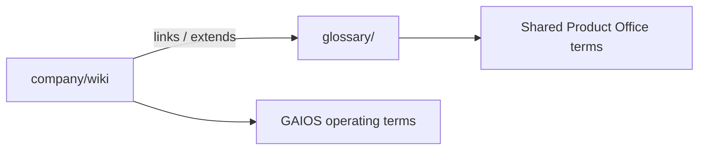

# Company Wiki

| Field | Value |
| --- | --- |
| Document ID | GOS-GPO-160 |
| Document Name | Company Wiki |
| Version | 1.0.0 |
| Status | Approved |
| Owner | Product Office / Documentation Engineering |
| Reviewer | Founder Board |
| Approver | Founder Board |
| Created Date | 2026-07-18 |
| Last Updated | 2026-07-18 |
| Purpose | GAIOS operating wiki for glossary bridges, processes, FAQs, architecture terms, business terms, and acronyms. |
| Scope | Company wiki under GAIOS; complements root `glossary/` without modifying those files. |

## Navigation

| Link | Target |
| --- | --- |
| Parent | [company/](../README.md) · [START-HERE](../START-HERE.md) |
| Child | [Glossary](./glossary.md) · [Processes](./processes.md) · [FAQs](./faqs.md) · [Architecture Terms](./architecture-terms.md) · [Business Terms](./business-terms.md) · [Acronyms](./acronyms.md) |
| Related | [Root Glossary](../../glossary/README.md) · [Research Center](../research/README.md) · [Governance Charter](../governance/gaios-governance-charter.md) |
| Previous | [Compliance Checklist](../governance/compliance-checklist.md) |
| Next | [Glossary](./glossary.md) |
| Back to START-HERE | [START-HERE.md](../START-HERE.md) |

## Purpose

The wiki is the human- and AI-friendly reference layer for GAIOS. Canonical Product Office glossary entries remain in [`../../glossary/`](../../glossary/README.md); this wiki links to them and adds GAIOS-, Subscription OS-, and Pawn Management-oriented operating language.

## Contents

| Document ID | Title | Path |
| --- | --- | --- |
| GOS-GPO-161 | Glossary (bridge) | [glossary.md](./glossary.md) |
| GOS-GPO-162 | Processes | [processes.md](./processes.md) |
| GOS-GPO-163 | FAQs | [faqs.md](./faqs.md) |
| GOS-GPO-164 | Architecture Terms | [architecture-terms.md](./architecture-terms.md) |
| GOS-GPO-165 | Business Terms | [business-terms.md](./business-terms.md) |
| GOS-GPO-166 | Acronyms | [acronyms.md](./acronyms.md) |

## Relationship to Root Glossary

When definitions conflict, **Approved Decision Register + root glossary** win over informal wiki notes; update the wiki to match.

## Related Documents

- [Root Glossary README](../../glossary/README.md)
- [Writing Style](../standards/writing-style.md)
- [START-HERE](../START-HERE.md)
