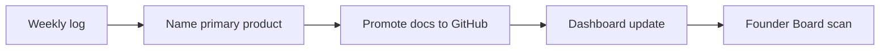

# Processes

| Field | Value |
| --- | --- |
| Document ID | GOS-GPO-162 |
| Document Name | Processes |
| Version | 1.0.0 |
| Status | Approved |
| Owner | Product Office |
| Reviewer | Founder Board |
| Approver | Founder Board |
| Created Date | 2026-07-18 |
| Last Updated | 2026-07-18 |
| Purpose | Describe core GAIOS operating processes for knowledge, decisions, research, and AI collaboration. |
| Scope | Company processes; product engineering SDLC details remain in product workspaces and standards. |

## Navigation

| Link | Target |
| --- | --- |
| Parent | [Company Wiki](./README.md) |
| Child | None |
| Related | [Approval Workflow](../governance/approval-workflow.md) · [FAQs](./faqs.md) · [Research Center](../research/README.md) · [Meeting Process](../standards/meeting-process.md) |
| Previous | [Glossary](./glossary.md) |
| Next | [FAQs](./faqs.md) |
| Back to START-HERE | [START-HERE.md](../START-HERE.md) |

## 1. Knowledge Promotion Process

1. Capture in chat, meeting, or AI session.
2. Verify facts (SSOT or named sources).
3. Write or update the owning GAIOS document.
4. Open PR or commit per repository rules.
5. Update registers/indexes if IDs change.

Related: [DEC-GPO-001](../decision-register/dec-gpo-001-github-as-ssot.md), [AI Session Template](../templates/ai-session-template.md).

## 2. Decision Process

1. Draft with [decision-draft-template.md](../templates/decision-draft-template.md).
2. Consult affected founders/roles.
3. Follow [Approval Workflow](../governance/approval-workflow.md).
4. Publish under `decision-register/` and update [REGISTER.md](../decision-register/REGISTER.md).
5. Calendar Review Date.

## 3. Risk Process

1. Identify risk; assign RISK-GPO ID.
2. Score Probability × Impact.
3. Define Mitigation and Owner.
4. Log in [REGISTER.md](../risk-register/REGISTER.md).
5. Review in Founder Board cadence.

## 4. Research Process

1. Frame question in Research Center topic doc.
2. Collect evidence (no PII in repo).
3. Update Findings Status with confidence.
4. Spawn decisions when bets change.
5. Refresh quarterly via Industry Reports cadence.

## 5. Weekly Founder Cadence

Templates: [founder-weekly-log-template.md](../templates/founder-weekly-log-template.md), [dashboard-update-template.md](../templates/dashboard-update-template.md).

## 6. AI Collaboration Process

1. Write objective and constraints.
2. Load START-HERE + relevant SSOT docs.
3. Optionally attach [agent-brief-template.md](../templates/agent-brief-template.md).
4. Execute; verify; promote.
5. Never let AI set Approval alone.

## Related Documents

- [Approval Workflow](../governance/approval-workflow.md)
- [Authority Matrix](../governance/authority-matrix.md)
- [Meeting Process Standard](../standards/meeting-process.md)
- [FAQs](./faqs.md)
