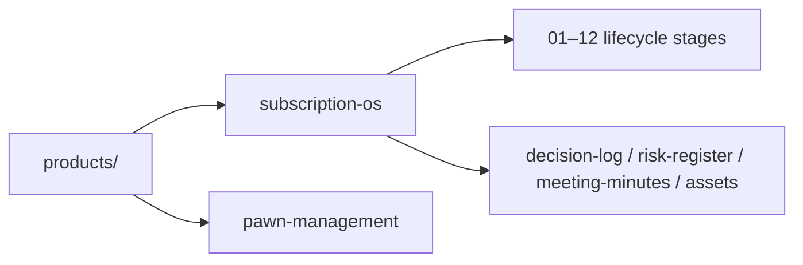

# Products

## Purpose

Index all Gojen Technology product workspaces documented in the Product Office.

## Contents

| Product | Path | Notes |
| --- | --- | --- |
| Subscription OS | [subscription-os/](./subscription-os/README.md) | Full lifecycle structure initialized |
| Pawn Management | [pawn-management/](./pawn-management/README.md) | Product workspace initialized |

## Owner

Gojen Product Office.

## Related Documents

- [Repository home](../README.md)
- [Company](../company/README.md)
- [Templates](../templates/README.md)
- [Glossary](../glossary/README.md)
