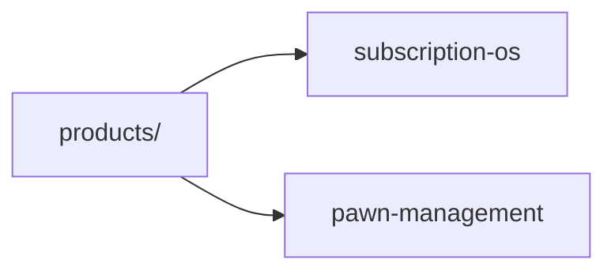

# Products

## Breadcrumb

[Home](../README.md) › Products

## Navigation Links

- [Master Index](../INDEX.md)
- [Company](../company/README.md)
- [Templates](../templates/README.md)
- [Glossary](../glossary/README.md)
- [Dashboard](../README.md)

## Parent Folder

[Repository root](../README.md)

## Child Folders

| Product | Path | Notes |
| --- | --- | --- |
| Subscription OS | [subscription-os/](./subscription-os/README.md) | Lifecycle structure ready; no product docs in Sprint 1 |
| Pawn Management | [pawn-management/](./pawn-management/README.md) | Workspace initialized |

## Purpose

Index all Gojen Technology product workspaces documented in the Product Office.

## Owner

Gojen Product Office.

## Related Documents

- [Repository dashboard](../README.md)
- [Master index](../INDEX.md)
- [Company](../company/README.md)
- [Templates](../templates/README.md)
- [Glossary](../glossary/README.md)
- [Repository rules](../company/standards/repository-rules.md)
