# Subscription OS

## Breadcrumb

[Home](../../README.md) › [Products](../README.md) › Subscription OS

## Navigation Links

- [Products](../README.md)
- [Templates](../../templates/README.md)
- [Standards](../../company/standards/README.md)
- [Master Index](../../INDEX.md)
- [Dashboard](../../README.md)

## Parent Folder

[products/](../README.md)

## Child Folders

### Lifecycle stages

| Stage | Folder |
| --- | --- |
| Discovery | [01-discovery/](./01-discovery/README.md) |
| Market research | [02-market-research/](./02-market-research/README.md) |
| Business | [03-business/](./03-business/README.md) |
| Product | [04-product/](./04-product/README.md) |
| Design | [05-design/](./05-design/README.md) |
| Architecture | [06-architecture/](./06-architecture/README.md) |
| Engineering | [07-engineering/](./07-engineering/README.md) |
| Testing | [08-testing/](./08-testing/README.md) |
| Sales | [09-sales/](./09-sales/README.md) |
| Marketing | [10-marketing/](./10-marketing/README.md) |
| Release | [11-release/](./11-release/README.md) |
| Roadmap | [12-roadmap/](./12-roadmap/README.md) |

### Cross-cutting

| Folder | Description |
| --- | --- |
| [backlog/](./backlog/README.md) | Sprint backlogs (active: [SPR-001](./backlog/SPR-001.md)) |
| [decision-log/](./decision-log/README.md) | Product decisions and rationale |
| [risk-register/](./risk-register/README.md) | Risks, owners, and mitigation |
| [meeting-minutes/](./meeting-minutes/README.md) | Product meeting records |
| [assets/](./assets/README.md) | Supporting non-code assets |

```mermaid
flowchart LR
  D1["01 Discovery"] --> D2["02 Market research"]
  D2 --> D3["03 Business"]
  D3 --> D4["04 Product"]
  D4 --> D5["05 Design"]
  D5 --> D6["06 Architecture"]
  D6 --> D7["07 Engineering"]
  D7 --> D8["08 Testing"]
  D8 --> D9["09 Sales"]
  D9 --> D10["10 Marketing"]
  D10 --> D11["11 Release"]
  D11 --> D12["12 Roadmap"]
```

## Purpose

Product workspace for **Subscription OS**. Sprint 1 established documentation infrastructure only — do not add product business documents here until a later sprint explicitly starts product documentation.

## Owner

Product Owner — Subscription OS, stewarded by the Gojen Product Office.

## Related Documents

- [Products index](../README.md)
- [Templates](../../templates/README.md)
- [Document numbering](../../company/standards/document-numbering.md)
- [Master index](../../INDEX.md)
- [Dashboard](../../README.md)
