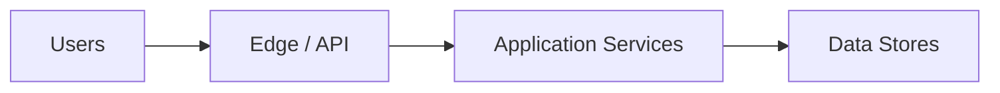

# Architecture Template

> Architecture overview or ADR companion. Allocate `ARCH-*` or `ADR-*` per numbering standards.

## Document Information

| Field | Value |
| --- | --- |
| Document ID | `{ARCH\|ADR}-{SCOPE}-{NNN}` |
| Title | `{Architecture Title}` |
| Product / Scope | `{SOS \| PAW \| …}` |
| Version | `0.1.0` |
| Status | Draft |
| Author | `{Name}` |
| Owner | `{Architecture / Engineering Lead}` |
| Created | `YYYY-MM-DD` |
| Last Updated | `YYYY-MM-DD` |

## Version History

| Version | Date | Author | Summary |
| --- | --- | --- | --- |
| 0.1.0 | YYYY-MM-DD | Name | Initial draft |

## Purpose

Describe the architecture approach, boundaries, and key technical decisions for the stated scope.

## Scope

### In Scope

- Systems, services, and interfaces covered

### Out of Scope

- …

## Context

## Quality Attributes

| Attribute | Target | Notes |
| --- | --- | --- |
| Availability | … | |
| Latency | … | |
| Scalability | … | |
| Security | … | |

## Building Blocks

| Component | Responsibility | Owner |
| --- | --- | --- |
| … | … | … |

## Interfaces

| Interface | Consumers | Protocol | Spec Link |
| --- | --- | --- | --- |
| … | … | … | API-… |

## Assumptions

| ID | Assumption | Impact if false |
| --- | --- | --- |
| A-01 | … | … |

## Risks

| Risk ID | Description | Likelihood | Impact | Mitigation | Owner |
| --- | --- | --- | --- | --- | --- |
| R-01 | … | L/M/H | L/M/H | … | … |

## Decision Links

| Decision ID | Summary |
| --- | --- |
| ADR-… / DEC-… | … |

## References

| Document ID | Title | Link |
| --- | --- | --- |
| … | … | … |

## Approval Table

| Role | Name | Decision | Date |
| --- | --- | --- | --- |
| Author | | Prepared | |
| Architecture Lead | | | |
| Engineering Lead | | | |
| Approver | | | |

## Change Log

| Date | Version | Change | Author |
| --- | --- | --- | --- |
| YYYY-MM-DD | 0.1.0 | Initial architecture doc from template | Name |
