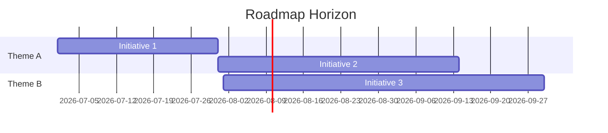

# Roadmap Template

> Use for roadmap views (`12-roadmap/` or company portfolio roadmaps). Allocate Document ID per numbering standards (often product-scoped planning docs).

## Document Information

| Field | Value |
| --- | --- |
| Document ID | `{PREFIX}-{SCOPE}-{NNN}` |
| Title | `{Roadmap Title}` |
| Product / Scope | `{GPO \| SOS \| PAW \| …}` |
| Version | `0.1.0` |
| Status | Draft |
| Author | `{Name}` |
| Owner | `{Product Owner}` |
| Horizon | `{Now / Next / Later \| Quarterly \| Annual}` |
| Created | `YYYY-MM-DD` |
| Last Updated | `YYYY-MM-DD` |

## Version History

| Version | Date | Author | Summary |
| --- | --- | --- | --- |
| 0.1.0 | YYYY-MM-DD | Name | Initial draft |

## Purpose

Communicate sequencing, themes, and planned outcomes for the stated horizon.

## Scope

### In Scope

- Themes, initiatives, and sequencing for this roadmap

### Out of Scope

- Detailed sprint backlog and ticket-level estimates

## Assumptions

| ID | Assumption | Impact if false |
| --- | --- | --- |
| A-01 | … | … |

## Risks

| Risk ID | Description | Likelihood | Impact | Mitigation | Owner |
| --- | --- | --- | --- | --- | --- |
| R-01 | … | L/M/H | L/M/H | … | … |

## Themes and Initiatives

| Theme | Initiative | Outcome | Target Window | Status | Links |
| --- | --- | --- | --- | --- | --- |
| … | … | … | YYYY-Qn | Planned | |

## Timeline

## Dependencies

| Dependency | Needed By | Owner | Status |
| --- | --- | --- | --- |
| … | … | … | … |

## References

| Document ID | Title | Link |
| --- | --- | --- |
| … | … | … |

## Approval Table

| Role | Name | Decision | Date |
| --- | --- | --- | --- |
| Author | | Prepared | |
| Product Owner | | | |
| Approver | | | |

## Change Log

| Date | Version | Change | Author |
| --- | --- | --- | --- |
| YYYY-MM-DD | 0.1.0 | Initial roadmap from template | Name |
